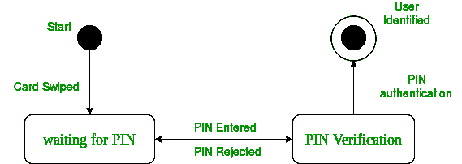
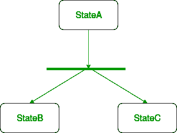
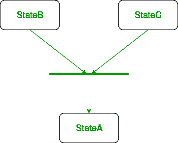
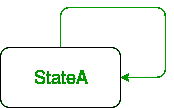
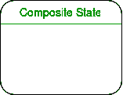
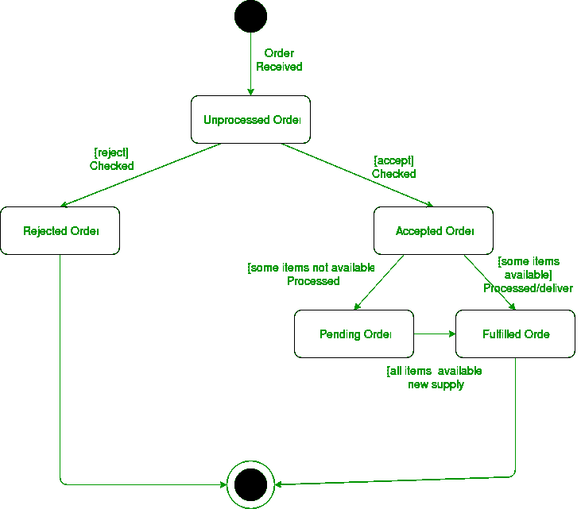

# 统一建模语言(UML) |状态图

> 原文:[https://www . geesforgeks . org/unified-modeling-language-UML-state-diagrams/](https://www.geeksforgeeks.org/unified-modeling-language-uml-state-diagrams/)

## 简介

一个`状态图`用于表示系统或系统的一部分在有限时间内的状态。这是一个`行为`图，它使用有限状态转换来表示行为。状态图也称为`状态机`和`状态图`。这些术语经常互换使用。简单来说，状态图被用来模拟一个类响应时间和变化的外部刺激的动态行为。我们可以说每一个类都有一个状态，但是我们不会用状态图来建模每一个类。我们更喜欢用三个或更多的州来模拟州。

## 状态图的使用

*   我们用它来陈述导致状态变化的事件(我们没有显示是什么过程导致了这些事件)。
*   我们用它来模拟系统的动态行为。
*   理解对象/类对内部或外部刺激的反应。

## 行为图

首先让我们了解什么是`行为图`？UML 中有两种类型的图:

1.  `结构图`–用于对系统的静态结构进行建模，例如——类图、包图、对象图、部署图等。
2.  `行为图`–用于模拟系统随时间的动态变化。它们用于建模和构建系统的功能。因此，行为图只是使用用例图、交互图、活动图和状态图来指导我们完成系统的功能。

## 状态图和流程图的区别

状态图的基本目的是描述类状态的各种变化，而不是引起变化的过程或命令。然而，另一方面`流程图`描绘了在执行时改变类或类的对象的状态的过程或命令。

**Figure –** a state diagram for user verification

上面的状态图显示了特定系统的验证子系统或类存在的不同状态。

## 状态图的基本组件

### 1. 初始状态
我们使用一个黑色填充的圆圈表示系统或类的初始状态。

**Figure –** initial state notation

### 2. 转移
我们使用一个实心箭头表示从一个状态到另一个状态的转移或控制变化。箭头被标记为导致状态变化的事件。

**Figure –** transition

### 3. 状态
我们用一个圆角矩形来表示一个状态。状态表示一个类的对象在某一时刻的条件或环境。

**图–**状态批注

### 4. 分叉
我们使用一个圆角的实心矩形条来表示分叉符号，它有一个来自父状态的传入箭头和指向新创建状态的传出箭头。我们使用分叉符号来表示一个状态分裂成两个或多个并发状态。

**Figure –** a diagram using the fork notation

### 5. 合并
我们使用一个圆角的实心矩形条来表示合并符号，它有来自合并状态的传入箭头和指向共同目标状态的传出箭头。当两个或多个状态在事件发生时并发地收敛到一个状态时，我们使用合并符号。

**Figure –** a diagram using join notation

### 6. 自转移
我们使用一个指向状态本身的实心箭头来表示自转移。可能存在对象状态在事件发生时不改变的情况。我们使用自转移来表示这种情况。

**Figure –** self transition notation

### 7. 复合状态
我们使用一个圆角矩形来表示复合状态。我们使用复合状态来表示具有内部活动的状态。

**Figure –** a state with internal activities

### 8. 最终状态
我们使用一个圆圈内填充圆圈的符号来表示状态机图中的最终状态。

**Figure –** final state notation

## 绘制状态图的步骤

1.  确定初始状态和最终终止状态。
2.  识别对象可能存在的状态(不同属性对应的边界值指导我们识别不同的状态)。
3.  标记触发这些转换的事件。

## 示例：在线订单的状态图

**Figure –** state diagram for an online order

我们绘制的UML图取决于我们要表示的系统。以下只是一个在线订购系统的示例:

1.  在收到订单的情况下，我们从初始状态转换到未处理订单状态。
2.  然后检查未处理的订单。
3.  如果订单被拒绝，我们会转到“拒绝订单”状态。
4.  如果订单被接受，并且我们有可用的项目，我们将转移到已履行的订单状态。
5.  但是，如果这些项目不可用，我们会转移到“待定订单”状态。
6.  订单完成后，我们将过渡到最终状态。在本例中，我们将两种状态，即已完成订单和已拒绝订单合并为一个最终状态。

**注意–**在这里，我们也可以将已完成订单和已拒绝订单分别视为最终状态。

## 参考

[状态图–IBM](https://www.ibm.com/support/knowledgecenter/en/SS6RBX_11.4.2/com.ibm.sa.oomethod.doc/com.ibm.sa.oomethod.doc_eclipse-gentopic9.html)

本文由 [**安基特·贾恩**](https://www.facebook.com/profile.php?id=100000412091676) 供稿。如果你喜欢 GeeksforGeeks 并想投稿，你也可以使用[contribute.geeksforgeeks.org](http://www.contribute.geeksforgeeks.org)写一篇文章或者把你的文章邮寄到 contribute@geeksforgeeks.org。看到你的文章出现在极客博客主页上，帮助其他极客。

如果你发现任何不正确的地方，或者你想分享更多关于上面讨论的话题的信息，请写评论。