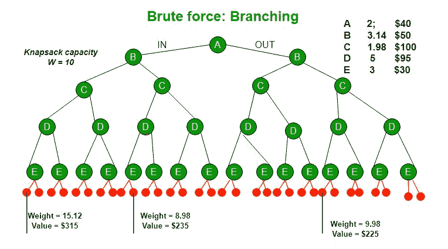
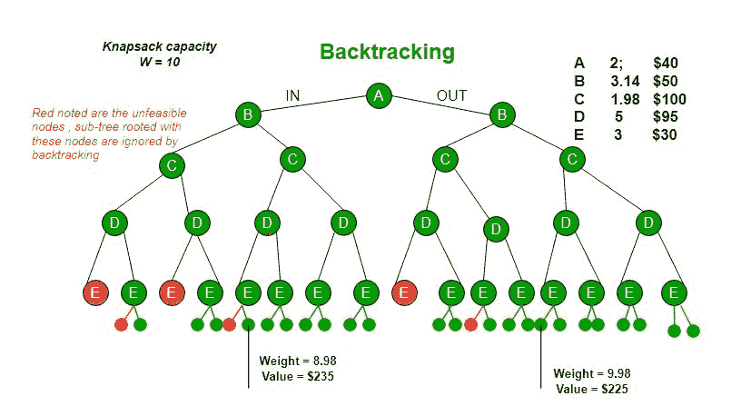
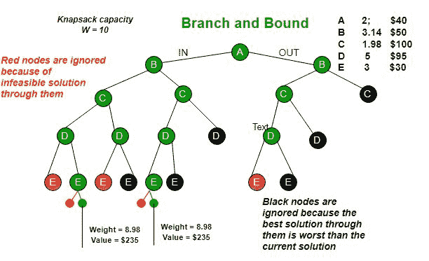

# 使用分支定界的 0/1 背包

> 原文: [https://www.geeksforgeeks.org/0-1-knapsack-using-branch-and-bound/](https://www.geeksforgeeks.org/0-1-knapsack-using-branch-and-bound/)

分支定界是一种算法设计范式，通常用于解决组合优化问题。这些问题在时间复杂度方面通常是指数级的，并且在最坏的情况下可能需要探索所有可能的排列。分支和绑定可以相对快速地解决这些问题。

让我们考虑下面的 0/1 背包问题来理解分支和有界。

*给定两个整数数组`val[0..n-1]`和`wt[0..n-1]`分别表示与 n 个项目相关联的值和权重。找出`val[]`的最大值子集，使得该子集的权重之和小于或等于背包容量`W`。*

让我们探索解决这个问题的所有方法。

1.  一种[贪婪的方法](https://www.geeksforgeeks.org/fractional-knapsack-problem/)是按单位重量价值递减的顺序挑选物品。贪婪方法只适用于[分数背包](https://www.geeksforgeeks.org/fractional-knapsack-problem/)问题，可能不会对[0/1 背包](https://www.geeksforgeeks.org/dynamic-programming-set-10-0-1-knapsack-problem/)产生正确的结果。
2.  对于 0/1 背包问题，我们可以使用[动态规划](https://www.geeksforgeeks.org/dynamic-programming-set-10-0-1-knapsack-problem/)。在 DP 中，我们使用大小为`n×w`的 2D 表。如果项目权重不是整数，则 DP 解决方案不起作用。
3.  由于 DP 解决方案并不总是有效，一种解决方案是使用**暴力法**。对于 n 个物品，需要生成`2^n`个解决方案，检查每个方案是否满足约束条件，并保存满足约束的最大解决方案。这个解决方案可以表示为**树**。

4.  我们可以使用**回溯**来优化暴力解。在树的表示中，我们可以做树的 DFS。如果我们到了一个解决方案不再可行的地步，就没有必要继续探索了。在给定的例子中，如果我们有更多的物品或更小的背包容量，回溯会更有效。

## Branch and Bound

基于回溯的解决方案通过忽略不可行的解决方案，比暴力法表现更好。如果我们知道以每个节点为根的子树中可能的最佳解决方案的界限，我们可以做得比回溯更好。如果子树中的最佳方案比当前最佳方案差，我们可以简单地忽略这个节点及其子树。因此，我们为每个节点计算界限（最佳解决方案），并在探索节点之前将界限与当前最佳解决方案进行比较。

下图中使用的示例界限是，`A`节点可给出 315 美元，`B`节点可给出 275 美元，`C`节点可给出 225 美元，`D`节点可给出 125 美元，`E`节点可给出 30 美元。在[下一篇文章](https://www.geeksforgeeks.org/branch-and-bound-set-2-implementation-of-01-knapsack/)中，我们已经讨论了获得这些界限的过程。

分支定界是搜索解的非常有用的技术，但是在最坏的情况下，我们需要完全计算整个树。充其量，我们只需要完全计算出一条穿过树的路径，然后修剪掉剩下的部分。

**来源:**
以上图片及内容采用自以下链接。[http://www.cse.msu.edu/~torng/Classes/Archives/cse830.03fall/Lectures/Lecture11.ppt](http://www.cse.msu.edu/~torng/Classes/Archives/cse830.03fall/Lectures/Lecture11.ppt)

[分支定界 | 集合 2 (0/1 背包的实现)](https://www.geeksforgeeks.org/branch-and-bound-set-2-implementation-of-01-knapsack/)

本文由乌特卡尔什·特里维迪供稿。如果你喜欢极客博客并想投稿，你也可以写一篇文章并把你的文章邮寄到`contribute@geeksforgeeks.org`。看到你的文章出现在极客博客主页上，帮助其他极客。

如果您发现任何不正确的地方，或者您想分享更多关于上面讨论的主题的信息，请写评论。