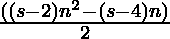

# 65537-gon 编号

> 原文: [https://www.geeksforgeeks.org/65537-gon-number/](https://www.geeksforgeeks.org/65537-gon-number/)

给定一个编号 `N`，任务是找到第 `N` 个 65537-gon 数。

> 65537-gon 数是一类图形数。它有一个 65537 边的多边形，叫做 65537-gon。第 `N` 个 65537 边数是 65537 个数的点，所有其他点被一个公共共享角包围并形成一个图案。前几个 65537-gon 数字是 **1、65537、196608、393214、655355、983031、…**

**例:**

> **输入:** `N = 2`
> **输出:** `65537`
> **说明:**
> 第二个 65537-gon 数为 `65537`。
> **输入:** `N = 3`
> **输出:** `196608`

**方法:** 第 `N` 个 65537-gon 数由公式给出:

*   `s` 边多边形的第 `n` 项= 
*   因此 65537 边多边形的第 `n` 项为
> 

以下是上述方法的实现:

## C++

```cpp
// C++ implementation for
// above approach
#include <bits/stdc++.h>
using namespace std;

// Function to find the 
// nth 65537-gon Number
int gonNum65537(int n)
{
    return (65535 * n * n - 65533 * n) / 2;
}

// Driver Code
int main()
{
    int n = 3;
    cout << gonNum65537(n);

    return 0;
}
```

## Java

```java
// Java program for above approach
class GFG{

// Function to find the
// nth 65537-gon Number
static int gonNum65537(int n)
{
    return (65535 * n * n - 65533 * n) / 2;
}

// Driver code
public static void main(String[] args)
{
    int n = 3;

    System.out.print(gonNum65537(n));
}
}

// This code is contributed by shubham
```

## Python 3

```python
# Python3 implementation for
# above approach

# Function to find the
# nth 65537-gon Number
def gonNum65537(n):

    return (65535 * n * n - 65533 * n) // 2;

# Driver Code
n = 3;
print(gonNum65537(n));

# This code is contributed by Code_Mech
```

## C#

```csharp
// C# program for above approach
using System;
class GFG{

// Function to find the
// nth 65537-gon Number
static int gonNum65537(int n)
{
    return (65535 * n * n - 65533 * n) / 2;
}

// Driver code
public static void Main(String[] args)
{
    int n = 3;

    Console.Write(gonNum65537(n));
}
}

// This code is contributed by sapnasingh4991
```

## JavaScript

```javascript
<script>

// Javascript program for above approach

    // Function to find the
    // nth 65537-gon Number
    function gonNum65537( n) {
        return (65535 * n * n - 65533 * n) / 2;
    }

    // Driver code

        let n = 3;

        document.write(gonNum65537(n));

// This code contributed by aashish1995

</script>
```

**Output:**

```
196608
```

**参考资料:** [https://en.wikipedia.org/wiki/65537-gon](https://en.wikipedia.org/wiki/65537-gon)