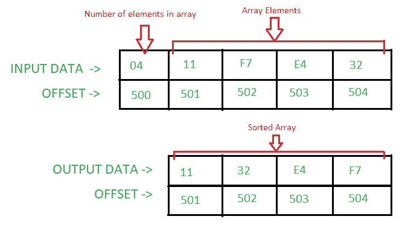

# 8086 选择排序程序

> 原文: [https://www.geeksforgeeks.org/8086-program-selection-sort/](https://www.geeksforgeeks.org/8086-program-selection-sort/)

## 问题
在 8086 微处理器中编写汇编语言程序，使用 Selection Sort 对给定的 n 个数数组进行排序。

## 假设
数组中的元素数量以偏移量 `500` 存储。数组从偏移量 `501` 开始。

## 示例


## 算法
1. 我们首先找到数组中最小的数字。
2. 从数组的第一个元素中交换最小的数字。
3. 继续重复这个过程，直到遍历完所有元素。

## 程序

| Offset | Mnemonics | Comments |
| :--- | :--- | :--- |
| `400` | `MOV SI, 501` | `SI` |
| `403` | `MOV IS, 500` | `IS` |
| `406` | `MOV CL, [SI]` | `CL` |
| `408` | `XOR CH, CH` | `CH` |
| `40A` | `INC SI` | `SI` |
| `40B` | `DEC CX` | `CX <- CX-0001` |
| `40C` | `MOV BX, SI` | `BX` |
| `40E` | `MOV AH, CL` | `AH` |
| `410` | `INC AH` | `AH` |
| `412` | `MOV AL, [SI]` | `AL` |
| `414` | `INC SI` | `SI` |
| `415` | `DEC AH` | `AH` |
| `417` | `CMP AL, [SI]` | `[SI]` |
| `419` | `JC 41F` | 如果进位标志= 1，跳转到偏移量 `41F` |
| `41B` | `MOV AL, [SI]` | `AL` |
| `41D` | `MOV BX, SI` | `BX` |
| `41F` | `INC SI` | `SI` |
| `420` | `DEC AH` | `AH` |
| `422` | `JNZ 417` | 如果零标志= 0，跳转到偏移 `417` |
| `424` | `MOV DL, [BX]` | `DL` |
| `426` | `XCHG DL, [SI]` | `DL <-> [SI]` |
| `428` | `XCHG DL, [BX]` | `DL <-> [BX]` |
| `42A` | `INC DI` | `DI` |
| `42B` | `MOV IS, DI` | `IS` |
| `42D` | `LOOP 40C` | `CX` |
| `42F` | `HLT` | 程序结束。 |

## 说明
寄存器 `AH`、`AL`、`BX`、`CX`、`DL`、`SI`、`DI` 用于通用目的：

```text
AL - Stored the smallest number
AH - Stores the counter for the inner loop
BX - Stores the offset of the smallest 
     number of each iteration of the outer loop
CX - Stores the counter for the outer loop
DL - Helps in swapping the elements
SI - Pointer
DI - Pointer 
```

1. **`MOV SI, 500`**: 在 `SI` 存储 `0500`。
2. **`MOV CL, [SI]`**: 将偏移量 `SI` 处的内容存储在 `CL` 中。
3. **`XOR CH, CH`**: 将逻辑运算异或 b/w `CH` 和 `CH` 的结果存储在 `CH` 中。
4. **`INC SI`**: 将 `SI` 的值增加 `1`。
5. **`DEC CX`**: `CX` 值减 `1`。
6. **`MOV AH, CL`**: 存储 `AH` 中 `CL` 的含量。
7. **`CMP AL, [SI]`**: 将 `AL` 的含量与偏移 `SI` 处的含量进行比较。如果 `AL < [SI]` – 设置进位标志(即进位标志= `1`)。
8. **`JC 41F`**: 跳至偏移 `041F`，如果进位标志被设置(`1`)。
9. **`JNZ 417`**: 跳至偏移 `0417`，如果零标志复位(`0`)。
10. **`XCHG DL, [BX]`**: 用偏移 `BX` 的内容交换 `DL` 的内容。
11. **`LOOP 40C`**: 将 `CX` 值减少 `1`，并检查是否设置零标志(`1`)。如果零标志被重置(`0`)，那么它跳到偏移 `040C`。
12. **`HLT`**: 终止程序。