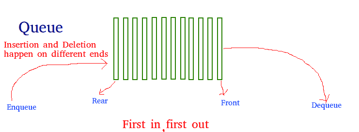
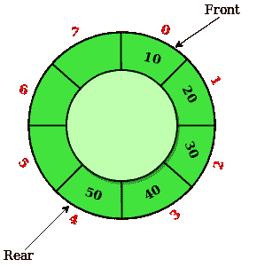
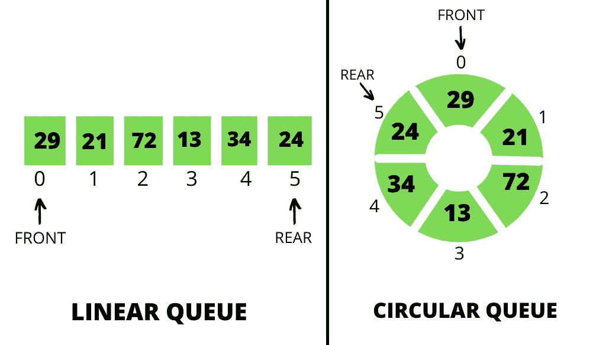
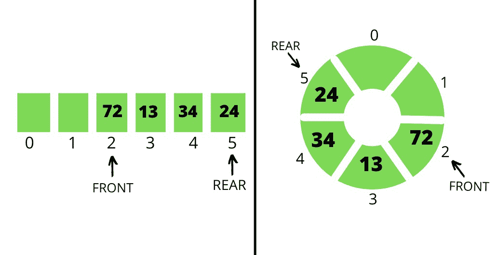
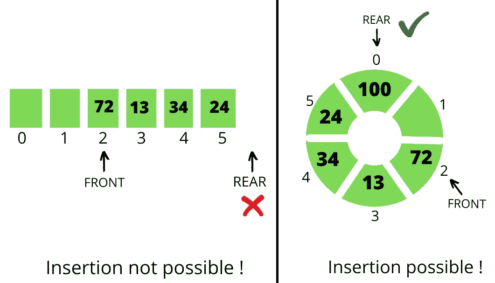

# 循环队列相对于线性队列的优势

> 原文: [https://www.geeksforgeeks.org/advantages-of-circular-queue-over-linear-queue/](https://www.geeksforgeeks.org/advantages-of-circular-queue-over-linear-queue/)

## `线性队列`
`线性队列`一般被称为队列。它是一种[线性数据结构](https://www.geeksforgeeks.org/difference-between-linear-and-non-linear-data-structures/)，遵循先进先出的顺序。队列的一个实际例子是顾客排队等候从商店购买产品，先到的顾客先得。在队列中，所有删除(`出列`)都在前端进行，所有插入(入队)都在后端进行。

## `循环队列`
`循环队列`只是线性队列的一种变体，其中前端和后端相互连接，以优化线性队列的空间浪费并使其高效。

以下是说明`循环队列`如何优于`线性队列`的操作:

*   **当对两个队列执行`入队`操作时：** 假设队列大小为`6`，包含元素`{29, 21, 72, 13, 34, 24}`。在两个队列中，`front`指向第一个元素`29`，`rear`指向最后一个元素`24`，如下图所示：

*   **当对两个队列执行`出列`操作时：** 考虑从两个队列中删除前2个元素。在两个队列中，`front`指向元素`72`，`rear`指向元素`24`，如下图所示：

*   **现在再次执行入队操作：** 考虑向两个队列中插入一个值为`100`的元素。在`线性队列`中插入元素`100`是不可能的，但在`循环队列`中，插入值为`100`的元素是可行的，如下图所示：

## 解说
*   由于队列中的插入是从`rear`端开始的，并且在`线性队列`的情况下大小是固定的，当`rear`到达队列末端时，插入是不可能的。
    *   但是在`循环队列`的情况下，`rear`端从最后一个位置循环移动到`front`位置。

## 结论
`循环队列`比`线性队列`更有优势。`循环队列`的其他优点是:

*   **更容易插入-删除:** 在循环队列中，只要有空闲位置，元素就可以很容易地插入，而在线性队列的情况下，一旦尾部到达最后一个索引，即使队列中存在空闲位置，也不可能插入。
    *   **内存的高效利用:** 在循环队列中，由于使用了未占用的空间，因此没有浪费内存，与线性队列相比，内存以有价值和有效的方式得到了适当的利用。
    *   **执行操作的难易程度:** 在线性队列中，遵循`先进先出`，所以先插入的元素就是先删除的元素。这不是循环队列的情况，因为`rear`和`front`不是固定的，所以插入-删除的顺序可以改变，这非常有用。