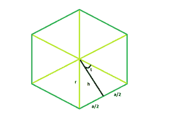

# n 边正多边形的顶点

> 原文: [https://www.geeksforgeeks.org/apothem-of-a-n-sided-regular-polygon/](https://www.geeksforgeeks.org/apothem-of-a-n-sided-regular-polygon/)

这里给定一个正 n 边多边形的边长 `a`，任务是找到它的顶点的长度。
`h` 是从多边形的中心画出的一条线，该线垂直于多边形的一条边。
**例:**

```
Input: a = 9, n = 6
Output: 7.79424

Input: a = 8, n = 7
Output: 8.30609
```



**接近:**

> 在图中，我们看到多边形可以分成 `n` 个相等的三角形。
> 看其中一个三角形，我们看到中心的整个角度可以分为 `360°/n`。所以，角度 `t = 180°/n`。现在，`tan t = a/2h`。所以，`h = a/(2 * tan t)`。这里，`h` 是 apothes，
> 所以，apothes = `a/(2 * tan(180/n))`。

**下面是上述方法的实现。**

## C++

```cpp
// C++ Program to find the apothem
// of a regular polygon with given side length
#include <bits/stdc++.h>
using namespace std;

// Function to find the apothem
// of a regular polygon
float polyapothem(float n, float a)
{

    // Side and side length cannot be negative
    if (a < 0 && n < 0)
        return -1;

    // Degree converted to radians
    return a / (2 * tan((180 / n) * 3.14159 / 180));
}

// Driver code
int main()
{
    float a = 9, n = 6;
    cout << polyapothem(n, a) << endl;

    return 0;
}
```

## Java

```java
// Java Program to find the apothem of a
// regular polygon with given side length
import java.util.*;

class GFG
{

    // Function to find the apothem
    // of a regular polygon
    double polyapothem(double n, double a)
    {

        // Side and side length cannot be negative
        if (a < 0 && n < 0)
            return -1;

        // Degree converted to radians
        return (a / (2 * java.lang.Math.tan((180 / n)
                * 3.14159 / 180)));
    }

// Driver code
public static void main(String args[])
{
    double a = 9, n = 6;
    GFG g=new GFG();
    System.out.println(g.polyapothem(n, a));

}
}
//This code is contributed by Shivi_Aggarwal
```

## Python 3

```python
# Python 3 Program to find the apothem
# of a regular polygon with given side
# length
from math import tan

# Function to find the apothem
# of a regular polygon
def polyapothem(n, a):

    # Side and side length cannot be negative
    if (a < 0 and n < 0):
        return -1

    # Degree converted to radians
    return a / (2 * tan((180 / n) *
                   3.14159 / 180))

# Driver code
if __name__ == '__main__':
    a = 9
    n = 6
    print('{0:.6}'.format(polyapothem(n, a)))

# This code is contributed by
# Sahil_Shelangia
```

## C#

```csharp
// C# Program to find the apothem of a
// regular polygon with given side length
using System;

class GFG
{

// Function to find the apothem
// of a regular polygon
static double polyapothem(double n,
                          double a)
{

    // Side and side length cannot
    // be negative
    if (a < 0 && n < 0)
        return -1;

    // Degree converted to radians
    return (a / (2 * Math.Tan((180 / n) *
                       3.14159 / 180)));
}

// Driver code
public static void Main()
{
    double a = 9, n = 6;
    Console.WriteLine(Math.Round(polyapothem(n, a), 4));
}
}

// This code is contributed by Ryuga
```

## PHP

```php
<?php
// PHP Program to find the apothem of a
// regular polygon with given side length

// Function to find the apothem
// of a regular polygon
function polyapothem($n, $a)
{

    // Side and side length cannot
    // be negative
    if ($a < 0 && $n < 0)
        return -1;

    // Degree converted to radians
    return $a / (2 * tan((180 / $n) *
                    3.14159 / 180));
}

// Driver code
$a = 9; $n = 6;
echo polyapothem($n, $a) . "\n";

// This code is contributed
// by Akanksha Rai
?>
```

## JavaScript

```javascript
<script>
// javascript Program to find the apothem of a
// regular polygon with given side length

// Function to find the apothem
// of a regular polygon
function polyapothem(n , a)
{

    // Side and side length cannot be negative
    if (a < 0 && n < 0)
        return -1;

    // Degree converted to radians
    return (a / (2 * Math.tan((180 / n)
            * 3.14159 / 180)));
}

// Driver code

var a = 9, n = 6;

document.write(polyapothem(n, a).toFixed(5));

// This code contributed by Princi Singh
</script>
```

**Output:**

```
7.79424
```