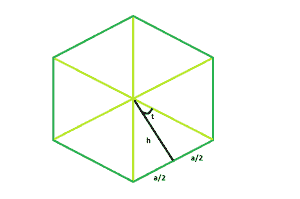

# 给定边长的正多边形的面积

> 原文：[https://www.geeksforgeeks.org/area-of-a-n-sided-regular-polygon-with-given-side-length/](https://www.geeksforgeeks.org/area-of-a-n-sided-regular-polygon-with-given-side-length/)

给定一个边长为 `a` 的 `N` 边正多边形。任务是找到多边形的面积。

**例：**

```
Input : N = 6, a = 9
Output : 210.444

Input : N = 7, a = 8
Output : 232.571
```



**逼近：** 在上图中，我们看到多边形可以分为 `N` 个等边三角形。看其中一个三角形，我们看到中心的整个角度可以分为 `360/N`。
所以，角度 `t = 180/n`。
现在， `tan(t) = a/2*h`。
所以， `h = a/(2*tan(t))`。
每个三角形的面积= `(底*高)/2 = a * a/(4*tan(t))`。

```
A = n * (area of one triangle) = a^2 * n/(4tan t)
```

以下是上述方法的实现：

## C++

```cpp
// C++ Program to find the area of a regular
// polygon with given side length

#include <bits/stdc++.h>
using namespace std;

// Function to find the area
// of a regular polygon
float polyarea(float n, float a)
{
    // Side and side length cannot be negative
    if (a < 0 && n < 0)
        return -1;

    // Area
    // degree converted to radians
    float A = (a * a * n) / (4 * tan((180 / n) * 3.14159 / 180));

    return A;
}

// Driver code
int main()
{
    float a = 9, n = 6;

    cout << polyarea(n, a) << endl;

    return 0;
}
```

## Java

```java
// Java Program to find the area of a regular
// polygon with given side length

import java.io.*;

class GFG {

// Function to find the area
// of a regular polygon
static float polyarea(float n, float a)
{
    // Side and side length cannot be negative
    if (a < 0 && n < 0)
        return -1;

    // Area
    // degree converted to radians
    float A = (a * a * n) /(float) (4 * Math.tan((180 / n) * 3.14159 / 180));

    return A;
}

// Driver code

    public static void main (String[] args) {
    float a = 9, n = 6;

    System.out.println( polyarea(n, a));
    }
}
// This code is contributed by inder_verma..
```

## Python 3

```python
# Python 3 Program to find the area
# of a regular polygon with given
# side length
from math import tan

# Function to find the area of a
# regular polygon
def polyarea(n, a):

    # Side and side length cannot
    # be negative
    if (a < 0 and n < 0):
        return -1

    # Area degree converted to radians
    A = (a * a * n) / (4 * tan((180 / n) *
                      3.14159 / 180))

    return A

# Driver code
if __name__ == '__main__':
    a = 9
    n = 6

    print('{0:.6}'.format(polyarea(n, a)))

# This code is contributed by
# Shashank_sharma
```

## C#

```csharp
// C# Program to find the area of a regular
// polygon with given side length
using System;

class GFG
{

// Function to find the area
// of a regular polygon
static float polyarea(float n, float a)
{
    // Side and side length cannot be negative
    if (a < 0 && n < 0)
        return -1;

    // Area
    // degree converted to radians
    float A = (a * a * n) / (float)(4 * Math.Tan((180 / n) *
                                           3.14159 / 180));

    return A;
}

// Driver code
public static void Main ()
{
    float a = 9, n = 6;

    Console.WriteLine(polyarea(n, a));
}
}

// This code is contributed
// by Akanksha Rai
```

## PHP

```php
<?php
// PHP Program to find the area of a regular
// polygon with given side length

// Function to find the area
// of a regular polygon
function polyarea($n, $a)
{
    // Side and side length cannot
    // be negative
    if ($a < 0 && $n < 0)
        return -1;

    // Area
    // degree converted to radians
    $A = ($a * $a * $n) / (4 * tan((180 / $n) *
                              3.14159 / 180));

    return $A;
}

// Driver code
$a = 9 ;
$n = 6 ;

echo round(polyarea($n, $a), 3);

// This code is contributed by Ryuga
?>
```

## JavaScript

```javascript
<script>
// javascript Program to find the area of a regular
// polygon with given side length

// Function to find the area
// of a regular polygon
function polyarea(n , a)
{

    // Side and side length cannot be negative
    if (a < 0 && n < 0)
        return -1;

    // Area
    // degree converted to radians
    var A = (a * a * n) / (4 * Math.tan((180 / n) * 3.14159 / 180));

    return A;
}

// Driver code
var a = 9, n = 6;
document.write( polyarea(n, a).toFixed(5));

// This code contributed by Princi Singh
</script>
```

**Output:**

```
210.444
```