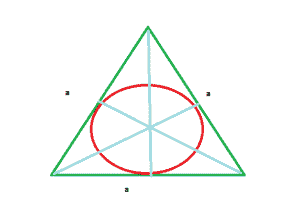

# 内接等边三角形的圆的面积

> 原文: [https://www.geeksforgeeks.org/area-of-circle-which-is-inscribed-in-equilateral-triangle/](https://www.geeksforgeeks.org/area-of-circle-which-is-inscribed-in-equilateral-triangle/)

给定一个边长为 `a` 的等边三角形，任务是找出这个等边三角形内切圆的面积。

## 示例

```
Input : a = 4
Output : 4.1887902047863905

Input : a = 10
Output : 26.1799387799
```



## 方法

等边三角形的面积=
等边三角形的半周长= `(a + a + a) / 2`
内切圆半径 `r` = 等边三角形的面积 / 等边三角形的半周长
=
=
圆的面积=π*(r * r)=

以下是上述方法的实现:

### C++

```cpp
// C++ program to find the area
// of circle which is inscribed
// in equilateral triangle
# include<bits/stdc++.h>
# define PI 3.14
using namespace std;

// Function return the area of circle
// inscribed in equilateral triangle
float circle_inscribed(int a)
{
    return PI * (a * a) / 12;
}

// Driver code
int main()
{
    int a = 4;

    cout << circle_inscribed(a);
    return 0;
}

// This code is contributed
// by Mahadev99
```

### Java

```java
// Java program to find the area
// of circle which is inscribed
// in equilateral triangle
import java.io.*;

class GFG
{

static double PI = 3.14;

// Function return the area of circle
// inscribed in equilateral triangle
static double circle_inscribed(int a)
{
    return PI * (a * a) / 12;
}

// Driver code
public static void main (String[] args)
{
    int a = 4;

    System.out.println(circle_inscribed(a));
}
}

// This code is contributed by anuj_67
```

### Python 3

```python
# Python3 program to find the area of circle
# which is inscribed in equilateral triangle

# import math library for pi value
from math import pi

# Function return the area of circle
# inscribed in equilateral triangle
def circle_inscribed(a):
    return pi*(a * a) / 12

# Driver code
a = 4
print(circle_inscribed(a))
```

### C#

```csharp
// C# program to find the area
// of circle which is inscribed
// in equilateral triangle
using System;

class GFG
{
static double PI = 3.14;

// Function return the area of circle
// inscribed in equilateral triangle
static double circle_inscribed(int a)
{
    return PI * (a * a) / 12;
}

// Driver code
public static void Main ()
{
    int a = 4;

    Console.WriteLine( circle_inscribed(a));
}
}

// This code is contributed
// by inder_verma
```

### PHP

```php
<?php
// PHP program to find the area
// of circle which is inscribed
// in equilateral triangle

// Function return the area of circle
// inscribed in equilateral triangle
function circle_inscribed($a)
{
    return 3.14 * ($a * $a) / 12;
}

// Driver code
$a = 4;

echo circle_inscribed($a);

// This code is contributed
// by Akanksha Rai(Abby_akku)
```

### JavaScript

```javascript
<script>

// javascript program to find the area
// of circle which is inscribed
// in equilateral triangle

let PI = 3.14;

// Function return the area of circle
// inscribed in equilateral triangle
function circle_inscribed( a)
{
    return PI * (a * a) / 12;
}

// Driver code
let a = 4;
    document.write(circle_inscribed(a).toFixed(5));

// This code contributed by gauravrajput1

</script>
```

## 输出

```
4.1887902047863905
```