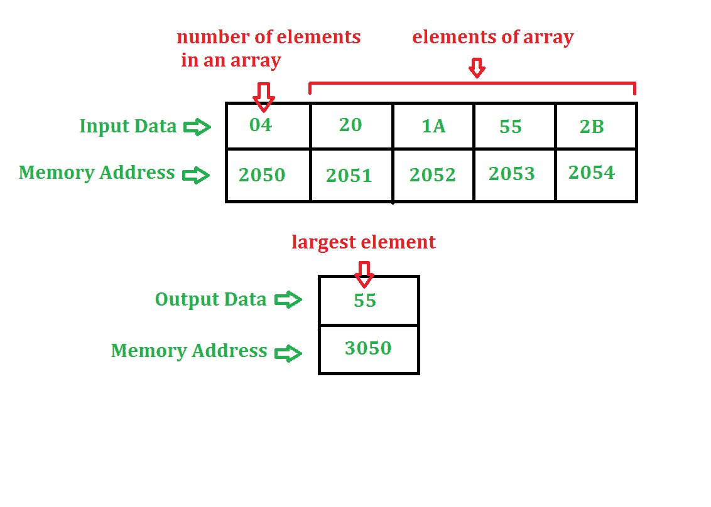

# 寻找数组中最大数的汇编语言程序

> 原文: [https://www.geeksforgeeks.org/assembly-language-program-find-largest-number-array/](https://www.geeksforgeeks.org/assembly-language-program-find-largest-number-array/)

## 问题
确定 `n` 个元素的数组中的最大数。`n` 的值存储在地址 `2050`，数组从地址 `2051` 开始。结果存储在地址 `3050`。程序的起始地址取 `2000`。

## 示例

## 算法
1.  我们正在取数组的第一个元素。
2.  将 `A` 与数组的其他元素进行比较，如果 `A` 较小，则将该元素存储在 `A` 中，否则与下一个元素进行比较。
3.  `A` 的值就是答案。

## 程序

| 存储地址 | 记忆术 | 评论 |
| --- | --- | --- |
| `2000` | `LXI H, 2050` | `H<-20, L<-50` |
| `2003` | `MOV C, M` | `C<-M` |
| `2004` | `DCR C` | `C<-C-1` |
| `2005` | `INX H` | `HL<-HL+1` |
| `2006` | `MOV A, M` | `A<-M` |
| `2007` | `INX H` | `HL<-HL+1` |
| `2008` | `CMP M` | `A-M` |
| `2009` | `JNC 200D` | 如果进位标志=`0`，转到 `200D` |
| `200C` | `MOV A, M` | `A<-M` |
| `200D` | `DCR C` | `C<-C-1` |
| `200E` | `JNZ 2007` | 如果零标志=`0`，转到 `2007` |
| `2011` | `STA 3050` | `A->3050` |
| `2014` | `HLT` |  |

## 解释
使用的寄存器: `A`, `H`, `L`, `C`

1.  `LXI H, 2050` 给 `H` 分配 `20`，给 `L` 分配 `50`。
2.  `MOV C, M` 将内存内容(由 `HL` 寄存器对指定)复制到 `C`(这用作计数器)。
3.  `DCR C` 将 `C` 的值减 `1`。
4.  `INX H` 使 `HL` 值增加 `1`。这样做是为了访问下一个存储位置。
5.  `MOV A, M` 将内存内容(由 `HL` 寄存器对指定)复制到 `A`。
6.  `INX H` 使 `HL` 值增加 `1`。这样做是为了访问下一个存储位置。
7.  `CMP M` 通过从 `A` 中减去 `M` 来比较 `A` 和 `M`。如果 `A-M` 为负，进位标志和符号标志将被设置。
8.  `JNC 200D` 如果进位标志=`0`，将程序计数器跳到 `200D`。
9.  `MOV A, M` 将内存内容(由 `HL` 寄存器对指定)复制到 `A`。
10. `DCR C` 将 `C` 的值减 `1`。
11. `JNZ 2007` 如果零标志=`0`，将程序计数器跳至 `2007`。
12. `STA 3050` 在 `3050` 存储位置存储 `A` 的值。
13. `HLT` 停止执行程序并停止任何进一步的执行。