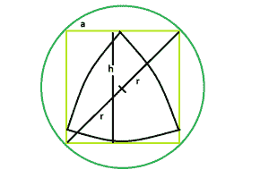

# 内接圆的正方形中最大的三角形

> 原文：[https://www.geeksforgeeks.org/biggest-reuleaux-triangle-within-a-square-which-is-inscribed-within-a-circle/](https://www.geeksforgeeks.org/biggest-reuleaux-triangle-within-a-square-which-is-inscribed-within-a-circle/)

这里给定的是一个半径为 `r` 的圆，圆上刻有一个正方形，正方形上又刻有一个三角形。任务是找到这个 reuleaux 三角形的最大可能面积。

**例:**

```
Input: r = 6
Output: 50.7434

Input: r = 11
Output: 170.554
```



### 推导过程

从图中可以很清楚的看到，如果正方形的一边是 `a` ，那么

> `a^2 = 2r`
> `a = √(2r)`

另外，在 Reuleaux 三角形中， `h = a = √2r` ，请参考[正方形内最大的 Reuleaux 三角形](https://www.geeksforgeeks.org/biggest-reuleaux-triangle-within-a-sqaure/)。
所以，Reuleaux 三角形的[面积是 `A = 0.70477 * h^2 = 0.70477 * 2 * r^2`](https://www.geeksforgeeks.org/area-of-reuleaux-triangle/)

## C++

```cpp
// C++ Program to find the biggest Reuleaux
// triangle inscribed within in a square which
// in turn is inscribed within a circle
#include <bits/stdc++.h>
using namespace std;

// Function to find the Area
// of the Reuleaux triangle
float ReuleauxArea(float r)
{

    // radius cannot be negative
    if (r < 0)
        return -1;

    // Area of the Reuleaux triangle
    float A = 0.70477 * 2 * pow(r, 2);

    return A;
}

// Driver code
int main()
{
    float r = 6;
    cout << ReuleauxArea(r) << endl;
    return 0;
}
```

## Java

```java
// Java Program to find the biggest Reuleaux
// triangle inscribed within in a square which
// in turn is inscribed within a circle
import java.util.*;

class GFG
{

// Function to find the Area
// of the Reuleaux triangle
static double ReuleauxArea(double r)
{

    // radius cannot be negative
    if (r < 0)
        return -1;

    // Area of the Reuleaux triangle
    double A = 0.70477 * 2 * Math.pow(r, 2);

    return A;
}

// Driver code
public static void main(String args[])
{
    double r = 6;
    System.out.println(ReuleauxArea(r));

}
}
// This code is contributed by
// Surendra_Gangwar
```

## Python 3

```python
# Python3 Program to find the biggest
# Reuleaux triangle inscribed within
# in a square which in turn is inscribed
# within a circle
import math as mt

# Function to find the Area
# of the Reuleaux triangle
def ReuleauxArea(r):

    # radius cannot be negative
    if (r < 0):
        return -1

    # Area of the Reuleaux triangle
    A = 0.70477 * 2 * pow(r, 2)

    return A

# Driver code
r = 6
print(ReuleauxArea(r))

# This code is contributed by
# Mohit kumar 29
```

## C#

```csharp
// C# Program to find the biggest Reuleaux
// triangle inscribed within in a square which
// in turn is inscribed within a circle
using System;

class GFG
{

// Function to find the Area
// of the Reuleaux triangle
static double ReuleauxArea(double r)
{

    // radius cannot be negative
    if (r < 0)
        return -1;

    // Area of the Reuleaux triangle
    double A = 0.70477 * 2 * Math.Pow(r, 2);

    return A;
}

// Driver code
public static void Main()
{
    double r = 6;
    Console.WriteLine(ReuleauxArea(r));
}
}

// This code is contributed by
// shs..
```

## PHP

```php
<?php
// PHP Program to find the biggest Reuleaux
// triangle inscribed within in a square
// which in turn is inscribed within a circle

// Function to find the Area of the
// Reuleaux triangle
function ReuleauxArea($r)
{

    // radius cannot be negative
    if ($r < 0)
        return -1;

    // Area of the Reuleaux triangle
    $A = 0.70477 * 2 * pow($r, 2);

    return $A;
}

// Driver code
$r = 6;
echo ReuleauxArea($r) . "\n";

// This code is contributed by ita_c
?>
```

## JavaScript

```javascript
<script>
// javascript Program to find the biggest Reuleaux
// triangle inscribed within in a square which
// in turn is inscribed within a circle

// Function to find the Area
// of the Reuleaux triangle
function ReuleauxArea(r)
{

    // radius cannot be negative
    if (r < 0)
        return -1;

    // Area of the Reuleaux triangle
    var A = 0.70477 * 2 * Math.pow(r, 2);

    return A;
}

// Driver code

var r = 6;
document.write(ReuleauxArea(r));

// This code contributed by Princi Singh
</script>
```

**Output:**

```
50.7434
```