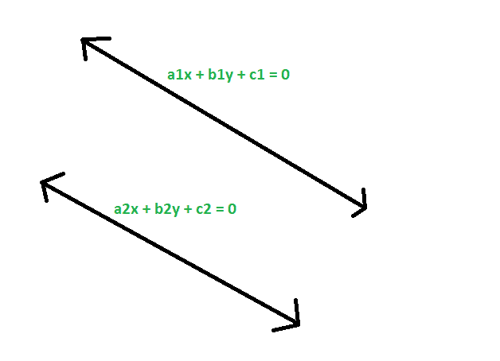
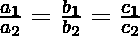

# 检查给定的两条直线是否相同

> 原文: [https://www.geeksforgeeks.org/check-if-given-two-straight-lines-are-identical-or-not/](https://www.geeksforgeeks.org/check-if-given-two-straight-lines-are-identical-or-not/)

给定两条直线，分别具有方程 `a1x + b1y + c1 = 0` 和 `a2x + b2y + c2 = 0` 的系数，任务是检查直线是否相同。

## 示例

> **输入:** `a1 = -2`，`b1 = 4`，`c1 = 3`，`a2 = -6`，`b2 = 12`，`c2 = 9`
> **输出:** 给定直线相同
>
> **输入:** `a1 = 12`，`b1 = 3`，`c1 = 8`，`a2 = 7`，`b2 = -12`，`c2 = 0`
> **输出:** 给定直线不相同



## 方法

1.  给定方程，
    `a1x + b1y + c1 = 0`
    `a2x + b2y + c2 = 0`

2.  将它们转换为斜率截距形式，我们得到
    `y = (-a1/b1)x + (-c1/b1)`
    `y = (-a2/b2)x + (-c2/b2)`

3.  现在，如果这些线是相同的，那么斜率和截距必须相等，所以，
    `-a1/b1 = -a2/b2` 或者，`a1/a2 = b1/b2`
    同样，
    `-c1/b1 = -c2/b2` 所以，`c1/c2 = b1/b2`

4.  所以，如果两条给定的直线是相同的，那么系数应该是成比例的。
    

## 代码实现

以下是上述方法的实现：

### C++

```cpp
// C++ program to check if
// given two straight lines
// are identical or not

#include <bits/stdc++.h>
using namespace std;

// Function to check if they are identical
void idstrt(double a1, double b1,
            double c1, double a2,
            double b2, double c2)
{
    if ((a1 / a2 == b1 / b2)
        && (a1 / a2 == c1 / c2)
        && (b1 / b2 == c1 / c2))
        cout << "The given straight"
             << " lines are identical"
             << endl;

    else
        cout << "The given straight"
             << " lines are not identical"
             << endl;
}

// Driver Code
int main()
{
    double a1 = -2, b1 = 4,
           c1 = 3, a2 = -6,
           b2 = 12, c2 = 9;
    idstrt(a1, b1, c1, a2, b2, c2);
    return 0;
}
```

### Java

```java
// Java program to check if
// given two straight lines
// are identical or not
class GFG
{

// Function to check if they are identical
static void idstrt(double a1, double b1,
                    double c1, double a2,
                    double b2, double c2)
{
    if ((a1 / a2 == b1 / b2)
        && (a1 / a2 == c1 / c2)
        && (b1 / b2 == c1 / c2))
        System.out.println( "The given straight"
        +" lines are identical");

    else
        System.out.println("The given straight"
            + " lines are not identical");
}

// Driver Code
public static void main(String[] args)
{
    double a1 = -2, b1 = 4,
            c1 = 3, a2 = -6,
            b2 = 12, c2 = 9;
    idstrt(a1, b1, c1, a2, b2, c2);
}
}

// This code has been contributed by 29AjayKumar
```

### Python 3

```python
# Python3 program to check if
# given two straight lines
# are identical or not

# Function to check if they are identical
def idstrt(a1, b1, c1, a2, b2, c2):
    if ((a1 // a2 == b1 // b2) and
        (a1 // a2 == c1 // c2) and
        (b1 // b2 == c1 // c2)):
        print("The given straight lines",
                     "are identical");
    else:
        print("The given straight lines",
                     "are not identical");

# Driver Code
a1, b1 = -2, 4
c1, a2 = 3,-6
b2, c2 = 12,9
idstrt(a1, b1, c1, a2, b2, c2)

# This code is contributed
# by mohit kumar
```

### C#

```csharp
// C# program to check if
// given two straight lines
// are identical or not
using System;

class GFG
{

// Function to check if they are identical
static void idstrt(double a1, double b1,
                    double c1, double a2,
                    double b2, double c2)
{
    if ((a1 / a2 == b1 / b2)
        && (a1 / a2 == c1 / c2)
        && (b1 / b2 == c1 / c2))
        Console.WriteLine( "The given straight"
        +" lines are identical");

    else
        Console.WriteLine("The given straight"
            + " lines are not identical");
}

// Driver Code
public static void Main(String[] args)
{
    double a1 = -2, b1 = 4,
            c1 = 3, a2 = -6,
            b2 = 12, c2 = 9;
    idstrt(a1, b1, c1, a2, b2, c2);
}
}

// This code contributed by Rajput-Ji
```

### PHP

```php
<?php

// PHP program to check if
// given two straight lines
// are identical or not

// Function to check if they are identical
function idstrt($a1, $b1,
            $c1, $a2,
            $b2, $c2)
{
    if (($a1 / $a2 == $b1 / $b2)
        && ($a1 / $a2 == $c1 / $c2)
        && ($b1 / $b2 == $c1 / $c2))
        echo "The given straight lines are identical","\n";

    else
        echo "The given straight lines are not identical","\n";
}

    // Driver Code
    $a1 = -2; $b1 = 4;
    $c1 = 3; $a2 = -6;
    $b2 = 12; $c2 = 9;
    idstrt($a1, $b1, $c1, $a2, $b2, $c2);

    // This code is contributed by Ryuga

?>
```

### JavaScript

```javascript
<script>

// javascript program to check if
// given two straight lines
// are identical or not

// Function to check if they are identical
function idstrt(a1 , b1,
                    c1 , a2,
                    b2 , c2)
{
    if ((a1 / a2 == b1 / b2)
        && (a1 / a2 == c1 / c2)
        && (b1 / b2 == c1 / c2))
        document.write( "The given straight"
        +" lines are identical");

    else
        document.write("The given straight"
            + " lines are not identical");
}

// Driver Code

var a1 = -2, b1 = 4,
        c1 = 3, a2 = -6,
        b2 = 12, c2 = 9;
idstrt(a1, b1, c1, a2, b2, c2);

// This code contributed by Princi Singh

</script>
```

## 输出

```
The given straight lines are identical
```