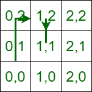

# 检查是否可以通过在相邻的四个方向上移动来在给定的时间内移动所有的点

> 原文: [https://www.geeksforgeeks.org/check-if-it-is-possible-to-travel-all-points-in-given-time-by-moving-in-adjacent-four-directions/](https://www.geeksforgeeks.org/check-if-it-is-possible-to-travel-all-points-in-given-time-by-moving-in-adjacent-four-directions/)

## 问题描述

给定 3 个[数组](https://www.geeksforgeeks.org/array-data-structure/) `X[]`，`Y[]` 和 `T[]`，所有大小均为 `N`。其中 `X[i]` 和 `Y[i]` 代表第 `i` 个坐标，`T[i]` 代表以秒为单位的时间。需要判断是否有可能从起始坐标 `(0, 0)` 出发，在时间 `T[i]` 内到达所有坐标 `(X[i], Y[i])`。指针可以在四个方向上移动：`(x+1, y)`，`(x-1, y)`，`(x, y+1)` 和 `(x, y-1)`。从一个坐标移动到相邻坐标需要 `1` 秒，不能停留在原地。

**示例 1:**

> **输入:** `N = 2`，`X[] = {1, 1}`，`Y[] = {2, 1}`，`T[] = {3, 6}`
> **输出:** 是
> **说明:** 假设 2D 矩阵:
> 
> 在上面的矩阵中，每个点被定义为 `x` 和 `y` 坐标。可以在 3 秒内从 `(0, 0) -> (0, 1) -> (1, 1) -> (1, 2)` 到达第一个点，然后在第 6 秒从 `(1, 2) -> (1, 1) -> (1, 0) -> (1, 1)` 到达第二个点。所以，是的，有可能在给定的时间内到达所有的坐标。

**示例 2:**

> **输入:** `N = 1`，`X[] = {100}`，`Y[] = {100}`，`T[] = {2}`
> **输出:** 否
> **说明:** 从坐标 `(0, 0)` 不可能在 `2` 秒内到达坐标 `(100, 100)`。

## 方法

解决这个问题的思路是基于从第 `i` 点移动到第 `(i+1)` 点需要 `abs(X[i+1]–X[i]) + abs(Y[i+1]–Y[i])` 时间。在第一点的情况下，前一点是 `(0, 0)`。所以，如果这个时间小于等于 `T[i]` 就可以了，否则就违反了条件。按照以下步骤解决问题:

1.  创建三个变量 `currentX`、`currentY`、`currentTime` 并初始化为零。
2.  创建布尔变量 `IsPossible` 并初始化为真。
3.  使用变量 `i` 迭代范围 `[0, N)`，并执行以下任务:
    *   如果 `abs(X[i]–currentX) + abs(Y[i]–currentY)` 大于 `(T[i]–currentTime)`，则使 `IsPossible` 为假。
    *   否则，如果 `(abs(X[i]–currentX) + abs(Y[i]–currentY)) % 2` 不等于 `(T[i]–currentTime) % 2`，则使 `IsPossible` 为假。
    *   否则，将 `currentX`、`currentY` 和 `currentTime` 的值分别更新为 `X[i]`、`Y[i]` 和 `T[i]`。
4.  执行上述步骤后，返回 `IsPossible` 的值作为答案。

## 代码实现

下面是上述方法的实现。

### C++

```cpp
// C++ program for the above approach
#include <bits/stdc++.h>
using namespace std;

// Function to check if it is possible
// to traverse all the points.
bool CheckItisPossible(int X[], int Y[],
                       int T[], int N)
{

    // Make 3 variables to store given
    // ith values
    int currentX = 0, currentY = 0,
        currentTime = 0;

    // Also, make a bool variable to
    // check it is possible
    bool IsPossible = true;

    // Now, iterate on all the coordinates
    for (int i = 0; i < N; i++) {

        // check first condition
        if ((abs(X[i] - currentX)
             + abs(Y[i] - currentY))
            > (T[i] - currentTime)) {
            // means thats not possible to
            // reach current coordinate
            // at Ithtime from previous coordinate
            IsPossible = false;
            break;
        }
        else if (((abs(X[i] - currentX)
                   + abs(Y[i] - currentY))
                  % 2)
                 > ((T[i] - currentTime) % 2)) {
            // means thats not possible to
            // reach current coordinate
            // at Ithtime from previous coordinate
            IsPossible = false;
            break;
        }
        else {
            // If both above conditions are false
            // then we change the values of current
            // coordinates
            currentX = X[i];
            currentY = Y[i];
            currentTime = T[i];
        }
    }

    return IsPossible;
}

// Driver Code
int main()
{
    int X[] = { 1, 1 };
    int Y[] = { 2, 1 };
    int T[] = { 3, 6 };
    int N = sizeof(X[0]) / sizeof(int);
    bool ans = CheckItisPossible(X, Y, T, N);

    if (ans == true) {
        cout << "Yes"
             << "\n";
    }
    else {
        cout << "No"
             << "\n";
    }
    return 0;
}
```

### Java

```java
// Java program for the above approach
public class GFG {

    // Function to check if it is possible
    // to traverse all the points.
    static boolean CheckItisPossible(int X[], int Y[],
                        int T[], int N)
    {

        // Make 3 variables to store given
        // ith values
        int currentX = 0, currentY = 0,
            currentTime = 0;

        // Also, make a bool variable to
        // check it is possible
        boolean IsPossible = true;

        // Now, iterate on all the coordinates
        for (int i = 0; i < N; i++) {

            // check first condition
            if ((Math.abs(X[i] - currentX) +
                 Math.abs(Y[i] - currentY)) > (T[i] - currentTime)) {

                // means thats not possible to
                // reach current coordinate
                // at Ithtime from previous coordinate
                IsPossible = false;
                break;
            }
            else if (((Math.abs(X[i] - currentX) +
                       Math.abs(Y[i] - currentY)) % 2) > ((T[i] - currentTime) % 2)) {
                // means thats not possible to
                // reach current coordinate
                // at Ithtime from previous coordinate
                IsPossible = false;
                break;
            }
            else {
                // If both above conditions are false
                // then we change the values of current
                // coordinates
                currentX = X[i];
                currentY = Y[i];
                currentTime = T[i];
            }
        }

        return IsPossible;
    }

    // Driver Code
    public static void main(String[] args)
    {
        int X[] = { 1, 1 };
        int Y[] = { 2, 1 };
        int T[] = { 3, 6 };
        int N = X.length;
        boolean ans = CheckItisPossible(X, Y, T, N);

        if (ans == true) {
            System.out.println("Yes");
        }
        else {
            System.out.println("No");
        }
    }
}

// This code is contributed by AnkThon
```

### Python 3

```python
# python program for the above approach

# Function to check if it is possible
# to traverse all the points.
def CheckItisPossible(X, Y, T, N):

        # Make 3 variables to store given
        # ith values
    currentX = 0
    currentY = 0
    currentTime = 0

    # Also, make a bool variable to
    # check it is possible
    IsPossible = True

    # Now, iterate on all the coordinates
    for i in range(0, N):

                # check first condition
        if ((abs(X[i] - currentX)
             + abs(Y[i] - currentY))
                > (T[i] - currentTime)):
             # means thats not possible to
             # reach current coordinate
             # at Ithtime from previous coordinate
            IsPossible = False
            break

        elif (((abs(X[i] - currentX)
                + abs(Y[i] - currentY))
               % 2)
              > ((T[i] - currentTime) % 2)):
            # means thats not possible to
            # reach current coordinate
            # at Ithtime from previous coordinate
            IsPossible = False
            break

        else:
           # If both above conditions are false
           # then we change the values of current
           # coordinates
            currentX = X[i]
            currentY = Y[i]
            currentTime = T[i]

    return IsPossible

# Driver Code
if __name__ == "__main__":

    X = [1, 1]
    Y = [2, 1]
    T = [3, 6]
    N = len(X)
    ans = CheckItisPossible(X, Y, T, N)

    if (ans == True):
        print("Yes")
    else:
        print("No")

    # This code is contributed by rakeshsahni
```

## C#

```csharp
// C# program for the above approach
using System;

class GFG {

    // Function to check if it is possible
    // to traverse all the points.
    static bool CheckItisPossible(int []X, int []Y,
                        int []T, int N)
    {

        // Make 3 variables to store given
        // ith values
        int currentX = 0, currentY = 0,
            currentTime = 0;

        // Also, make a bool variable to
        // check it is possible
        bool IsPossible = true;

        // Now, iterate on all the coordinates
        for (int i = 0; i < N; i++) {

            // check first condition
            if ((Math.Abs(X[i] - currentX) +
                 Math.Abs(Y[i] - currentY)) > (T[i] - currentTime)) {

                // means thats not possible to
                // reach current coordinate
                // at Ithtime from previous coordinate
                IsPossible = false;
                break;
            }
            else if (((Math.Abs(X[i] - currentX) +
                       Math.Abs(Y[i] - currentY)) % 2) > ((T[i] - currentTime) % 2)) {
                // means thats not possible to
                // reach current coordinate
                // at Ithtime from previous coordinate
                IsPossible = false;
                break;
            }
            else {
                // If both above conditions are false
                // then we change the values of current
                // coordinates
                currentX = X[i];
                currentY = Y[i];
                currentTime = T[i];
            }
        }

        return IsPossible;
    }

    // Driver Code
    public static void Main()
    {
        int []X = { 1, 1 };
        int []Y = { 2, 1 };
        int []T = { 3, 6 };
        int N = X.Length;
        bool ans = CheckItisPossible(X, Y, T, N);

        if (ans == true) {
            Console.Write("Yes");
        }
        else {
            Console.Write("No");
        }
    }
}

// This code is contributed by Samim Hossain Mondal.
```

## JavaScript

```javascript
<script>
// Javascript program for the above approach

// Function to check if it is possible
// to traverse all the points.
function CheckItisPossible(X, Y, T, N)
{

    // Make 3 variables to store given
    // ith values
    let currentX = 0, currentY = 0,
        currentTime = 0;

    // Also, make a bool variable to
    // check it is possible
    let IsPossible = true;

    // Now, iterate on all the coordinates
    for (let i = 0; i < N; i++) {

        // check first condition
        if ((Math.abs(X[i] - currentX)
             + Math.abs(Y[i] - currentY))
            > (T[i] - currentTime)) {
            // means thats not possible to
            // reach current coordinate
            // at Ithtime from previous coordinate
            IsPossible = false;
            break;
        }
        else if (((Math.abs(X[i] - currentX)
                   + Math.abs(Y[i] - currentY))
                  % 2)
                  > ((T[i] - currentTime) % 2)) {
            // means thats not possible to
            // reach current coordinate
            // at Ithtime from previous coordinate
            IsPossible = false;
            break;
        }
        else {
            // If both above conditions are false
            // then we change the values of current
            // coordinates
            currentX = X[i];
            currentY = Y[i];
            currentTime = T[i];
        }
    }

    return IsPossible;
}

// Driver Code
let X = [ 1, 1 ];
let Y = [ 2, 1 ];
let T = [ 3, 6 ];
let N = X.length;
let ans = CheckItisPossible(X, Y, T, N);

if (ans == true) {
    document.write("Yes" + "\n");
}
else {
    document.write("No" + "\n");
}

// This code is contributed by Samim Hossain Mondal.
</script>
```

## Output

```
Yes
```

时间复杂度: `O(N)`
辅助空间: `O(1)`