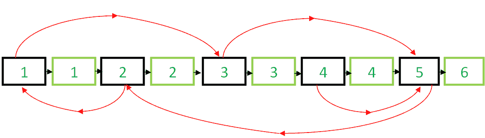
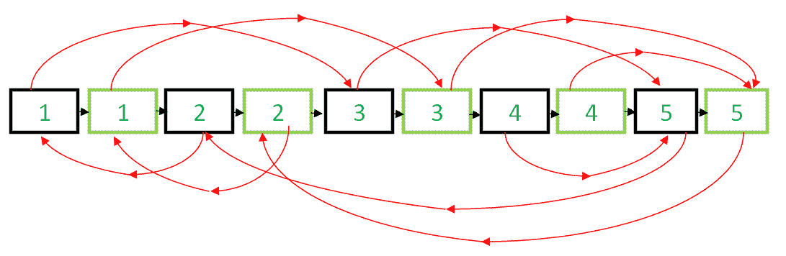
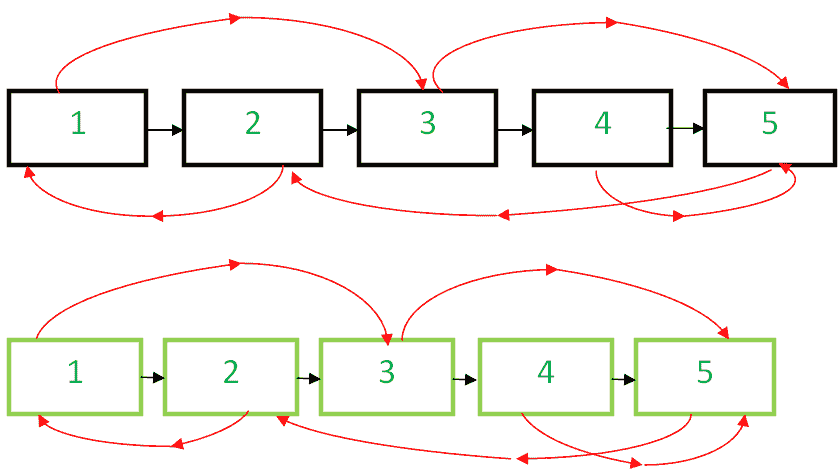

# 使用`O(1)`空间克隆带有下一个指针和随机指针的链表

> 原文：[https://www.geeksforgeeks.org/clone-linked-list-next-random-pointer-o1-space/](https://www.geeksforgeeks.org/clone-linked-list-next-random-pointer-o1-space/)

给定一个链表，每个节点中都有两个指针。第一个指针指向列表的下一个节点，但是，另一个指针是随机的，可以指向列表的任何节点。编写一个在`O(1)`空间中克隆给定列表的程序，即没有任何额外空间。

**示例**：

```
Input : Head of the below-linked list

Output :
A new linked list identical to the original list.
```

在先前的文章[系列 1](https://www.geeksforgeeks.org/a-linked-list-with-next-and-arbit-pointer/) 和[系列 2](https://www.geeksforgeeks.org/clone-linked-list-next-arbit-pointer-set-2/) 中，讨论了各种方法，并且`O(n)`空间复杂度实现也可用。

在本文中，我们将实现一种算法，该算法不需要系列 1 中讨论的额外空间。

下面是算法：

*   创建节点 1 的副本并将其插入原始链表中的节点 1 和节点 2 之间，创建 2 的副本并将其插入 2 和 3 之间。以这种方式继续，在第`N`个节点之后添加`N`的副本



*   现在以这种方式复制随机链接：

    ```
    original->next->random= original->random->next;  /*TRAVERSE TWO NODES*/
    ```

    这是有效的，因为`original->next`只是原始副本，而`Original->random->next`只是随机副本。



*   现在，以这种方式在单个循环中还原原始链表和复制链表。

    ```
    original->next = original->next->next;
    copy->next = copy->next->next;
    ```

*   确保`original->next`为`NULL`并返回克隆列表



下面是实现。

## C++

```cpp
// C++ program to clone a linked list with next 
// and arbit pointers in O(n) time 
#include <bits/stdc++.h> 
using namespace std; 

// Structure of linked list Node 
struct Node 
{ 
    int data; 
    Node *next,*random; 
    Node(int x) 
    { 
        data = x; 
        next = random = NULL; 
    } 
}; 

// Utility function to print the list. 
void print(Node *start) 
{ 
    Node *ptr = start; 
    while (ptr) 
    { 
        cout << "Data = " << ptr->data << ", Random  = "
             << ptr->random->data << endl; 
        ptr = ptr->next; 
    } 
} 

// This function clones a given linked list 
// in O(1) space 
Node* clone(Node *start) 
{ 
    Node* curr = start, *temp; 

    // insert additional node after 
    // every node of original list 
    while (curr) 
    { 
        temp = curr->next; 

        // Inserting node 
        curr->next = new Node(curr->data); 
        curr->next->next = temp; 
        curr = temp; 
    } 

    curr = start; 

    // adjust the random pointers of the 
    // newly added nodes 
    while (curr) 
    { 
        if(curr->next) 
            curr->next->random = curr->random ? 
                                 curr->random->next : curr->random; 

        // move to the next newly added node by 
        // skipping an original node 
        curr = curr->next?curr->next->next:curr->next; 
    } 

    Node* original = start, *copy = start->next; 

    // save the start of copied linked list 
    temp = copy; 

    // now separate the original list and copied list 
    while (original && copy) 
    { 
        original->next = 
         original->next? original->next->next : original->next; 

        copy->next = copy->next?copy->next->next:copy->next; 
        original = original->next; 
        copy = copy->next; 
    } 

    return temp; 
} 

// Driver code 
int main() 
{ 
    Node* start = new Node(1); 
    start->next = new Node(2); 
    start->next->next = new Node(3); 
    start->next->next->next = new Node(4); 
    start->next->next->next->next = new Node(5); 

    // 1's random points to 3 
    start->random = start->next->next; 

    // 2's random points to 1 
    start->next->random = start; 

    // 3's and 4's random points to 5 
    start->next->next->random = 
                    start->next->next->next->next; 
    start->next->next->next->random = 
                    start->next->next->next->next; 

    // 5's random points to 2 
    start->next->next->next->next->random = 
                              start->next; 

    cout << "Original list : \n"; 
    print(start); 

    cout << "\nCloned list : \n"; 
    Node *cloned_list = clone(start); 
    print(cloned_list); 

    return 0; 
}
```

## Java

```java
// Java program to clone a linked list with next 
// and arbit pointers in O(n) time 
class GfG 
{ 

// Structure of linked list Node 
static class Node 
{ 
    int data; 
    Node next,random; 
    Node(int x) 
    { 
        data = x; 
        next = random = null; 
    } 
} 

// Utility function to print the list. 
static void print(Node start) 
{ 
    Node ptr = start; 
    while (ptr != null) 
    { 
        System.out.println("Data = " + ptr.data + 
                    ", Random = "+ptr.random.data); 
        ptr = ptr.next; 
    } 
} 

// This function clones a given 
// linked list in O(1) space 
static Node clone(Node start) 
{ 
    Node curr = start, temp = null; 

    // insert additional node after 
    // every node of original list 
    while (curr != null) 
    { 
        temp = curr.next; 

        // Inserting node 
        curr.next = new Node(curr.data); 
        curr.next.next = temp; 
        curr = temp; 
    } 
    curr = start; 

    // adjust the random pointers of the 
    // newly added nodes 
    while (curr != null) 
    { 
        if(curr.next != null) 
            curr.next.random = (curr.random != null) 
                      ? curr.random.next : curr.random; 

        // move to the next newly added node by 
        // skipping an original node 
        curr = (curr.next != null) ? curr.next.next 
                                    : curr.next; 
    } 

    Node original = start, copy = start.next; 

    // save the start of copied linked list 
    temp = copy; 

    // now separate the original list and copied list 
    while (original != null && copy != null) 
    { 
        original.next = (original.next != null)? 
                    original.next.next : original.next; 

        copy.next = (copy.next != null) ? copy.next.next 
                                        : copy.next; 
        original = original.next; 
        copy = copy.next; 
    } 
    return temp; 
} 

// Driver code 
public static void main(String[] args) 
{ 
    Node start = new Node(1); 
    start.next = new Node(2); 
    start.next.next = new Node(3); 
    start.next.next.next = new Node(4); 
    start.next.next.next.next = new Node(5); 

    // 1's random points to 3 
    start.random = start.next.next; 

    // 2's random points to 1 
    start.next.random = start; 

    // 3's and 4's random points to 5 
    start.next.next.random = start.next.next.next.next; 
    start.next.next.next.random = start.next.next.next.next; 

    // 5's random points to 2 
    start.next.next.next.next.random = start.next; 

    System.out.println("Original list : "); 
    print(start); 

    System.out.println("Cloned list : "); 
    Node cloned_list = clone(start); 
    print(cloned_list); 

} 
} 

// This code is contributed by Prerna Saini.
```

## C#

```cs
// C# program to clone a linked list with 
// next and arbit pointers in O(n) time 
using System;

class GFG
{
    // Structure of linked list Node
    class Node
    {
        public int data;
        public Node next, random;
        public Node(int x)
        {
            data = x;
            next = random = null;
        }
    }

    // Utility function to print the list.
    static void print(Node start)
    {
        Node ptr = start;
        while (ptr != null)
        {
            Console.WriteLine("Data = " + ptr.data +
                              ", Random = " +
                              ptr.random.data);
            ptr = ptr.next;
        }
    }

    // This function clones a given
    // linked list in O(1) space
    static Node clone(Node start)
    {
        Node curr = start, temp = null;

        // insert additional node after
        // every node of original list
        while (curr != null)
        {
            temp = curr.next;

            // Inserting node
            curr.next = new Node(curr.data);
            curr.next.next = temp;
            curr = temp;
        }
        curr = start;

        // adjust the random pointers of
        // the newly added nodes
        while (curr != null)
        {
            if (curr.next != null)
                curr.next.random = (curr.random != null)
                        ? curr.random.next : curr.random;

            // move to the next newly added node
            // by skipping an original node
            curr = (curr.next != null) ? curr.next.next
                                        : curr.next;
        }

        Node original = start, copy = start.next;

        // save the start of copied linked list
        temp = copy;

        // now separate the original list
        // and copied list
        while (original != null && copy != null)
        {
            original.next = (original.next != null) ?
                        original.next.next : original.next;

            copy.next = (copy.next != null) ? copy.next.next
                                             : copy.next;
            original = original.next;
            copy = copy.next;
        }
        return temp;
    }

    // Driver code
    public static void Main(String[] args)
    {
        Node start = new Node(1);
        start.next = new Node(2);
        start.next.next = new Node(3);
        start.next.next.next = new Node(4);
        start.next.next.next.next = new Node(5);

        // 1's random points to 3
        start.random = start.next.next;

        // 2's random points to 1
        start.next.random = start;

        // 3's and 4's random points to 5
        start.next.next.random = start.next.next.next.next;
        start.next.next.next.random = start.next.next.next.next;

        // 5's random points to 2
        start.next.next.next.next.random = start.next;

        Console.WriteLine("Original list : ");
        print(start);

        Console.WriteLine("Cloned list : ");
        Node cloned_list = clone(start);
        print(cloned_list);
    }
}

// This code has been contributed
// by Rajput-Ji
```

## Python

```py
'''Python program to clone a linked list with next and arbitrary pointers'''
'''Done in O(n) time with O(1) extra space'''

class Node:
    '''Structure of linked list node'''

    def __init__(self, data):
        self.data = data
        self.next = None
        self.random = None

def clone(original_root):
    '''Clone a doubly linked list with random pointer'''
    '''with O(1) extra space'''

    '''Insert additional node after every node of original list'''
    curr = original_root
    while curr != None:
        new = Node(curr.data)
        new.next = curr.next
        curr.next = new
        curr = curr.next.next

    '''Adjust the random pointers of the newly added nodes'''
    curr = original_root
    while curr != None:
        curr.next.random = curr.random.next
        curr = curr.next.next

    '''Detach original and duplicate list from each other'''
    curr = original_root
    dup_root = original_root.next
    while curr.next != None:
        tmp = curr.next
        curr.next = curr.next.next
        curr = tmp

    return dup_root

def print_dlist(root):
    '''Function to print the doubly linked list'''

    curr = root
    while curr != None:
        print('Data =', curr.data, ', Random =', curr.random.data)
        curr = curr.next

####### Driver code #######
'''Create a doubly linked list'''
original_list = Node(1)
original_list.next = Node(2)
original_list.next.next = Node(3)
original_list.next.next.next = Node(4)
original_list.next.next.next.next = Node(5)

'''Set the random pointers'''

# 1's random points to 3
original_list.random = original_list.next.next

# 2's random points to 1
original_list.next.random = original_list

# 3's random points to 5
original_list.next.next.random = original_list.next.next.next.next

# 4's random points to 5
original_list.next.next.next.random = original_list.next.next.next.next

# 5's random points to 2
original_list.next.next.next.next.random = original_list.next

'''Print the original linked list'''
print('Original list:')
print_dlist(original_list)

'''Create a duplicate linked list'''
cloned_list = clone(original_list)

'''Print the duplicate linked list'''
print('\nCloned list:')
print_dlist(cloned_list)

'''This code is contributed by Shashank Singh'''
```

**输出**：

```
Original list : 
Data = 1, Random  = 3
Data = 2, Random  = 1
Data = 3, Random  = 5
Data = 4, Random  = 5
Data = 5, Random  = 2

Cloned list : 
Data = 1, Random  = 3
Data = 2, Random  = 1
Data = 3, Random  = 5
Data = 4, Random  = 5
Data = 5, Random  = 2
```

This article is contributed by [**Ashutosh Kumar**](https://in.linkedin.com/in/ashutosh-kumar-9527a7105) 😀 If you like GeeksforGeeks and would like to contribute, you can also write an article using [contribute.geeksforgeeks.org](http://www.contribute.geeksforgeeks.org) or mail your article to contribute@geeksforgeeks.org. See your article appearing on the GeeksforGeeks main page and help other Geeks.

如果发现任何不正确的地方，或者您想分享有关上述主题的更多信息，请发表评论。