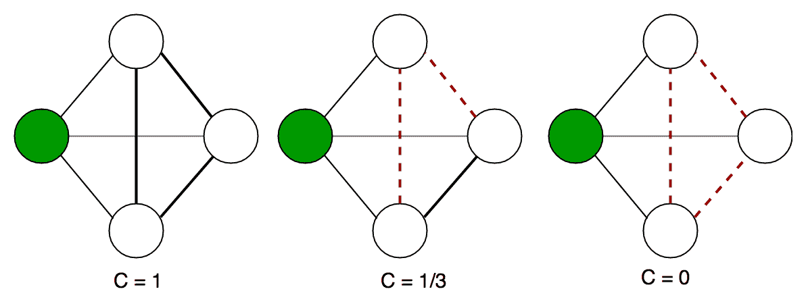

# 图论中的聚类系数

> 原文: [https://www.geeksforgeeks.org/clustering-coefficient-graph-theory/](https://www.geeksforgeeks.org/clustering-coefficient-graph-theory/)

在图论中，聚类系数是对图中节点倾向于聚集在一起的程度的度量。证据表明，在大多数现实世界的网络中，特别是在社交网络中，节点倾向于创建紧密结合的群体，其特征是联系密度相对较高；这种可能性往往大于两个节点之间随机建立的平局的平均概率（Holland 和 Leinhardt，1971；瓦茨和斯特罗加兹，1998）。

这项措施有两个版本：全球和地方。全局版本旨在给出网络中集群的总体指示，而本地版本给出单个节点的嵌入性指示。

## 全局聚类系数

全局聚类系数基于三个节点。三元组由三个相连的节点组成。因此，一个三角形包括三个封闭的三元组，每个三元组以每个节点为中心（注意，这意味着三角形中的三个三元组来自节点的重叠选择）。全局聚类系数是封闭三元组（或 `3 x` 个三角形）的数量占三元组总数（开放和封闭）的比例。卢斯和佩里（1949 年）首次尝试测量它。该度量给出了整个网络（全局）中聚类的指示，并且可以应用于无向和有向网络。

## 局部聚类系数

图 `G=(V,E)` 形式上由一组顶点 `V` 和它们之间的一组边 `E` 组成。一条边 `e_{ij}` 连接顶点 `v_{i}` 和顶点 `v_{j}`。

顶点 `v_{i}` 的邻域 `N_{i}` 定义为其直接相连的邻域，如下所示：

`N_i = \{v_j : e_{ij} \in E \or e_{ji} \in E\}`。

我们将 `k_{i}` 定义为一个顶点的邻域 `N_{i}` 中的顶点数 `|N_{i}|`。

然后，顶点 `v_{i}` 的局部聚类系数 `C_{i}` 由邻域内顶点之间的链接比例除以它们之间可能存在的链接数量给出。对于有向图来说，`e_{ij}` 不同于 `e_{{ji}}`，因此对于每个邻域 `N_{i}`，邻域内的顶点之间可能存在 `k_{i}(k_{i}-1)` 个链接（`k_{i}` 是一个顶点的邻域数）。因此，有向图的局部聚类系数由[2]给出

`C_{i}={\frac  {|\{e_{{jk}}:v_{j},v_{k}\in N_{i},e_{{jk}}\in E\}|}{k_{i}(k_{i}-1)}}`。
无向图具有 `e_{ij}` 和 `e_{{ji}}` 被认为相同的性质。因此，如果一个顶点 `v_{i}` 有 `k_{i}` 个邻居，`{\frac  {k_{i}(k_{i}-1)}{2}}` 条边可能存在于邻居的顶点之间。因此，无向图的局部聚类系数可以定义为

`C_{i}={\frac  {2|\{e_{{jk}}:v_{j},v_{k}\in N_{i},e_{{jk}}\in E\}|}{k_{i}(k_{i}-1)}}`。
设 `\lambda _{G}(v)` 为无向图 `G` 的 `v\in V(G)` 上的三角形个数，即 `\lambda _{G}(v)` 为 `G` 的 3 边 3 顶点的子图个数，其中一个为 `v`，设 `\tau _{G}(v)` 为 `v\in G` 上的三元组个数。也就是说，`\tau _{G}(v)` 是具有 2 条边和 3 个顶点的子图（不一定是诱导的）的数量，其中一个是 `v`，并且使得 `v` 入射到两条边。那么我们也可以将聚类系数定义为
略
`C_{i}={\frac  {\lambda _{G}(v)}{\tau _{G}(v)}}`。
很容易表明前面两个定义是相同的，因为

`\tau _{G}(v)=C({k_{i}},2)={\frac  {1}{2}}k_{i}(k_{i}-1)`。
如果连接到 `v_{i}` 的每个邻居也连接到邻域内的每个其他顶点，则这些度量为 1；如果没有连接到 `v_{i}` 的顶点连接到任何其他连接到 `v_{i}` 的顶点，则这些度量为 0。



无向图上的局部聚类系数示例。绿色节点的局部聚类系数被计算为其相邻节点之间的连接比例。

下面是在图中实现上述聚类系数的代码。它是 `networkx` 库的一部分，可以使用它直接访问。

```python
def average_clustering(G, trials=1000):
    """Estimates the average clustering coefficient of G.

    The local clustering of each node in `G` is the 
    fraction of triangles that actually exist over 
    all possible triangles in its neighborhood.
    The average clustering coefficient of a graph 
    `G` is the mean of local clusterings.

    This function finds an approximate average 
    clustering coefficient for G by repeating `n` 
    times (defined in `trials`) the following
    experiment: choose a node at random, choose 
    two of its neighbors at random, and check if
    they are connected. The approximate coefficient 
    is the fraction of triangles found over the 
    number of trials [1]_.

    Parameters
    ----------
    G : NetworkX graph

    trials : integer
        Number of trials to perform (default 1000).

    Returns
    -------
    c : float
        Approximated average clustering coefficient.

    """
    n = len(G)
    triangles = 0
    nodes = G.nodes()
    for i in [int(random.random() * n) for i in range(trials)]:
        nbrs = list(G[nodes[i]])
        if len(nbrs) < 2:
            continue
        u, v = random.sample(nbrs, 2)
        if u in G[v]:
            triangles += 1
    return triangles / float(trials)
```

注意：以上代码对无向网络有效，对有向网络无效。
下面的代码已经在 `IDLE`（Windows 的 Python IDE）上运行。在运行此代码之前，您需要下载 `networkx` 库。大括号内的部分表示输出。它几乎与 `Ipython`（针对 Ubuntu 用户）相似。

```python
>>> import networkx as nx
>>> G=nx.erdos_renyi_graph(10,0.4)
>>> cc=nx.average_clustering(G)
>>> cc
#Output of Global CC
0.08333333333333333 
>>> c=nx.clustering(G)
>>> c 
# Output of local CC
{0: 0.0, 1: 0.3333333333333333, 2: 0.0, 3: 0.0, 4: 0.0, 5: 0.0, 6: 0.0,
 7: 0.3333333333333333, 8: 0.0, 9: 0.16666666666666666} 
```

以上两个值给出了网络的全局聚类系数和网络的局部聚类系数。

接下来，我们将讨论任何给定网络的另一个中心性度量。

## 参考文献
你可以在以下网址找到更多信息：

*   [https://en.wikipedia.org/wiki/Clustering_coefficient](https://en.wikipedia.org/wiki/Clustering_coefficient)
*   [http://networkx.readthedocs.io/en/networkx-1.10/index.html](http://networkx.readthedocs.io/en/networkx-1.10/index.html)

本文由 **[贾扬特](https://in.linkedin.com/in/jayant-bisht-978085114)** 供稿。如果你喜欢 GeeksforGeeks 并想投稿，你也可以使用 [contribute.geeksforgeeks.org](http://www.contribute.geeksforgeeks.org) 写一篇文章或者把你的文章邮寄到 `contribute@geeksforgeeks.org`。看到你的文章出现在极客博客主页上，帮助其他极客。

如果你发现任何不正确的地方，或者你想分享更多关于上面讨论的话题的信息，请写评论。