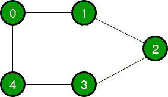
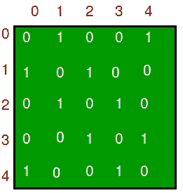
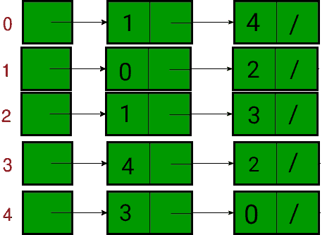

# 图的邻接表和邻接矩阵表示的比较

> 原文：[https://www.geeksforgeeks.org/comparison-between-adjacency-list-and-adjacency-matrix-representation-of-graph/](https://www.geeksforgeeks.org/comparison-between-adjacency-list-and-adjacency-matrix-representation-of-graph/)

一个[图](https://www.geeksforgeeks.org/graph-data-structure-and-algorithms/)是由节点和边组成的非线性数据结构。节点有时也称为顶点，边是连接图中任意两个节点的直线或圆弧。在本文中，我们将了解图形表示方式之间的区别。

一个图形主要可以用两种方式来表示。他们是：

1.  **邻接表**：邻接表是由所有[链表](https://www.geeksforgeeks.org/data-structures/linked-list/)的地址组成的数组。链接列表的第一个节点代表顶点，连接到该节点的其余列表代表该节点所连接的顶点。这种表示也可以用来表示加权图。链表可以稍微改变，甚至可以存储边的权重。
2.  **邻接矩阵**：邻接矩阵是一个大小为 `V x V` 的 [2D 数组](https://www.geeksforgeeks.org/multidimensional-arrays-in-java/)，其中 `V` 是图中的顶点数。设 2D 数组为 `adj[][]`，槽 `adj[i][j] = 1` 表示从顶点 `i` 到顶点 `j` 有一条边，无向图的邻接矩阵总是对称的。邻接矩阵也用于表示加权图。如果 `adj[i][j] = w`，那么从顶点 `i` 到顶点 `j` 有一条边，权重为 `w`。

让我们考虑一个图来理解邻接表和邻接矩阵表示。设无向图为：

下面的图在上面的表示中表示为：

## 邻接矩阵

在邻接矩阵表示中，一个图以二维数组的形式表示。数组的大小是 `V x V`，其中 `V` 是顶点的集合。下图展示了邻接矩阵表示：

## 邻接表

在邻接表表示中，一个图被表示为一个链表数组。数组的索引代表一个顶点，其链表中的每个元素代表与该顶点形成一条边的顶点。下图展示了邻接列表表示：

下表描述了邻接矩阵和邻接表的区别：

| 操作 | 邻接矩阵 | 邻接表 |
| --- | --- | --- |
| 储存空间 | 该表示利用了 `V x V` 矩阵，因此最坏情况下所需空间为 `O(|V|^2)`。 | 在这个表示中，对于每个顶点，我们存储它的邻居。在最坏的情况下，如果一个图是连通的，那么一个顶点需要 `O(V)`，存储对应于每个顶点的邻居需要 `O(E)`。因此，整体空间复杂度为 `O(|V|+|E|)`。 |
| 添加顶点 | 为了给 `V x V` 矩阵添加一个新顶点，存储必须增加到 `(|V|+1)^2`。为了实现这一点，我们需要复制整个矩阵。因此复杂度为 `O(|V|^2)`。 | 邻接表中有两个指针，一个指向前节点，另一个指向后节点。因此顶点的插入可以直接在 `O(1)` 时间内完成。 |
| 添加边 | 要添加从 `i` 到 `j` 的边，`matrix[i][j] = 1`，这需要 `O(1)` 时间。 | 类似于插入顶点，这里也使用了两个指针指向列表的后面和前面。因此，可以在 `O(1)` 时间内插入一条边。 |
| 移除顶点 | 为了从 `V*V` 矩阵中移除顶点，存储必须从 `(|V|+1)^2` 减少到 `|V|^2`。为了实现这一点，我们需要复制整个矩阵。所以复杂度是 `O(|V|^2)`。 | 为了移除一个顶点，我们需要搜索在最坏情况下需要 `O(|V|)` 时间的顶点，之后我们需要遍历边，在最坏情况下需要 `O(|E|)` 时间。因此，总时间复杂度为 `O(|V|+|E|)`。 |
| 移除边缘 | 要移除从 `i` 到 `j` 的边，`matrix[i][j] = 0`，这需要 `O(1)` 时间。 | 要移除一条穿过边的边是需要的，在最坏的情况下，我们需要穿过所有的边。由此可见，时间复杂度为 `O(|E|)`。 |
| 询问 | 为了找到现有的边，需要检查矩阵的内容。给定两个顶点，比如 `i` 和 `j`，`matrix[i][j]` 可以在 `O(1)` 时间检查。 | 在邻接列表中，每个顶点都与相邻顶点列表相关联。对于给定的图，为了检查边，我们需要检查与给定顶点相邻的顶点。一个顶点最多可以有 `O(|V|)` 个邻居，最坏的情况是我们必须检查每个相邻的顶点。因此，时间复杂度为 `O(|V|)`。 |