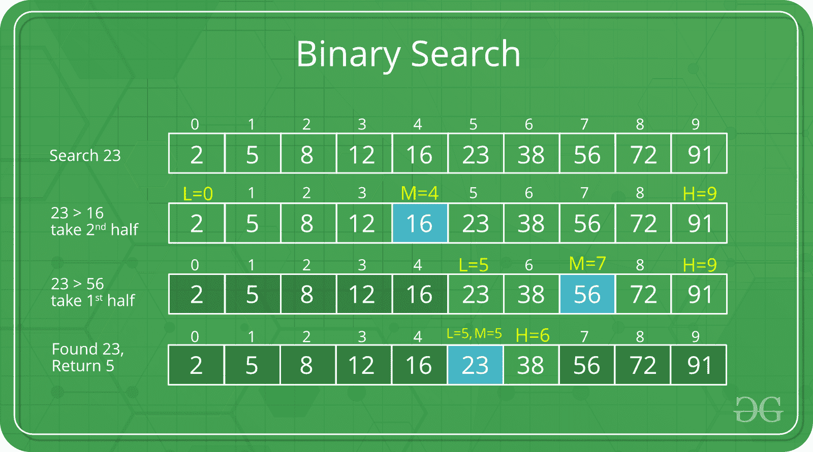

# 二分搜索法复杂度分析

> 原文: [https://www.geeksforgeeks.org/complexity-analysis-of-binary-search/](https://www.geeksforgeeks.org/complexity-analysis-of-binary-search/)

像`O(1)`、`O(n)`这样的复杂度很容易理解。`O(1)`表示它需要恒定的时间来执行操作，例如像字典一样在恒定的时间内到达元素；而`O(n)`表示它依赖于`n`的值来执行操作，例如在`n`个元素的数组中搜索元素。

但是对于`O(Log n)`来说，就没那么简单了。让我们借助复杂度为`O(对数 n)`的二分搜索法算法来讨论这个问题。

**二分搜索法:** 通过重复将搜索间隔减半来搜索排序后的数组。从覆盖整个数组的间隔开始。如果搜索关键字的值小于间隔中间的项目，请将间隔缩小到下半部分。否则，缩小到上半部分。反复检查，直到找到值或间隔为空。

**例:**



```
Sorted Array of 10 elements: 2, 5, 8, 12, 16, 23, 38, 56, 72, 91

Let us say we want to search for 23.
```

**找到给定的元素:**
现在要找到`23`，将会有很多次迭代，每个迭代都有上图中提到的步骤:

*   **Iteration 1:**

```
Array: 2, 5, 8, 12, 16, 23, 38, 56, 72, 91
```

*   **Iteration 2:**

```
Array: 23, 38, 56, 72, 91
```

*   **Iteration 3:**

```
Array: 23, 38
```

```
Length of array = n
```

*   在**迭代 2**

```
Length of array = n⁄2
```

*   在**迭代 3**

```
Length of array = (n⁄2)⁄2 = n⁄2²
```

*   因此**迭代 k** 后

```
Length of array = n⁄2ᵏ
```

*   同样，我们知道

```
After k iterations, the length of array becomes 1
```

*   因此

```
Length of array = n⁄2ᵏ = 1
=> n = 2ᵏ
```

*   在两侧应用对数函数:

```
=> log₂(n) = log₂(2ᵏ)
=> log₂(n) = k log₂(2)
```

*   如 `(logₐ(a) = 1)`
    故

```
=> k = log₂(n)
```