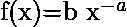
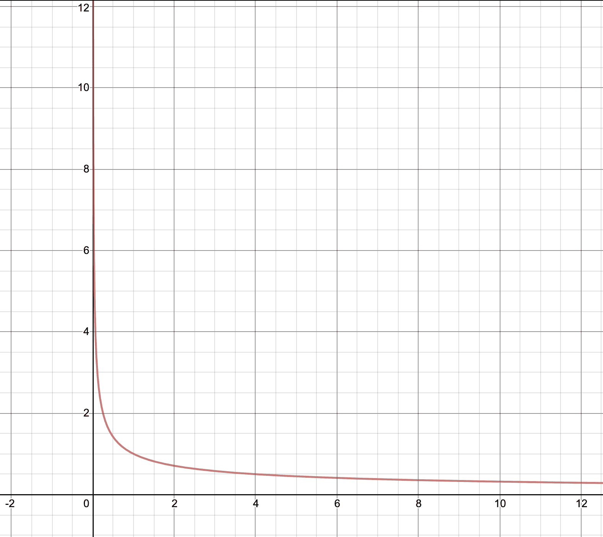
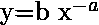
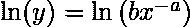
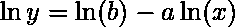
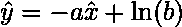
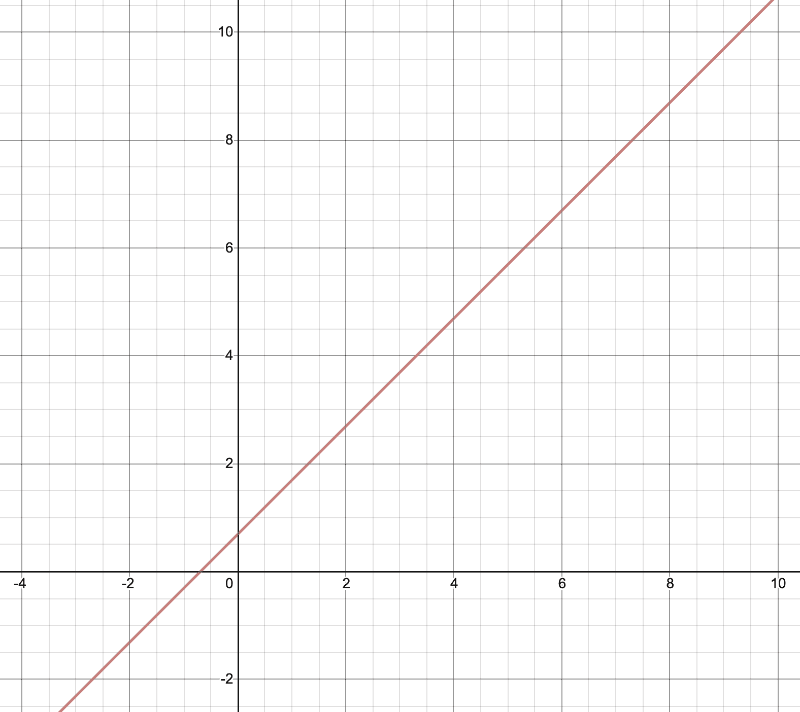

# 将幂律分布转换为线性图

> 原文：[https://www.geeksforgeeks.org/converting-power-law-distribution-to-a-linear-graph/](https://www.geeksforgeeks.org/converting-power-law-distribution-to-a-linear-graph/)

每当我们在 ML 项目上工作时，我们都必须处理数据集的高维度。这里有一个非常特殊的术语，即维度诅咒。虽然有很多方法可以解决这个问题，其中一个解决办法就是改变坐标系。从数据科学家的角度来看，这个解决方案有些有趣和新颖。

在进行模型训练时，我们试图消除假设的线性，以提高模型的准确性。但在本文中，我们试图理解如何轻松地可视化数据，并借助简单而创新的数学来理解它。

下面给出的是假设：

Power Law 是一个非常重要的统计学概念，它描述了两个变量之间的关系。这两个变量相对成比例，这意味着一个变量数量的变化将反映另一个变量数量的变化。一个量随着另一个量的幂次而变化。

现在让我们借助自然对数（ln）来求解这个方程。

幂律图

使用对数属性

现在，假设 `ln(y)` 为 ``，`ln(x)` 为 ``。将这些值代入上面的方程，我们得到：

幂律图中的线性图

所以现在很明显，假设已被转换为一个线性方程。这将使我们的任务变得容易，以分析参数是如何相互影响的。