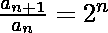
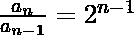
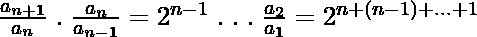
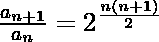

# 求给定递推关系的第 n 项

> 原文: [https://www.geeksforgeeks.org/find-nth-term-of-a-given-recurrence-relation/](https://www.geeksforgeeks.org/find-nth-term-of-a-given-recurrence-relation/)

设 `a_n` 为一个数列，由递推关系 `a_1 = 1` 和 `a_{n+1}/a_n = 2^n` 定义。任务是为给定的 `n` 找到 `log_2(a_n)` 的值。

## 举例:

```
Input: 5
Output: 10
Explanation: 
log2(an) = (n * (n - 1)) / 2
= (5*(5-1))/2
= 10

Input: 100
Output: 4950
```





，我们将以上所有相乘，以达到


自 `1+2+3+...+(n-1)+n = \frac{n(n+1)}{2}` 起。然后
`a_{n+1} = 2^{\frac{n(n+1)}{2}} \;.a_{1} = 2^{\frac{n(n+1)}{2}}`。
用 `n+1` 代替 `n`: `a_{n} = 2^{\frac{n(n-1)}{2}}`
所以，`log_{2}(a_{n}) = \frac{n(n-1)}{2}`

以下是上述方法的实施。

## C++

```cpp
// C++ program to find nth term of
// a given recurrence relation

#include <bits/stdc++.h>
using namespace std;

// function to return required value
int sum(int n)
{

    // Get the answer
    int ans = (n * (n - 1)) / 2;

    // Return the answer
    return ans;
}

// Driver program
int main()
{

    // Get the value of n
    int n = 5;

    // function call to print result
    cout << sum(n);

    return 0;
}
```

## Java

```java
// Java program to find nth term
// of a given recurrence relation
import java.util.*;

class solution
{
static int sum(int n)
{
    // Get the answer
    int ans = (n * (n - 1)) / 2;

    // Return the answer
    return ans;
}

// Driver code
public static void main(String arr[])
{

    // Get the value of n
    int n = 5;

    // function call to print result
    System.out.println(sum(n));
}
}
//This code is contributed byte
//Surendra_Gangwar
```

## Python 3

```python
# Python3 program to find nth
# term of a given recurrence
# relation

# function to return
# required value
def sum(n):

    # Get the answer
    ans = (n * (n - 1)) / 2;

    # Return the answer
    return ans

# Driver Code

# Get the value of n
n = 5

# function call to prresult
print(int(sum(n)))

# This code is contributed by Raj
```

## C#

```csharp
// C# program to find nth term
// of a given recurrence relation
using System;

class GFG
{
static int sum(int n)
{
    // Get the answer
    int ans = (n * (n - 1)) / 2;

    // Return the answer
    return ans;
}

// Driver code
public static void Main()
{

    // Get the value of n
    int n = 5;

    // function call to print result
    Console.WriteLine(sum(n));
}
}

// This code is contributed byte
// inder_verma
```

## PHP

```php
<?php
// PHP program to find nth term of
// a given recurrence relation

// function to return required value
function sum($n)
{

    // Get the answer
    $ans = ($n * ($n - 1)) / 2;

    // Return the answer
    return $ans;
}

// Driver Code

// Get the value of n
$n = 5;

// function call to print result
echo sum($n);

// This code is contributed by
// inder_verma
?>
```

## JavaScript

```javascript
<script>
// Javascript program to find nth term of
// a given recurrence relation

// function to return required value
function sum(n)
{

    // Get the answer
    let ans = parseInt((n * (n - 1)) / 2);

    // Return the answer
    return ans;
}

// Driver program

// Get the value of n
let n = 5;

// function call to print result
document.write(sum(n));

// This code is contributed by subham348.
</script>
```

### 时间复杂度: O(1)