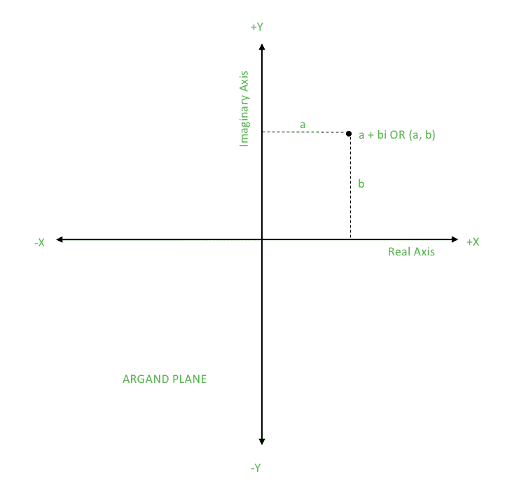
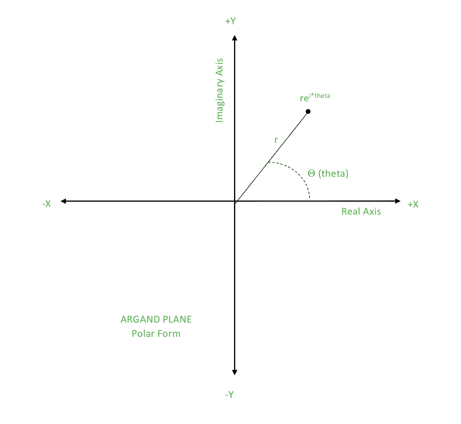

# 在 C++中使用复数的几何 (`std::complex`) | 集合 1

> 原文: [https://www.geeksforgeeks.org/geometry-using-complex-numbers-stdcomplex-in-c/](https://www.geeksforgeeks.org/geometry-using-complex-numbers-stdcomplex-in-c/)

在解决几何问题时，定义用于在 2D 平面或欧几里得平面上指定点的点类是非常耗时的。因此，本文指定了一种更快、更聪明的方法，在 C++中使用来自 STL 的 `complex` 类来实现同样的功能。
在实现之前，必须了解什么是复数，以及它们如何帮助表示 2D 平面上的点。

## 什么是复数？

复数的形式是

```
a + bi
where, a is the real part
b is the imaginary part
```


从图中我们可以看到，2D 平面上可以表示一个复数。因此对于一个点 `(a，b)`，我们可以有一个复数 `a + bi`，其中 `a` 是 X 坐标，`b` 是 Y 坐标。
**重要提示:** `i^2 = -1`

### Polar Form of Complex Number

复数的极坐标形式是可视化和表示复数的另一种方式。极坐标形式使用复数的模 `r` 和方向 `θ`。
具有这些参数的复数表示为 `r(cosθ + isinθ)`。
注意：`θ` 以弧度为单位。

`z = r(cosθ+isinθ)`



### 复数的共轭

如果 `z = a + bi`，那么 `z` 的共轭就是 `z’ = a–bi`。
如果 `z = (r，θ)`，那么 `z` 的共轭就是 `z’ = (r，-θ)`。
复数的共轭可以用来获得某些特殊性质，如下所示：
*   `z + z’ = (a+bi) + (a–bi) = 2a`
    实部 = (复数 + 共轭) / 2
*   `z – z’ = (a+bi) – (a–bi) = 2b`
    虚部 = (复数 – 共轭) / 2
*   `z * z’ = (a+bi) * (a–bi) = a^2 – b^2i^2 + 2abi – 2abi = a^2 + b^2`
    模的平方 = 复数 * 共轭

## 如何使用复数？

让我们考虑欧几里得平面上的点 `P (a，b)`。现在我们做一个复数 `z = a + bi`，并给出两者之间的等价性。与 `P` 相关的一些属性有：

1.  **P 的 X 坐标:** 我们可以简单地说 X 坐标 = `a`，这样，返回 `z` 的实部 (`real()`)。
2.  **P 的 Y 坐标:** 我们可以简单地说 Y 坐标 = `b`，这样，返回 `z` 的虚部 (`imag()`)。
3.  **P 距原点的距离 (0，0):** `P` 距原点的距离 = `sqrt((a-0)^2 + (b-0)^2) = sqrt(a^2 + b^2)`
    `z` 的大小 = `sqrt(a^2 + b^2)`
    这样，返回 `z` 的模 (`abs()`)。
4.  **OP 与 X 轴形成的角度，其中 O 为原点:** `OP` 与 X 轴形成的角度 = `tan^{-1} (b/a)`
    即 `z` 的辐角 `θ` 可推导如下：
    `rcosθ = a …..(i)`
    `rsinθ = b …..(ii)`
    将 `(ii)` 除以 `(i)`
    `tanθ = (b/a)`
    `θ = tan^{-1}(b/a)`
    这样，返回 `z` 的辐角 (`arg()`)。
5.  **P 绕原点旋转:** 点绕原点旋转不会改变其与原点的距离，只会改变 `PO` 与 X 轴的夹角。
    所以，如果我们考虑极坐标形式的复数，可以更好地理解旋转等价。
    `z = re^{iθ}`
    让点逆时针旋转 `α`。
    该点现在变为 `re^{i(θ+α)} = re^{iθ} * 1e^{iα} = z * 1e^{iα}`
    因此，返回 `z * polar(1，α)`。
    其中，`polar(r，θ)` 为一般表示。

让我们考虑欧几里得平面上的点 `P (a，b)` 和 `Q (c，d)`。这些基本上可以认为是向量，其长度等于从原点到 X 轴方向的距离。(如果将点作为向量，可以更好地理解许多属性，这是各种几何算法中的关键思想之一)。
现在我们考虑 `z1 = a + bi`，`z2 = c + di`。
**一些与 P 和 Q 相关的属性是：**

1.  **Vector Addition:**

    ```
    (a, b) + (c, d) = (a + c, b + d)
    z1 + z2 = (a + bi) + (c + di) = (a + c) + (b + d)i
    ```

    因此，返回 `z1 + z2`。

2.  **向量减法:** 只需返回

    ```
    z1 – z2
    ```

3.  **Slope of line PQ:** `z2 – z1` 的辐角给出了直线 `PQ` 的倾斜角。
    所以，直线 `PQ` 的斜率由倾斜角的切线给出。
    因此，返回 `arg(z2 – z1)` 的正切值 (`tan(arg(z2 - z1))`)。

4.  **Euclidean Distance:**

    ```
    Distance of P from Q = sqrt((a-c)^2 + (b-d)^2)
    Magnitude of z1 – z2 = sqrt((a-c)^2 + (b-d)^2)
    ```

    因此，返回 `abs(z1 – z2)`。

    ```
    一个在几何问题中会频繁使用的重要构造是 z1’z2。
    让我们计算它：
    z1’ = a – bi
    z1’z2 = (a – bi)*(c + di) = ac + adi – bci + bd = (ac + bd) + (ad – bc)i
    ```

5.  **Dot Product:** 向量 `P` 和 `Q` 的点积是

    ```
    (ac + bd)
    ```

    这与上述构造的实部相同。因此，返回 `real(z1’z2)`。

6.  **Cross Product:** 向量 `P` 和 `Q` 的叉积的模是

    ```
    (ad – bc)
    ```

    这与上述构造的虚部相同。因此，返回 `imag(z1’z2)`。

复杂类的实现部分包含在[集合 2](https://www.geeksforgeeks.org/geometry-using-complex-numbers-c-set-2/) 中

本文由**安雅金达尔**供稿。如果你喜欢 GeeksforGeeks 并想投稿，你也可以使用 [contribute.geeksforgeeks.org](http://www.contribute.geeksforgeeks.org) 写一篇文章或者把你的文章邮寄到 `contribute@geeksforgeeks.org`。看到你的文章出现在极客博客主页上，帮助其他极客。

如果你发现任何不正确的地方，或者你想分享更多关于上面讨论的话题的信息，请写评论。