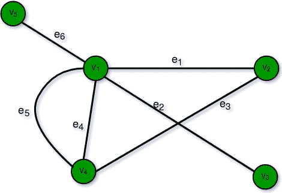
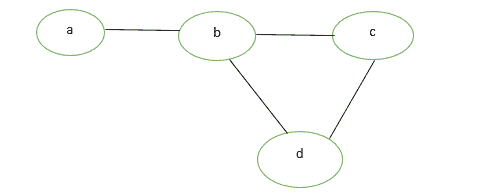
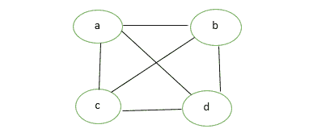
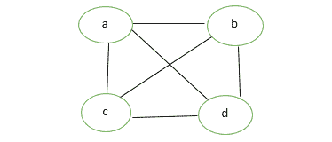
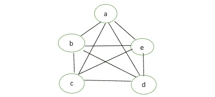
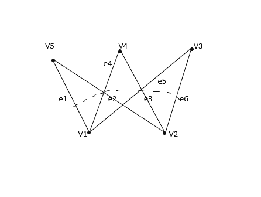
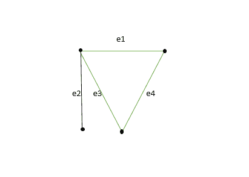
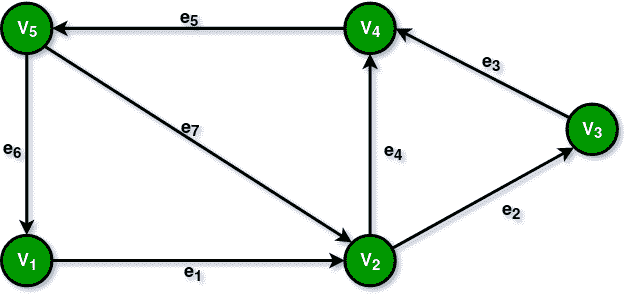
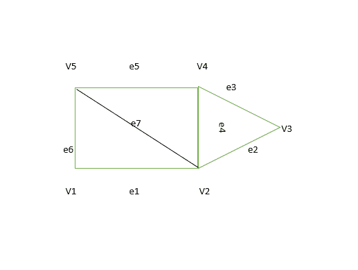

# 图形类型和应用

> 原文:[https://www.geeksforgeeks.org/graph-types-and-applications/](https://www.geeksforgeeks.org/graph-types-and-applications/)

**先决条件:** [图论基础–第 1 集](https://www.geeksforgeeks.org/mathematics-graph-theory-basics-set-1/)[图论基础–第 2 集](https://www.geeksforgeeks.org/mathematics-graph-theory-basics/)

图 `G = (V, E)` 由一组顶点 `V = { V1, V2, ... }` 和边集 `E = { E1, E2, ... }` 组成。边集是不同顶点的无序对的集合，其元素称为图 `G` 的边，这样每条边都用一对无序的顶点 `(Vi, Vj)` 来标识。
如果存在与 `Vi` 和 `Vj` 相关联的边 `Ek`，则顶点 `(Vi, Vj)` 被称为是相邻的。在这种情况下，`Vi` 和 `Vj` 被称为端点，边 `Ek` 被称为 `Vi` 和 `Vj` 的连接/接合。

## 图形类型

### 有限图
如果一个图有有限数量的顶点和有限数量的边，则称它是有限的。

### 无限图
如果一个图有无限多的顶点和无限多的边，那么这个图就是无限的。

### 平凡图
如果一个有限图只包含一个顶点而没有边，则称该图为平凡图。

### 简单图
简单图是在一对顶点之间不包含多于一条边的图。连接不同城市的简单铁轨就是简单图形的一个例子。

### 多图
任何包含一些平行边但不包含任何自循环的图称为多图。例如《路线图》。
*   **平行边:** 如果两个顶点与一条以上的边相连，那么这种边称为平行边，即有许多根但只有一个目的地。
*   **环:** 将顶点连接到自身的图的边称为环或自环。

### 空图
`n` 阶且大小为零的图，它是包含 `n` 个顶点但不包含任何边的图。

### 完全图
一个具有 `n` 个顶点的简单图，如果每个顶点的度都是 `n-1`，即一个顶点连接 `n-1` 条边，则称为完全图。完全图也称为满图。

### 伪图
具有自循环和一些多条边的图 `G` 称为伪图。

### 正则图
如果一个图 `G` 的所有顶点都是等度的，那么简单的图就是正则的。所有完整的图都是规则的，但反之则不可能。

### 二分图
一个图 `G = (V, E)` 被称为二分图，如果其顶点集 `V(G)` 可以被划分为两个非空的不相交子集 `V1(G)` 和 `V2(G)`，使得 `E(G)` 的每条边 `e` 的一端在 `V1(G)` 中，另一端在 `V2(G)` 中。
划分 `V1 U V2 = V` 称为 `G` 的二分划分。
下图中：
`V1(G)={V5, V4, V3}`
`V2(G)={V1, V2}`

### 标记图
如果图的顶点和边用名称、数据或权重标记，则称之为标记图。也叫`加权图`。

### 有向图
一个图 `G = (V, E)` 带有一个映射 `f`，使得每条边都映射到某个有序顶点对 `(Vi, Vj)`，则称为有向图。有序对 `(Vi, Vj)` 表示一条从 `Vi` 到 `Vj` 的有向边。
下图中：
`e1 = (V1, V2)`
`e2 = (V2, V3)`
`e4 = (V2, V4)`

### 子图
一个图 `G = (V1, E1)` 被称为图 `G(V, E)` 的子图，如果 `V1(G)` 是 `V(G)` 的子集，并且 `E1(G)` 是 `E(G)` 的子集，使得 `G1` 的每条边与 `G` 中有相同的端点。

## 子图类型

### 顶点不相交子图
任意两个图 `G1 = (V1, E1)` 和 `G2 = (V2, E2)`，如果 `V1(G1) ∩ V2(G2) = ∅`，则称其为图 `G = (V, E)` 的顶点不相交子图。在图中，`G1` 和 `G2` 之间没有公共顶点。

### 边不相交子图
如果 `E1(G1) ∩ E2(G2) = ∅`，则称子图是边不相交的。在图中，`G1` 和 `G2` 没有共同的边。

**注:** 边不相交子图可能有公共顶点，但顶点不相交图不能有公共边，所以顶点不相交子图永远是边不相交子图。

### 连通或不连通图
如果图 `G` 的任意一对顶点 `(Vi, Vj)` 彼此可达，则称图 `G` 是连通的。或者，如果图 `G` 中的每一对顶点之间至少存在一条路径，则称该图是连通的，否则该图是不连通的。有 `n` 个顶点的空图是由 `n` 个分量组成的不连通图。每个组件由一个顶点组成，没有边。

### 循环图
由 `n` 个顶点 (`n >= 3`) `V1, V2, V3, ..., Vn` 和边 `(V1, V2), (V2, V3), (V3, V4), ..., (Vn, V1)` 组成的图 `G` 称为循环图。

## 图形的应用

*   **计算机科学:** 在计算机科学中，图形用于表示通信网络、数据组织、计算设备等。
*   **物理和化学:** 图论也用于研究化学和物理中的分子。
*   **社会科学:** 图论在社会学中也有广泛的应用。
*   **数学:** 在这种情况下，图在几何和拓扑的某些部分(如纽结理论)中很有用。
*   **生物学:** 图论在生物学和保护工作中很有用。