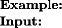
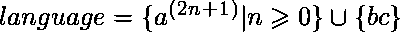
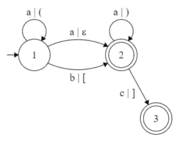
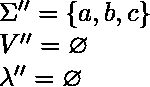
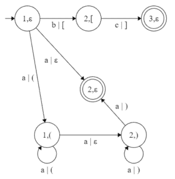

# TOC

## 中的假设(语言规律性)和算法(L 图到 NFA)

> 原文:[https://www . geesforgeks . org/假说-语言-规律性-和-算法-l-graph-to-nfa-in-toc/](https://www.geeksforgeeks.org/hypothesis-language-regularity-and-algorithm-l-graph-to-nfa-in-toc/)

先决条件–[有限自动机](https://www.geeksforgeeks.org/toc-finite-automata-introduction/)、[L-图以及它们所代表的](https://www.geeksforgeeks.org/theory-of-computation-l-graphs-and-what-they-represent/)、
L-图可以生成上下文相关的语言，但是编写上下文相关的语言比编写常规语言要困难得多。这就是为什么我提出了一个假设，关于什么样的 L 图可以生成一种规则的语言。但是首先，我需要向大家介绍我所说的迭代嵌套。

正如你所记得的，一个巢是一条中立的路径`T_1T_2T_3`，其中`T_1`和`T_3`是周期，`T_2`路径是中立的。我们将`T_1T_2T_3`称为迭代嵌套，如果`T_1`、`T_2`和`T_3`路径多次打印同一个符号串，更准确的说`T_1`打印`\alpha^k`、`T_2`打印`\alpha^l`、`T_3`打印`\alpha^m`、`k, \: l, \: m \geqslant 0`和`\alpha`是一串输入符号(最好是`k, \: l\: and\: m\: is \geqslant 1`中至少有一个)。
从这个定义中引出了下一个假设。

### 假设–
如果在一个上下文无关的 L-图 G 中所有的嵌套都在迭代，那么这个 L-图 G 定义的语言 L(G)是正则的。
如果这个假设将在不久的将来被证明，它可以改变编程的许多方面，这将使创建新的简单的编程语言比现在容易得多。上面的假设引出了下一个算法，即将迭代嵌套的上下文无关 L 图转换为 NFA 图。

### 算法–
将带有迭代补码的上下文无关 L 图转换为相应的 NFA
**输入–**带有迭代补码的上下文无关 L 图`G=(\Sigma, V, P, \lambda, P_0, F)`
**输出–**`G'=(\Sigma', V', \lambda', P'_0, F')\\*`

*   **第一步:**L 图和 NFA 的语言必须相同，因此，我们不需要新的字母表`\Rightarrow \Sigma'' = \Sigma, \: P'' = P`。(注释:我们构建上下文无关的 L 图 G ' '，它等于起始图 G ' '，没有冲突的嵌套)
*   **Step-2:** Build `Core(1, 1)` for the graph G.
    `V’’ := {(v, \varepsilon) | v \in V of \forall canon k \in Core(1, 1), v \notin k}`
    `\lambda'' := { arcs o \in \lambda | start and final states o', o'' \in V’’}`

对于所有 `k \in Core(1, 1)`:
    步骤 1’。`v :=`佳能第一州`\eta := \varepsilon`。
    `V ' '\cup= (v, \eta)` T5【第二步】。`\lambda'' \cup=`弧从状态`(v, \eta)`跟随该弧进入新状态，新状态用以下规则定义:
    `\eta := \eta`，如果输入括号在该弧上`= \varepsilon`；`\eta'the\: input\: bracket'`，如果输入括号是开括号；`\eta 'without\: the\: last\: bracket'`，如果输入括号是闭合括号
    `v :=`佳能 k 的第二状态
    `V'' \cup= (v, \eta)`
    步骤 3’。重复步骤 2’，同时佳能中仍有弧线。

*   **第三步:**构建`核心(1，2)`。
    如果佳能连续有 2 个相等的弧:开始状态和最终状态匹配；我们把给定状态的弧线加入到自身中，利用这个弧线，达到`\lambda''`。
    以`(v, \varepsilon) - (u, \varepsilon) (\alpha)`的形式将`\lambda`弧 v–u`(\alpha)`中的剩余部分添加到`\lambda''`中
*   **Step-4:** `P''_0 = (P_0, \varepsilon).\: F'' = \{(f, \varepsilon) | f \in F\}`
    (备注:以下是将上下文无关的 L-graph G ' '转换为 NFA G ' '的算法)
*   **第 5 步:**对 G“”中的每一个迭代补码`T = T_1T_2T_3`
    做如下操作:添加一个新的状态 v .创建一个从状态`beg(T_3)`开始的路径，等于`T_3`。从 v 进入`T_3`创建路径，等于`T_1`。删除循环`T_1`和`T_3`。
*   **第 6 步:** `G' = G ' '`，其中弧没有加载括号。

所以上面的每一步都很清楚，我给你们看下一个例子。

上下文无关的 L 图，具有迭代补语

![G = ( \{a, b, c\}, \\*\{1, 2, 3\} \\*\{( (, ) ), ( [, ] )\}, \\*\\*\{ (: \{ 1 - a - 1 \}, \\*): \{ 2 - a - 2 \}, \\*\big[: \{ 1 - b - 2 \}, \\*\big]: \{ 2 - c - 3 \}, \\*\varepsilon: \{ 1 - a - 2 \} \}, \\*\\*1, \\*\{2, 3\} \}](img/6fe2d3327004bf838949431f97960e69.png "Rendered by QuickLaTeX.com")、
，确定了

开始图 `G`

`core(1,1)` = { 1–a–2；1–a，(1–1–a–2–a)，1–2；1–b，(2–2–c，)2–3 }
`core(1,2)` = `core(1,1)`{ 1–a，(1–1–a)，(1–1–a–2–a，)1–2–a，)1–2 }

步骤 2:步骤 1’–步骤 3’

![\Rightarrow\\ V'' = \{(1, \varepsilon), (2, (_2), (3, \varepsilon), (1, (_1), (2, )_1), (2, \varepsilon)\}\\* \lambda'' = \{ \\*(: \{ (1, \varepsilon) - a - (1, (); (1, () - a - (1, () \}, \\*): \{ (2, )) - a - (2, )); (2, )) - a - (2, \varepsilon) \}, \\*\big[: \{ (1, \varepsilon) - b - (2, [) \}, \\*\big]: \{ (2, [) - c - (3, \varepsilon) \}, \\*\varepsilon: \{ (1, \varepsilon) - a - (2, \varepsilon); (1, () - a - (2, )) \} \}\\ P''_0 = (1, \varepsilon)\\ F'' = \{(2, \varepsilon), (3, \varepsilon)\}\\ G'' = (\Sigma'', V'', P'', \lambda'', P''_0, F'')](img/d1613b59e5c8c112a14e286b38941357.png "Rendered by QuickLaTeX.com")

中间图 `G''`

T21】NFA `G'`