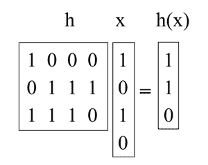

# 数据结构中的通用哈希介绍

> 原文：[https://www.geeksforgeeks.org/introduction-to-universal-hashing-in-data-structure/](https://www.geeksforgeeks.org/introduction-to-universal-hashing-in-data-structure/)

[哈希](https://www.geeksforgeeks.org/hashing-data-structure/)是一个很棒的实用工具，也有一个有趣而微妙的理论。除了用作字典数据结构，哈希还出现在许多不同的领域，包括[密码学](https://www.geeksforgeeks.org/cryptography-and-its-types/)和[复杂性理论](https://www.geeksforgeeks.org/introduction-to-computation-complex-theory/)。

本文讨论一个重要的概念：**通用哈希**（也称为通用哈希函数族）。

## 通用哈希

**通用哈希**是指从具有一定数学性质的哈希函数族中随机选择一个[哈希函数](https://www.geeksforgeeks.org/what-are-hash-functions-and-how-to-choose-a-good-hash-function/)。这确保了最小数量的冲突。

> 用于构造散列函数的随机化算法 `H: U → {1, …, M}` 是**通用的**，如果对于 `U` 中的所有 `(x, y)` 使得 `x ≠ y`，`Pr_{H∈H}[H(x) = H(y)] ≤ 1/M`（即碰撞的概率至多为 `1/M`）。

散列函数的集合 `H` 称为**通用散列函数族**，如果程序“随机选择 `H ∈ H`”是通用的。（这里的关键是识别在集合上具有均匀分布的函数集合。）

## 定理

如果 `H` 是通用散列函数族的集合，那么对于任何大小为 `N` 的集合 `S ⊆ U`，使得 `x ∈ U` 和 `y ∈ S`，`x` 和 `y` 之间的预期碰撞次数最多为 `N/M`。

## 证明

每个 `y ∈ S (y ≠ x)` 最多有一个 `1/M` 的几率与 `x` 碰撞，按照“通用”的定义。所以，

*   如果 `x` 和 `y` 碰撞，则让 `C_{xy} = 1`，否则让 `C_{xy} = 0`。
*   让 `C_x` 表示 `x` 的碰撞总数。所以，`C_x = ∑_{y∈S, x≠y} C_{xy}`。
*   我们知道 `E[C_{xy}] = Pr[x 和 y 碰撞] ≤ 1/M`。
*   所以，通过[线性期望](https://www.geeksforgeeks.org/linearity-of-expectation/)，`E[C_x] = ∑_y E[C_{xy}] < N/M`。

## 推论

如果 `H` 是通用散列函数族的集合，那么对于系统中任何时间最多有 `M` 个元素的 `L` 插入、查找或删除操作的任何序列，随机 `h ∈ H` 的 `L` 操作的预期总成本仅为 `O(L)`（将计算 `h` 的时间视为常数）。

对于序列中的任何给定操作，根据上述定理，其期望成本是恒定的。因此，`L` 作业的预计总成本为 `O(L)`，乘以[期望线性度](https://www.geeksforgeeks.org/linearity-of-expectation/)。

## 使用矩阵方法构建通用散列族

假设键是 `u` 位长，表尺寸 `M` 是 `2` 的幂，那么一个索引就是 `b` 位长（加上 `M = 2^b`）。

我们要做的是选择 `h` 作为随机的 `b-by-u` 二进制矩阵，定义 `h(x) = hx`，其中 `hx` 通过将 `h` 的某些列相加来计算 `1` 位（如下例中增加了 `h` 的第 `1` 和第 `3` 列）。这些矩阵又短又胖。例如：

现在，拿一对任意的键 `(x, y)`，这样 `x ≠ y`。他们一定在某个地方有所不同，让我们假设他们在 `i` 坐标上有所不同，具体来说就是说 `x_i = 0` 和 `y_i = 1`。试想我们首先选择的全是 `h`，却把第 `i` 列留到最后选择。结束剩下选择的第 `i` 列，`h(x)` 是固定的。然而，每一个 `2^b` 不同设置的第 `i` 列给出了不同值的 `h(y)`（特别是，每次我们翻转该列中的一个位，我们就翻转 `h(y)` 中的相应位）。所以正好有一个 `1/2^b` 的几率 `h(x) = h(y)`。