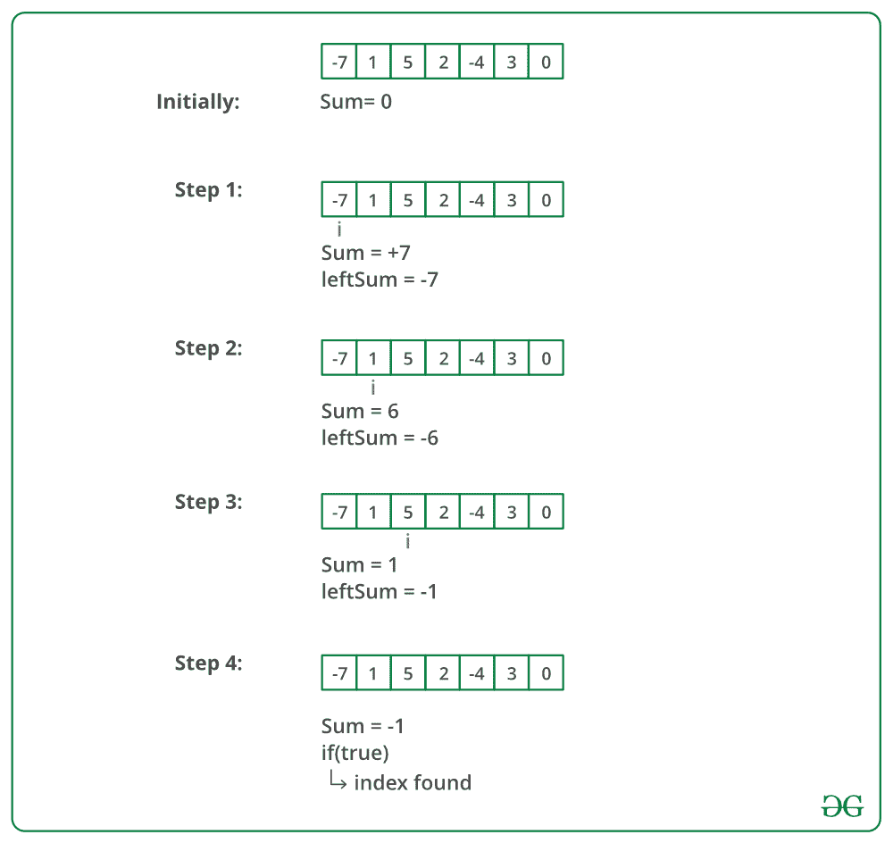

# 数组平衡索引的 JavaScript 程序

> 原文：[https://www.geeksforgeeks.org/javascript-program-for-equilibrium-index-of-an-array/](https://www.geeksforgeeks.org/javascript-program-for-equilibrium-index-of-an-array/)

数组的平衡索引是这样一种索引，即较低索引处的元素之和等于较高索引处的元素之和。例如，在数组 `A` 中：

**示例：**

> **输入**：`A[] = {-7, 1, 5, 2, -4, 3, 0}`
> **输出**：`3`
> `3` 是均衡指标，因为：
> `A[0]+A[1]+A[2] = A[4]+A[5]+A[6]`
>
> **输入**：`A[] = {1, 2, 3}`
> **输出**：`-1`

写一个函数 `int balance(int[] arr, int n)`；给定大小为 `n` 的序列 `arr`，返回一个平衡指数（如果有的话），如果不存在平衡指数，则返回 `-1`。

## 方法 1（简单但低效）

使用两个循环。外循环遍历所有元素，内循环找出外循环选择的当前索引是否为平衡索引。这个解决方案的时间复杂度是 `O(n^2)`。

```javascript
// JavaScript Program to find equilibrium
// index of an array
function equilibrium(arr, n)
{
    var i, j;
    var leftsum, rightsum;

    /*Check for indexes one by one until
    an equilibrium index is found*/
    for(i = 0; i < n; ++i)
    {
        /*get left sum*/
        leftsum = 0;
        for(let j = 0; j < i; j++)
            leftsum += arr[j];

        /*get right sum*/
        rightsum = 0;
        for(let j = i + 1; j < n; j++)
            rightsum += arr[j];

        /*if leftsum and rightsum are same,
        then we are done*/
        if(leftsum == rightsum)
            return i;
    }

    /* return -1 if no equilibrium index is found*/
    return -1;
}

// Driver code
var arr = new Array(-7,1,5,2,-4,3,0);
n = arr.length;
document.write(equilibrium(arr,n));

// This code is contributed by simranarora5sos
```

**时间复杂度**：`O(n^2)`

## 方法 2（巧妙高效）

思路是先得到数组的总和。然后迭代数组并不断更新初始化为零的左和。在循环中，我们可以通过逐个减去元素得到正确的和。感谢 Sambasiva 提出了这个解决方案，并为此提供了代码。

1.  初始化 `leftsum` 为 `0`
2.  获取数组的总和作为 `sum`
3.  遍历数组，对于每个索引 `i`，执行以下操作：
    a. 更新 `sum` 以获得右和。
        `sum = sum - arr[i]`
        // `sum` 现在是索引 `i` 的右和
    b. 如果 `leftsum` 等于 `sum`，则返回当前索引。
    c. 更新左和用于下一次迭代：`leftsum = leftsum + arr[i]`
4.  返回 `-1`
    // 如果循环结束没有返回，则说明没有平衡索引

下图显示了上述方法的试运行：



下面是上述方法的实现：

```javascript
// program to find equilibrium
// index of an array
function equilibrium(arr, n)
{
    sum = 0; // initialize sum of whole array
    leftsum = 0; // initialize leftsum

    /* Find sum of the whole array */
    for (let i = 0; i < n; ++i)
        sum += arr[i];

    for (let i = 0; i < n; i++)
    {
        sum -= arr[i]; // sum is now right sum for index i

        if (leftsum == sum)
            return i;

        leftsum += arr[i];
    }

    /* If no equilibrium index found, then return -1 */
    return -1;
}

// Driver code
arr = new Array(-7, 1, 5, 2, -4, 3, 0);
n = arr.length;
document.write("First equilibrium index is " + equilibrium(arr, n));

// This code is contributed by simranarora5sos
```

**输出**

```
First equilibrium index is 3
```

**时间复杂度**：`O(n)`

## 方法 3

这是一个非常简单直接的方法。想法是取数组的前缀和两次。一个来自数组前端，另一个来自数组后端。

在获取两个前缀和之后，运行一个循环并检查对于一些 `i`，如果第一个数组的前缀和等于第二个数组的前缀和，那么该点可以被认为是平衡点。

```javascript
// Program to find equilibrium index of an array
function equilibrium(a, n)
{
    if (n == 1)
        return (0);
    var forward = new Array(0);
    var rev = new Array(0);

    // Taking the prefixsum from front end array
    for (let i = 0; i < n; i++) {
        if (i) {
            forward[i] = forward[i - 1] + a[i];
        }
        else {
            forward[i] = a[i];
        }
    }

    // Taking the prefixsum from back end of array
    for (let i = n - 1; i > 0; i--) {
        if (i <= n - 2) {
            rev[i] = rev[i + 1] + a[i];
        }
        else {
            rev[i] = a[i];
        }
    }

    // Checking if forward prefix sum
    // is equal to rev prefix sum
    for (let i = 0; i < n; i++) {
        if (forward[i] == rev[i]) {
            return i;
        }
    }
    return -1;

    // If You want all the points
    // of equilibrium create
    // vector and push all equilibrium
    // points in it and
    // return the vector
}

// Driver code
arr = new Array(-7, 1, 5, 2, -4, 3, 0);
n = arr.length;
document.write("First Point of equilibrium is at index " + equilibrium(arr, n) + "\n");

// This code is contributed by simranarora5sos
```

**输出**

```
First Point of equilibrium is at index 3
```

**时间复杂度**：`O(N)`
**空间复杂度**：`O(N)`

更多详情请参考完整文章[数组平衡指数](https://www.geeksforgeeks.org/equilibrium-index-of-an-array/)！