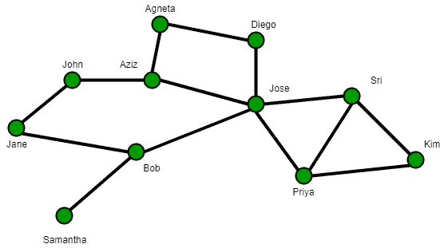

# 卡茨中心性（中心性测度）

> 原文：[https://www.geeksforgeeks.org/katz-centrality-centrality-measure/](https://www.geeksforgeeks.org/katz-centrality-centrality-measure/)

在图论中，节点的卡兹中心性是网络中心性的度量。它由利奥·卡茨于 1953 年提出，用于衡量一个参与者（或节点）在社交网络中的相对影响力。与只考虑一对参与者之间最短路径（测地线）的典型中心性度量不同，卡茨中心性度量通过考虑一对参与者之间的行走总数来影响。

它类似于谷歌的 PageRank 和特征向量中心性。

## 测量卡茨中心度



一个简单的社交网络：节点代表人或演员，节点之间的边代表演员之间的某种关系。

Katz centrality 通过测量直接邻居（一级节点）的数量以及网络中通过这些直接邻居连接到所考虑的节点的所有其他节点的数量来计算网络中节点的相对影响。然而，与远方邻居的连接会受到衰减因子 `α` 的影响。一对节点之间的每条路径或连接都被赋予一个由 `α` 确定的权重，节点之间的距离称为 `α^{d}`。

例如，在右图中，假设正在测量约翰的中心性，并且 `α = 0.5`。分配给连接约翰和他的近邻简和鲍勃的每个链接的权重将是 `(0.5)^{1} = 0.5`。由于何塞通过鲍勃间接连接到约翰，分配给这个连接（由两个链接组成）的权重将是 `(0.5)^{2} = 0.25`。同样，分配给阿格涅塔和约翰之间通过阿齐兹和简的连接的权重将是 `(0.5)^{3} = 0.125`，分配给阿格涅塔和约翰之间通过迭戈、何塞和鲍勃的连接的权重将是 `(0.5)^{4} = 0.0625`。

## 数学公式

设 `A` 为所考虑网络的邻接矩阵。如果节点 `i` 连接到节点 `j`，则 `A` 的元素 `(a_{ij})` 是取值 1 的变量，否则取值 0。`A` 的幂表示两个节点之间通过中介存在（或不存在）链接。例如，在矩阵 `A^{3}` 中，如果元素 `(a_{2,12}) = 1`，则表示节点 2 和节点 12 通过节点 2 的一些一阶和二阶邻居连接。如果 `C_{\mathrm{Katz}}(i)` 表示节点 `i` 的 Katz 中心性，那么数学上：

`C_{\mathrm{Katz}}(i) = \sum_{k=1}^{\infty} \sum_{j=1}^{n} \alpha^{k} (A^{k})_{ji}`

注意，上面的定义使用了邻接矩阵 `A` 的位置 `(i, j)` 处的元素上升到幂 `k`（即 `A^{k}`）反映了节点 `i` 和 `j` 之间的 `k` 度连接的总数。衰减因子 `α` 的值必须选择为小于邻接矩阵 `A` 的最大特征值的绝对值的倒数。在这种情况下，以下表达式可用于计算卡兹中心度：

`\overrightarrow{C}_{\mathrm{Katz}} = ((I - \alpha A^{T})^{-1} - I) \overrightarrow{I}`

这里 `I` 是单位矩阵，`\overrightarrow{I}` 是由 1 组成的 `n`（`n` 是节点数）大小的单位向量。`A^{T}` 表示 `A` 的转置矩阵，`(I - \alpha A^{T})^{-1}` 表示项的矩阵求逆 `(I - \alpha A^{T})`。

下面是计算图及其各个节点的卡兹中心度的代码。

```python
def katz_centrality(G, alpha=0.1, beta=1.0,
                    max_iter=1000, tol=1.0e-6,
                    nstart=None, normalized=True,
                    weight = 'weight'):
    """Compute the Katz centrality for the nodes
        of the graph G.

    Katz centrality computes the centrality for a node
    based on the centrality of its neighbors. It is a
    generalization of the eigenvector centrality. The
    Katz centrality for node `i` is

    .. math::

        x_i = \alpha \sum_{j} A_{ij} x_j + \beta,

    where `A` is the adjacency matrix of the graph G
    with eigenvalues `\lambda`.

    The parameter `\beta` controls the initial centrality and

    .. math::

        \alpha < \frac{1}{\lambda_{max}}.

    Katz centrality computes the relative influence of
    a node within a network by measuring the number of
    the immediate neighbors (first degree nodes) and
    also all other nodes in the network that connect
    to the node under consideration through these
    immediate neighbors.

    Extra weight can be provided to immediate neighbors
    through the parameter :math:`\beta`. Connections
    made with distant neighbors are, however, penalized
    by an attenuation factor `\alpha` which should be
    strictly less than the inverse largest eigenvalue
    of the adjacency matrix in order for the Katz
    centrality to be computed correctly.

    Parameters
    ----------
    G : graph
      A NetworkX graph

    alpha : float
      Attenuation factor

    beta : scalar or dictionary, optional (default=1.0)
      Weight attributed to the immediate neighborhood.
      If not a scalar, the dictionary must have an value
      for every node.

    max_iter : integer, optional (default=1000)
      Maximum number of iterations in power method.

    tol : float, optional (default=1.0e-6)
      Error tolerance used to check convergence in
      power method iteration.

    nstart : dictionary, optional
      Starting value of Katz iteration for each node.

    normalized : bool, optional (default=True)
      If True normalize the resulting values.

    weight : None or string, optional
      If None, all edge weights are considered equal.
      Otherwise holds the name of the edge attribute
      used as weight.

    Returns
    -------
    nodes : dictionary
       Dictionary of nodes with Katz centrality as
       the value.

    Raises
    ------
    NetworkXError
       If the parameter `beta` is not a scalar but
       lacks a value for at least one node

    Notes
    -----
    This algorithm it uses the power method to find
    the eigenvector corresponding to the largest
    eigenvalue of the adjacency matrix of G.
    The constant alpha should be strictly less than
    the inverse of largest eigenvalue of the adjacency
    matrix for the algorithm to converge.
    The iteration will stop after max_iter iterations
    or an error tolerance of number_of_nodes(G)*tol
    has been reached.

    When `\alpha = 1/\lambda_{max}` and `\beta=0`,
    Katz centrality is the same as eigenvector centrality.

    For directed graphs this finds "left" eigenvectors
    which corresponds to the in-edges in the graph.
    For out-edges Katz centrality first reverse the
    graph with G.reverse().

    """
    from math import sqrt

    if len(G) == 0:
        return {}

    nnodes = G.number_of_nodes()

    if nstart is None:
        # choose starting vector with entries of 0
        x = dict([(n,0) for n in G])
    else:
        x = nstart

    try:
        b = dict.fromkeys(G,float(beta))
    except (TypeError,ValueError,AttributeError):
        b = beta
        if set(beta) != set(G):
            raise nx.NetworkXError('beta dictionary '
                                   'must have a value for every node')

    # make up to max_iter iterations
    for i in range(max_iter):
        xlast = x
        x = dict.fromkeys(xlast, 0)

        # do the multiplication y^T = Alpha * x^T A - Beta
        for n in x:
            for nbr in G[n]:
                x[nbr] += xlast[n] * G[n][nbr].get(weight, 1)
        for n in x:
            x[n] = alpha*x[n] + b[n]

        # check convergence
        err = sum([abs(x[n]-xlast[n]) for n in x])
        if err < nnodes*tol:
            if normalized:
                # normalize vector
                try:
                    s = 1.0/sqrt(sum(v**2 for v in x.values()))
                    # this should never be zero?
                except ZeroDivisionError:
                    s = 1.0
            else:
                s = 1
            for n in x:
                x[n] *= s
            return x
```

raise `nx.NetworkXError('Power iteration failed to converge in '
                       '%d iterations.' % max_iter)`
```

上面的函数是使用 `networkx` 库调用的，一旦安装了这个库，您就可以最终使用它，下面的代码必须用 `python` 编写，以实现节点的 `katz` 中心性。

```python
>>> import networkx as nx
>>> import math
>>> G = nx.path_graph(4)
>>> phi = (1+math.sqrt(5))/2.0 # largest eigenvalue of adj matrix
>>> centrality = nx.katz_centrality(G,1/phi-0.01)
>>> for n,c in sorted(centrality.items()):
...    print("%d %0.2f"%(n,c))
```

上面代码的输出是:

```
0 0.37
1 0.60
2 0.60
3 0.37
```

上面的结果是描述每个节点的 `katz` 中心性值的字典。以上是我关于中心性度量的文章系列的扩展。保持联系！！！

## 参考文献

- [http://networkx.readthedocs.io/en/networkx-1.10/index.html](http://networkx.readthedocs.io/en/networkx-1.10/index.html)
- [https://en.wikipedia.org/wiki/Katz_centrality](https://en.wikipedia.org/wiki/Katz_centrality)