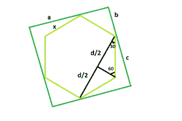

# 一个正方形内可内切的最大六边形

> 原文：[https://www.geeksforgeeks.org/largest-hexagon-that-can-be-inscribed-within-a-square/](https://www.geeksforgeeks.org/largest-hexagon-that-can-be-inscribed-within-a-square/)

给定一个正方形的边 `a`，任务是找到可以在给定正方形内内接的最大六边形的边。

**例：**

> **输入：** `a = 6`
> **输出：** `3.1056`
> **输入：** `a = 8`
> **输出：** `4.1408`



**逼近：** 假设，六边形的边为 `x`，假设正方形的边为 `a` 分成更小的长度 `b` 和更大的长度 `c`，即 `a = b + c`。

现在从图中我们看到，

> `b<sup>2</sup> + b<sup>2</sup> = x<sup>2</sup>`，这就给出了 `b = x / √2`。
> 现在再来一次，`d / (2 * x) = cos(30) = √3 / 2`，即 `d = x√3`。
> 所以，`c<sup>2</sup> + c<sup>2</sup> = d<sup>2</sup>`，即 `c = d / √2 = x√3 / √2`。
> 所以，`a = x/√2 + x√3/√2 = ((1+√3)/√2) * x = 1.932 * x`。
> 所以，六边形的边，`x = 0.5176 * a`。

以下是上述方法的实现：

## C++

```cpp
// C++ Program to find the biggest hexagon which
// can be inscribed within the given square
#include <bits/stdc++.h>
using namespace std;

// Function to return the side
// of the hexagon
float hexagonside(float a)
{

    // Side cannot be negative
    if (a < 0)
        return -1;

    // Side of the hexagon
    float x = 0.5176 * a;
    return x;
}

// Driver code
int main()
{
    float a = 6;
    cout << hexagonside(a) << endl;
    return 0;
}
```

## Java

```java
// Java Program to find the biggest hexagon which
// can be inscribed within the given square

import java.io.*;

class GFG {

    // Function to return the side
    // of the hexagon
    static double hexagonside(double a)
    {

        // Side cannot be negative
        if (a < 0)
            return -1;

        // Side of the hexagon
        double x = (0.5176 * a);
        return x;
    }

    // Driver code
    public static void main (String[] args) {

        double a = 6;
        System.out.println (hexagonside(a));
    }
}
// This code is contributed by ajit.
```

## Python 3

```python
# Python 3 Program to find the biggest
# hexagon which can be inscribed within
# the given square

# Function to return the side
# of the hexagon
def hexagonside(a):

    # Side cannot be negative
    if (a < 0):
        return -1;

    # Side of the hexagon
    x = 0.5176 * a;
    return x;

# Driver code
a = 6;
print(hexagonside(a));

# This code is contributed
# by Akanksha Rai
```

## C\#

```csharp
// C# Program to find the biggest hexagon which
// can be inscribed within the given square
using System;

class GFG
{

    // Function to return the side
    // of the hexagon
    static double hexagonside(double a)
    {

        // Side cannot be negative
        if (a < 0)
            return -1;

        // Side of the hexagon
        double x = (0.5176 * a);
        return x;
    }

    // Driver code
    public static void Main ()
    {
        double a = 6;
        Console.WriteLine(hexagonside(a));
    }
}

// This code is contributed by Ryuga.
```

## PHP

```php
<?php
// PHP Program to find the biggest hexagon which
// can be inscribed within the given square

// Function to return the side of the hexagon
function hexagonside($a)
{

    // Side cannot be negative
    if ($a < 0)
        return -1;

    // Side of the hexagon
    $x = 0.5176 * $a;
    return $x;
}

// Driver code
$a = 6;
echo hexagonside($a);

// This code is contributed by akt_mit
?>
```

## JavaScript

```javascript
<script>

// Javascript Program to find the biggest hexagon which
// can be inscribed within the given square

// Function to return the side
// of the hexagon
function hexagonside(a)
{

    // Side cannot be negative
    if (a < 0)
        return -1;

    // Side of the hexagon
    let x = 0.5176 * a;
    return x;
}

// Driver code
let a = 6;
document.write(hexagonside(a) + "<br>");

// This code is contributed by Manoj

</script>
```

**Output：**

```
3.1056
```