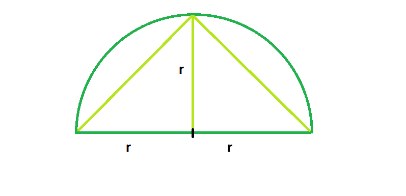

# 可内接半圆的最大三角形

> 原文: [https://www.geeksforgeeks.org/largest-triangle-that-can-be-inscribed-in-a-semicircle/](https://www.geeksforgeeks.org/largest-triangle-that-can-be-inscribed-in-a-semicircle/)

给定一个半径为 `r` 的半圆，我们必须找到半圆中可以内接的最大三角形，底边位于直径上。

**例:**

```
Input: r = 5
Output: 25

Input: r = 8
Output: 64
```



**逼近**: 从图中我们可以清楚的了解到半圆中可以内接的最大三角形有高度 `r`。另外，我们知道底座有长度 `2r`。所以三角形是等腰三角形。

> 所以，面积 `A` := (基础*高度)/2 = `(2r * r)/2 = r^2`

**以下是上述方式的实施**:

## C++

```cpp
// C++ Program to find the biggest triangle
// which can be inscribed within the semicircle
#include <bits/stdc++.h>
using namespace std;

// Function to find the area
// of the triangle
float trianglearea(float r)
{

    // the radius cannot be negative
    if (r < 0)
        return -1;

    // area of the triangle
     return r * r;
}

// Driver code
int main()
{
    float r = 5;
    cout << trianglearea(r) << endl;
    return 0;
}
```

## Java

```java
// Java  Program to find the biggest triangle
// which can be inscribed within the semicircle
import java.io.*;

class GFG {

// Function to find the area
// of the triangle
static float trianglearea(float r)
{

    // the radius cannot be negative
    if (r < 0)
        return -1;

    // area of the triangle
    return r * r;
}

// Driver code

    public static void main (String[] args) {
        float r = 5;
    System.out.println( trianglearea(r));
    }
}
// This code is contributed 
// by chandan_jnu.
```

## Python 3

```python
# Python 3 Program  to find the biggest triangle
# which can be inscribed within the semicircle

# Function to find the area
# of the triangle
def trianglearea(r) :

    # the radius cannot be negative
    if r < 0 :
        return -1

    #  area of the triangle
    return r * r

# Driver Code
if __name__ == "__main__" :

    r = 5
    print(trianglearea(r))

# This code is contributed by ANKITRAI1
```

## C\#

```csharp
// C# Program to find the biggest
// triangle which can be inscribed
// within the semicircle
using System;

class GFG
{

// Function to find the area
// of the triangle
static float trianglearea(float r)
{

    // the radius cannot be negative
    if (r < 0)
        return -1;

    // area of the triangle
    return r * r;
}

// Driver code
public static void Main ()
{
    float r = 5;
    Console.Write(trianglearea(r));
}
}

// This code is contributed
// by ChitraNayal
```

## PHP

```php
<?php
// PHP Program to find the biggest
// triangle which can be inscribed
// within the semicircle

// Function to find the area
// of the triangle
function trianglearea($r)
{

    // the radius cannot be negative
    if ($r < 0)
        return -1;

    // area of the triangle
    return $r * $r;
}

// Driver code
$r = 5;
echo trianglearea($r);

// This code is contributed
// by inder_verma
?>
```

## JavaScript

```javascript
<script>

// javascript  Program to find the biggest triangle
// which can be inscribed within the semicircle

// Function to find the area
// of the triangle
function trianglearea(r)
{

    // the radius cannot be negative
    if (r < 0)
        return -1;

    // area of the triangle
    return r * r;
}

// Driver code

var r = 5;
document.write( trianglearea(r));

// This code contributed by Princi Singh

</script>
```

**Output:**

```
25
```