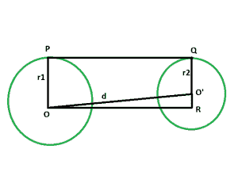
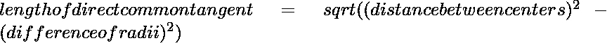

# 两个不相交圆之间的直接公共切线的长度

> 原文: [https://www.geeksforgeeks.org/length-of-direct-common-tangent-between-the-two-non-intersecting-circles/](https://www.geeksforgeeks.org/length-of-direct-common-tangent-between-the-two-non-intersecting-circles/)

给定半径的两个圆，它们的圆心相距给定的距离，这样两个圆就不会相互接触。任务是找到圆之间的直接公共切线的长度。

**例:**

```
Input: r1 = 4, r2 = 6, d = 12 
Output: 11.8322

Input: r1 = 5, r2 = 9, d = 25
Output: 24.6779
```



## 接近

*   让圆的半径分别为 `r1` 和 `r2`。
*   让中心之间的距离为 `d` 单位。
*   画一条线 `OR` 平行于 `PQ`。
*   `angle OPQ = 90 度`
    `angle O'QP = 90 度`
    {圆心到接触点的连线与切线成 90 度角}
*   `angle OPQ + angle O'QP = 180 度`
    `OP || QR`
*   由于对边平行，内角为 90°，因此 `OPQR` 为矩形。
*   所以 `OP = QR = r1` 和 `PQ = OR = d`。
*   在三角形 `OO'R` 中
    `angle ORO' = 90`
    由**勾股定理**
    `OR^2 + O'R^2 = (OO')^2`
    `OR^2 + (r1 - r2)^2 = d^2`
*   所以，`OR^2 = d^2 - (r1 - r2)^2` 或 `OR = √{d^2 - (r1 - r2)^2}`。



下面是上述方法的实现:

## C++

```cpp
// C++ program to find
// the length of the direct
// common tangent between two circles
// which donot touch each other

#include <bits/stdc++.h>
using namespace std;

// Function to find the length of the direct common tangent
void lengtang(double r1, double r2, double d)
{
    cout << "The length of the direct"
        <<" common tangent is "
        << sqrt(pow(d, 2) - pow((r1 - r2), 2))
        << endl;
}

// Driver code
int main()
{
    double r1 = 4, r2 = 6, d = 12;
    lengtang(r1, r2, d);
    return 0;
}
```

## Java

```java
// Java program to find
// the length of the direct
// common tangent between two circles
// which donot touch each other
class GFG
{

// Function to find the length of
// the direct common tangent
static void lengtang(double r1, double r2, double d)
{
    System.out.println("The length of the direct"
        +" common tangent is "
        +(Math.sqrt(Math.pow(d, 2) -
        Math.pow((r1 - r2), 2))));
}

// Driver code
public static void main(String[] args)
{
    double r1 = 4, r2 = 6, d = 12;
    lengtang(r1, r2, d);
}
}

/* This code contributed by PrinciRaj1992 */
```

## Python 3

```python
# Python3 program to find
# the length of the direct
# common tangent between two circles
# which do not touch each other
import math

# Function to find the length
# of the direct common tangent
def lengtang(r1, r2, d):
    print("The length of the direct common tangent is",
        (((d ** 2) - ((r1 - r2) ** 2)) ** (1 / 2)));

# Driver code
r1 = 4; r2 = 6; d = 12;
lengtang(r1, r2, d);

# This code is contributed by 29AjayKumar
```

## C#

```csharp
// C# program to find
// the length of the direct
// common tangent between two circles
// which donot touch each other
using System;

class GFG
{

    // Function to find the length of
    // the direct common tangent
    static void lengtang(double r1, double r2, double d)
    {
        Console.WriteLine("The length of the direct"
            +" common tangent is "
            +(Math.Sqrt(Math.Pow(d, 2) -
            Math.Pow((r1 - r2), 2))));
    }

    // Driver code
    public static void Main()
    {
        double r1 = 4, r2 = 6, d = 12;
        lengtang(r1, r2, d);
    }
}

// This code is contributed by AnkitRai01
```

## PHP

```php
<?php
// PHP program to find the length
// of the direct common tangent
// between two circles which
// donot touch each other

// Function to find the length
// of the direct common tangent
function lengtang($r1, $r2, $d)
{
    echo "The length of the direct",
            " common tangent is ",
        sqrt(pow($d, 2) -
            pow(($r1 - $r2), 2)), "\n";
}

// Driver code
$r1 = 4;
$r2 = 6;
$d = 12;
lengtang($r1, $r2, $d);

// This code is contributed by akt_mit
?>
```

## JavaScript

```javascript
<script>

// Javascript program to find
// the length of the direct
// common tangent between two circles
// which donot touch each other

// Function to find the length of the direct common tangent
function lengtang(r1, r2, d)
{
    document.write("The length of the direct common tangent is "+
        Math.sqrt(Math.pow(d, 2) - Math.pow((r1 - r2), 2)));
}

// Driver code
    var r1 = 4, r2 = 6, d = 12;
    lengtang(r1, r2, d);

</script>
```

**输出:**

```
The length of the direct common tangent is 11.8322
```