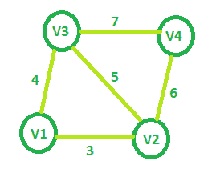

# 给定图的最小生成树代价

> 原文: [https://www.geeksforgeeks.org/minimum-spanning-tree-cost-of-given-graphs/](https://www.geeksforgeeks.org/minimum-spanning-tree-cost-of-given-graphs/)

给定一个名为 `V1`、`V2`、`V3`、…、`Vn` 的 `V` 节点（`V > 2`）的无向图。两个节点 `Vi` 和 `Vj` 相互连接，当且仅当 `0 < |i–j| ≤ 2`。任意顶点对 `(Vi, Vj)` 之间的每条边都被赋予一个权重 `i + j`。任务是找到这种带有 `V` 节点的图的[最小生成树](https://www.geeksforgeeks.org/kruskals-minimum-spanning-tree-algorithm-greedy-algo-2/)的代价。

**举例:**

> **输入:** `V = 4`
>
> 
>
> **输出:** `13`
>
> **输入:** `V = 5`
>
> **输出:** `21`

**方法:** 从具有最少节点（即 3 个节点）的图开始，最小生成树的代价将是 7。现在对于每个节点 `i` 从可以添加到该图的第四个节点开始，第 `i` 个节点只能连接到 `(i–1)` 和 `(i–2)` 节点，最小生成树将只包括具有最小权重的节点，因此新添加的边将具有权重 `i + (i–2)`。

> 所以增加第四个节点会增加整体权重为 `7 + (4 + 2) = 13`
> 同样增加第五个节点，权重 = `13 + (5 + 3) = 21`
> ……
> 对于第 `n` 个节点，**权重 = 权重 + (n + (n–2))**。

这可以概括为 **权重 = V<sup>2</sup> – V + 1**，其中 `V` 是图中的总节点。

以下是上述方法的实现:

## C++

```cpp
// C++ implementation of the approach
#include <bits/stdc++.h>
using namespace std;

// Function that returns the minimum cost
// of the spanning tree for the required graph
int getMinCost(int Vertices)
{
    int cost = 0;

    // Calculating cost of MST
    cost = (Vertices * Vertices) - Vertices + 1;

    return cost;
}

// Driver code
int main()
{
    int V = 5;
    cout << getMinCost(V);

    return 0;
}
```

## Java

```java
// Java implementation of the approach
class GfG
{

// Function that returns the minimum cost
// of the spanning tree for the required graph
static int getMinCost(int Vertices)
{
    int cost = 0;

    // Calculating cost of MST
    cost = (Vertices * Vertices) - Vertices + 1;

    return cost;
}

// Driver code
public static void main(String[] args)
{
    int V = 5;
    System.out.println(getMinCost(V));
}
}

// This code is contributed by
// Prerna Saini.
```

## C\#

```csharp
// C# implementation of the above approach
using System;

class GfG
{

    // Function that returns the minimum cost
    // of the spanning tree for the required graph
    static int getMinCost(int Vertices)
    {
        int cost = 0;

        // Calculating cost of MST
        cost = (Vertices * Vertices) - Vertices + 1;

        return cost;
    }

    // Driver code
    public static void Main()
    {
        int V = 5;
        Console.WriteLine(getMinCost(V));
    }
}

// This code is contributed by Ryuga
```

## Python 3

```python
# python3 implementation of the approach

# Function that returns the minimum cost
# of the spanning tree for the required graph
def getMinCost( Vertices):
    cost = 0

    # Calculating cost of MST
    cost = (Vertices * Vertices) - Vertices + 1

    return cost

# Driver code
if __name__ == "__main__":

    V = 5
    print (getMinCost(V))
```

## PHP

```php
<?php
// PHP implementation of the approach
// Function that returns the minimum cost
// of the spanning tree for the required graph
function getMinCost($Vertices)
{
    $cost = 0;

    // Calculating cost of MST
    $cost = ($Vertices * $Vertices) - $Vertices + 1;

    return $cost;
}

// Driver code
$V = 5;
echo getMinCost($V);

#This Code is contributed by ajit..
?>
```

## JavaScript

```javascript
<script>

// Javascript implementation of the approach

// Function that returns the minimum cost
// of the spanning tree for the required graph
function getMinCost(Vertices)
{
    var cost = 0;

    // Calculating cost of MST
    cost = (Vertices * Vertices) - Vertices + 1;

    return cost;
}

// Driver code
var V = 5;
document.write( getMinCost(V));

// This code is contributed by rrrtnx.
</script>
```

**Output:**

```output

```