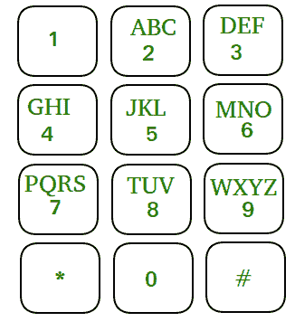

# 手机数字小键盘问题|设置 2

> 原文: [https://www.geeksforgeeks.org/mobile-numeric-keypad-problem-set-2/](https://www.geeksforgeeks.org/mobile-numeric-keypad-problem-set-2/)

给定移动数字键盘。您只能按下当前按钮的向上、向左、向右或向下按钮，或者可以选择再次按下同一个按钮。圆角按钮（即`*`和`#`）是无效的移动。



给定一个数字 **N**，你必须找到长度 N 的不同数字，你可以从 0-9 之间的任何一个数字开始拨号，条件是你只能从你最后按下的数字开始向上、向左、向右或向下移动，或者你可以选择再次按下同一个按钮。

**示例:**

> **输入:** `N = 1`
> **输出:** 10
> 0、1、2、3、4、5、6、7、8、9 是可能的数字。
>
> **输入:** `N = 2`
> **输出:** 36
> 所有可能的数字都是 00，08，11，12，14，21，22，23，25，…
>
> **输入:** `N = 6`
> **输出:** 7990

## 进场

我们看到了很多解决这个问题的方案[这里](https://www.geeksforgeeks.org/mobile-numeric-keypad-problem/)。

让 `X_{n}^{i}` 成为以 `i` 结尾的 `n` 位数的个数。所以，通过这个符号，

> `X_{1}^{0} = 1` 即 `{0}`
> `X_{1}^{1} = 1` 即 `{1}`
> `X_{1}^{2} = 1` 即 `{2}`
> `X_{1}^{3} = 1` 即 `{3}`
> 和
> `X_{2}^{0}`

中心思想是，如果你知道 `X_{n}^{i}`，你能得到哪些关于 `X_{n+1}^{j}` 的信息。

让我们借助一个例子来看看:

> 假设我们知道， `X_{2}^{1} = 3` 它们是 `{11，21，41}`
> 因为所有这些数字的最后一位数字是 `1`，让我们看看从 `1` 我们可以有哪些可能的招式:
>
> 1.  再次按 1。
> 2.  按 2（向右移动）。
> 3.  按 4（向下移动）
>
> 现在我们可以从我们的集合 `{11，21，41}` 中选择任何元素，并进行任何有效的移动:
>
> 1.  `{111，211，411}` 可以通过第一步实现。
> 2.  `{112，212，412}` 随着第二次移动。
> 3.  第三个是 `{114，214，414}`。

我们可以看到，做任何可能的移动，我们每次移动都会得到相同大小的集合。也就是说，在以 1 结尾的两位数集合中有 3 个元素，我们得到了从 1 开始的每个可能的移动的相同大小（3）的集合。

所以，可以看到 `X_{2}^{1}` 贡献了如下 3 位数:

> `X_{3}^{1} += X_{2}^{1}`
> `X_{3}^{2} += X_{2}^{1}`
> `X_{3}^{4} += X_{2}^{1}`

所以，一般来说，如果我们知道 `X_{n}^{i}`，我们就知道它对 `X_{n+1}^{j}` 的贡献数，其中 `j` 是从 `i` 的每一个可能的移动，其中 `0 <= j <= 9`，从 `j` 我们可以有一个有效的 to `i`。


其思想是首先枚举每个给定键的所有可能方向，并维护一个 10 个元素的数组，其中每个索引处的元素存储以该索引结尾的数字计数。例如，数组的初始值为:

> 数值: 1 1 1 1 1 1 1 1 1 1
> 指数: 0 1 2 3 4 5 6 7 8 9

`n = 1` 的初始结果是数组中所有元素的和，即 1+1+1+1+1+1+1+1+1+1 = 10，可以拨打 10 个 1 位数的号码。

**如何更新 `n > 1` 的数组？**
我们先来列举所有给定数字的所有方向:

> | 从 | 可能的移动到 |
> | --- | --- |
> | 0 | 0, 8 |
> | 1 | 1, 2, 4 |
> | 2 | 2, 1, 3, 5 |
> | 3 | 3, 2, 6 |
> | 4 | 4, 1, 5, 7 |
> | 5 | 5, 2, 4, 6, 8 |
> | 6 | 6, 3, 5, 9 |
> | 7 | 7, 4, 8 |
> | 8 | 8, 5, 7, 9, 0 |
> | 9 | 9, 6, 8 |

上面列出的表格的第一行表明，如果数字的最后一位是零，我们可以移动到 0 或 8。让我们详细看看 `N = 2` 的方法。

> 对于 `N = 1`，`Arr[10]` 是 `{1, 1, 1, 1, 1, 1, 1, 1, 1, 1}` 表示存在以索引 `i` 结尾的 `Arr[i]` 数字。
> `X_{1}^{i} = 1, 0 <= i <= 9`
> 让我们创建一个新数组，比如 `Arr2[10] = {0, 0, 0, 0, 0, 0, 0, 0, 0, 0}`
> 现在，对于 0，可能的移动是 0 和 8。我们已经知道 `X_{1}^{0} = 1` 会对 `{0, 8}` 贡献 1，即 `X_{2}^{0} += 1`，`X_{2}^{8} += 1`。
> `Arr2[10] = {1, 0, 0, 0, 0, 0, 0, 1, 0}`
> 对于 1，可能的移动是 1，2，4。我们已经知道 `X_{1}^{1} = 1` 会对 `{1, 2, 4}` 贡献 1，即 `X_{2}^{1} += 1`，`X_{2}^{2} += 1`，`X_{2}^{4} += 1`。
> 对于 2，可能的招式有 2、1、3、4。我们已经知道 `X_{1}^{2} = 1` 会对 `{2, 1, 3, 4}` 贡献 1，即 `X_{2}^{2} += 1`，`X_{2}^{1} += 1`，`X_{2}^{3} += 1`，`X_{2}^{4} += 1`。
> `Arr2[10] = {1, 2, 2, 1, 2, 0, 0, 0, 1, 0}`
> 等等。
> 最终 `Arr2[10] = {2, 3, 4, 3, 4, 5, 4, 3, 5, 3}`
> `Sum = 2+3+4+3+4+5+4+3+5+3 = 36`（对于 `N=2`）
> `Arr2` 现在保存了 `X_{2}^{i}, 0 <= i <= 9` 的值，可以认为是 `n=3` 的起点，过程继续。

下面是上述方法的实现:

## C++

```cpp
// C++ implementation of the approach
#include <iostream>
#include <list>
using namespace std;
#define MAX 10

// Function to return the count of numbers possible
int getCount(int n)
{
    // Array of list storing possible direction
    // for each number from 0 to 9
    // mylist[i] stores possible moves from index i
    list<int> mylist[MAX];

    // Initializing list
    mylist[0].assign({ 0, 8 });
    mylist[1].assign({ 1, 2, 4 });
    mylist[2].assign({ 2, 1, 3, 5 });
    mylist[3].assign({ 3, 6, 2 });
    mylist[4].assign({ 4, 1, 7, 5 });
    mylist[5].assign({ 5, 4, 6, 2, 8 });
    mylist[6].assign({ 6, 3, 5, 9 });
    mylist[7].assign({ 7, 4, 8 });
    mylist[8].assign({ 8, 5, 0, 7, 9 });
    mylist[9].assign({ 9, 6, 8 });

    // Storing values for n = 1
    int Arr[MAX] = { 1, 1, 1, 1, 1, 1, 1, 1, 1, 1 };

    for (int i = 2; i <= n; i++) {

        // To store the values for n = i
        int Arr2[MAX] = { 0 };

        // Loop to iterate through each index
        for (int j = 0; j < MAX; j++) {

            // For each move possible from j
            // Increment the value of possible
            // move positions by Arr[j]
            for (int x : mylist[j]) {
                Arr2[x] += Arr[j];
            }
        }

        // Update Arr[] for next iteration
        for (int j = 0; j < MAX; j++)
            Arr[j] = Arr2[j];
    }

    // Find the count of numbers possible
    int sum = 0;
    for (int i = 0; i < MAX; i++)
        sum += Arr[i];

    return sum;
}

// Driver code
int main()
{
    int n = 2;

    cout << getCount(n);

    return 0;
}
```

## Java

```java
// Java implementation of the approach
class GFG
{
    static int MAX = 10;

    // Function to return the count of numbers possible
    static int getCount(int n)
    {
        // Array of list storing possible direction
        // for each number from 0 to 9
        // list[i] stores possible moves from index i

        int [][] list = new int[MAX][];

        // Initializing list
        list[0] = new int [] { 0, 8 };
        list[1] = new int [] { 1, 2, 4 };
        list[2] = new int [] { 2, 1, 3, 5 };
        list[3] = new int [] { 3, 6, 2 };
        list[4] = new int [] { 4, 1, 7, 5 };
        list[5] = new int [] { 5, 4, 6, 2, 8 };
        list[6] = new int [] { 6, 3, 5, 9 };
        list[7] = new int [] { 7, 4, 8 };
        list[8] = new int [] { 8, 5, 0, 7, 9 };
        list[9] = new int [] { 9, 6, 8 };

        // Storing values for n = 1
        int Arr[] = new int [] { 1, 1, 1, 1, 1, 1, 1, 1, 1, 1 };

        for (int i = 2; i <= n; i++)
        {

            // To store the values for n = i
            int Arr2[] = new int [MAX];

            // Loop to iterate through each index
            for (int j = 0; j < MAX; j++)
            {

                // For each move possible from j
                // Increment the value of possible
                // move positions by Arr[j]
                for (int x = 0; x < list[j].length; x++)
                {
                    Arr2[list[j][x]] += Arr[j];
                }
            }

            // Update Arr[] for next iteration
            for (int j = 0; j < MAX; j++)
                Arr[j] = Arr2[j];
        }

        // Find the count of numbers possible
        int sum = 0;
        for (int i = 0; i < MAX; i++)
            sum += Arr[i];

        return sum;
    }

    // Driver code
    public static void main (String[] args)
    {

        int n = 2;

        System.out.println(getCount(n));
    }
}

// This code is contributed by ihritik
```

## C#

```csharp
// C# implementation of the approach
using System;

class GFG
{
    static int MAX = 10;

    // Function to return the count of numbers possible
    static int getCount(int n)
    {
        // Array of list storing possible direction
        // for each number from 0 to 9
        // list[i] stores possible moves from index i
        int [][] list = new int[MAX][];
```

```csharp
// Initializing list
list[0] = new int [] { 0, 8 };
list[1] = new int [] { 1, 2, 4 };
list[2] = new int [] { 2, 1, 3, 5 };
list[3] = new int [] { 3, 6, 2 };
list[4] = new int [] { 4, 1, 7, 5 };
list[5] = new int [] { 5, 4, 6, 2, 8 };
list[6] = new int [] { 6, 3, 5, 9 };
list[7] = new int [] { 7, 4, 8 };
list[8] = new int [] { 8, 5, 0, 7, 9 };
list[9] = new int [] { 9, 6, 8 };

// Storing values for n = 1
int [] Arr = new int [] { 1, 1, 1, 1, 1, 1, 1, 1, 1, 1 };

for (int i = 2; i <= n; i++)
{
    // To store the values for n = i
    int [] Arr2 = new int [MAX];

    // Loop to iterate through each index
    for (int j = 0; j < MAX; j++)
    {
        // For each move possible from j
        // Increment the value of possible
        // move positions by Arr[j]
        for (int x = 0; x < list[j].Length; x++)
        {
            Arr2[list[j][x]] += Arr[j];
        }
    }

    // Update Arr[] for next iteration
    for (int j = 0; j < MAX; j++)
        Arr[j] = Arr2[j];
}

// Find the count of numbers possible
int sum = 0;
for (int i = 0; i < MAX; i++)
    sum += Arr[i];

return sum;
```

```csharp
// Driver code
public static void Main ()
{
    int n = 2;
    Console.WriteLine(getCount(n));
}
```

// This code is contributed by ihritik

**Output:**

**时间复杂度:** `O(N)`
**空间复杂度:** `O(1)`