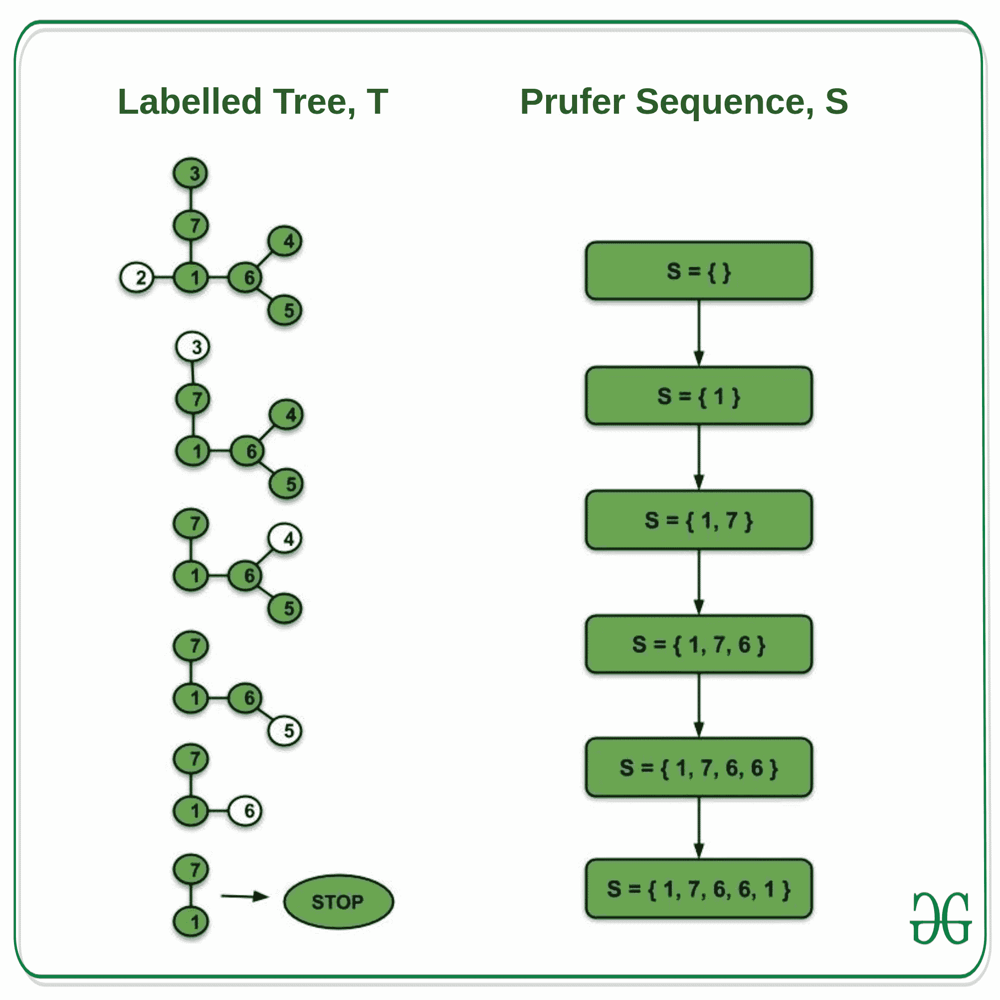
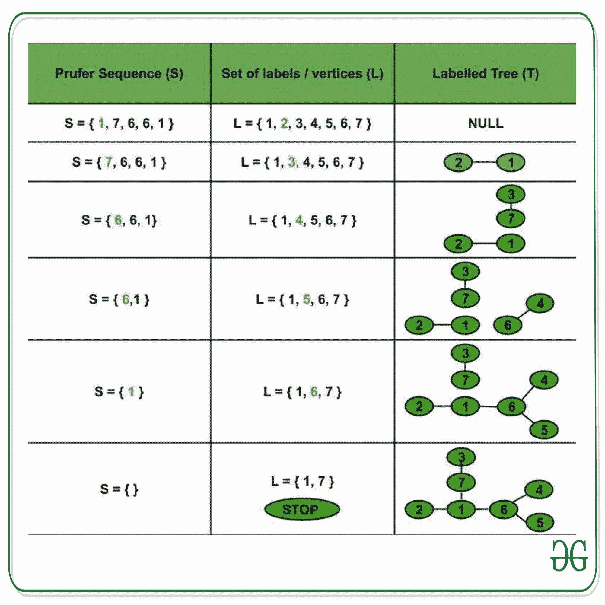

# 加权完全图的生成树数量

> 原文: [https://www.geeksforgeeks.org/number-of-spanning-trees-of-a-weighted-complete-graph/](https://www.geeksforgeeks.org/number-of-spanning-trees-of-a-weighted-complete-graph/)

## 先决条件
[图论基础](https://www.geeksforgeeks.org/mathematics-graph-theory-basics-set-1/)，[生成树](https://en.wikipedia.org/wiki/Spanning_tree)。

## 完全加权图
其中一条边连接每对图顶点，并且每条边都有与之关联的权重的图称为完全加权图。

具有 `n` 个顶点的完全加权图的生成树的数量是 `n^(n-2)`。

## 证明
生成树是图 `G` 的包含图的所有顶点的子图。因此，完全加权图的生成树的数量与具有 `n` 个顶点的标记树（不必是二进制的）的数量相同。

由 `n` 个顶点组成的标记树的 Prüfer 序列是与树相关联的唯一长度序列 `(n-2)`。此外，对于标签 `1` 至 `n` 上的给定长度 `(n-2)` 的普吕弗序列，存在具有给定普吕弗序列的唯一标记树。因此，我们在标签 `1` 到 `n` 上具有 `n` 个顶点的**标记树的集合 A** 和大小为 `n-2` 的 **Prüfer 序列的集合 B** 之间有一个**双射**。这可以证明如下：

设 `T` 是顶点为 `1, 2, …, n` 的标记树，`S` 作为大小为 `(n-2)` 的普吕弗序列。因此，`T` 和 `S` 分别是集合 `A` 和 `B` 的元素。

### (i) 标记树(T) –> 普鲁弗序列(S)

构建标记树的 Prüfer 序列：

最初，假设 `S` 为空。

**程序：**

```
求标签最小的 T 的叶节点(L)。
把 L 的邻居加到 S 上。
删除叶节点 L。
重复上述步骤，直到树中只剩下两个节点（只能有一个生成树）。
我们构建了与标记树 T 相关的序列 S。
```



**观察：**

*   没有叶节点附加到 `S`。
*   树 `T` 的每一个顶点 `V` 都加到 `S` 上，共加 `度(V)-1` 次。
*   树 `T` 有 `n` 个顶点，因此有 `(n-1)` 条边。
*   `S` 中的项数 = 属于树 `T` 的所有顶点 `V` 的 `(度(V)–1)` 之和 = 树 `T` 的所有顶点的度之和 – `(1+1+…+1..n 次)` = `2*(边数)–n = 2*(n-1)–n = n-2`。（因为树的所有顶点的度之和 = `2 * 树的边数`）。
*   因此，`T` 对应于长度为 `(n-2)` 的普吕弗序列 `S`。

### (ii) 普鲁弗序列 –> 标记树(T)

从标记树的 Prüfer 序列构建标记树：

**程序：**

```
设 L = {1, 2, …, n} 为标签集（T 的顶点）。
让 S = {a_1, a_2, …, a_(n-2)} 成为大小为 (n-2) 的 Prüfer 序列，其中每个 a_i 属于 L。
求属于 L 但不在 S 中的最小元素 x。
通过一条边连接 x 和 S 的第一个元素 (a_1)。
从 S 中删除 a_1，从 L 中删除 x（因此，S := S - {a_1}，L := L - {x}）。
同样，求 y，属于 L 而不在 S 的最小元素。
连接 y 和 S 的第一个元素 (a_2)。
从 L 中移除 y，从 S 中移除 a_2（因此，S := S - {a_2}，L := L - {y}）。
继续上述过程，直到 L 中剩下两个项目。
在目前形成的树中连接这两个项目。
```



从 `S` 得到的树与 `T` 相同，因此大小为 `(n-2)` 的 Prüfer 序列 `S` 对应于 `T`（`S ↔ T`）。因此，在具有 `n` 个顶点的标记树集合和标签 `1` 到 `n` 上的大小为 `(n-2)` 的普吕弗序列集合之间存在一个**双射**。

因此，`n` 个顶点的完全加权图的**生成树的数量** = 具有 `n` 个顶点的标记树的数量 = 大小为 `(n-2)` 的 Prüfer 序列的数量 = `n^(n-2)`。