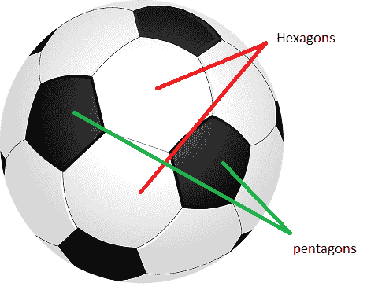
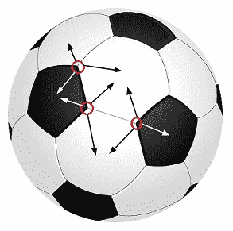
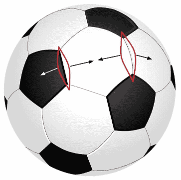

# 足球上五边形和六边形的数量

> 原文: [https://www.geeksforgeeks.org/number-pentagons-hexagons-football/](https://www.geeksforgeeks.org/number-pentagons-hexagons-football/)

## 问题描述

给定一个标准的足球，在上面画出规则的六边形和五边形，如图所示。找出六边形和五边形的数量。



## 应用欧拉特征

我们可以应用[欧拉特征](https://en.wikipedia.org/wiki/Euler_characteristic)找出一个标准足球上的六边形和五边形的数量。

根据欧拉特征：每个曲面 `S` 存在一个整数 `χ(S)`，使得每当具有 `V` 个顶点和 `E` 条边的图 `G` 嵌入到 `S` 中从而存在 `F` 个面（由该图划分的区域）时，我们具有：

`V - E + F = χ(S)`

对于球体（足球的形状），`χ(S) = 2`。
因此，方程变成 `V–E+F = 2`。

## 计算顶点数

现在，让五边形的数量为 `P`，六边形的数量为 `H`。

顶点的数量将是：
每个六边形 6 个顶点，即 `6*H`。
每个五边形 5 个顶点，即 `5*P`。
但是我们已经计算了每个顶点三次，每个相邻多边形一次，如下图。



因此，顶点的数量 `V = (6*H + 5*P)/3`。

## 计算边数

边的数量将是：
每个六边形 6 条边，即 `6*H`。
每个五边形 5 条边，即 `5*P`。
但是我们已经计算了每个边两次，每个相邻多边形一次，如下图。



因此，边的数量 `E = (6*H + 5*P)/2`。

## 计算面数

面数将为：
有 `H` 个六边形和 `P` 个五边形，各形成一个面。因此，面的总数 `F = (H + P)`。

## 求解方程

所以，我们可以写道：

```
V - E + F = 2
(6*H + 5*P)/3 - (6*H + 5*P)/2 + (H + P) = 2
```

求解这个方程后，我们将得到 `P = 12`。所以，有 12 个五边形。

现在六边形的数量：
我们可以看到每个五边形被 5 个六边形包围。所以应该有 `5*P` 个六边形，但是我们已经为每个六边形的 3 个相邻五边形计算了三次。因此，六边形的数量 `H = 5*P/3 = 5*12/3 = 20`。

## 结论

因此，一个标准足球中有 20 个六边形和 12 个五边形。