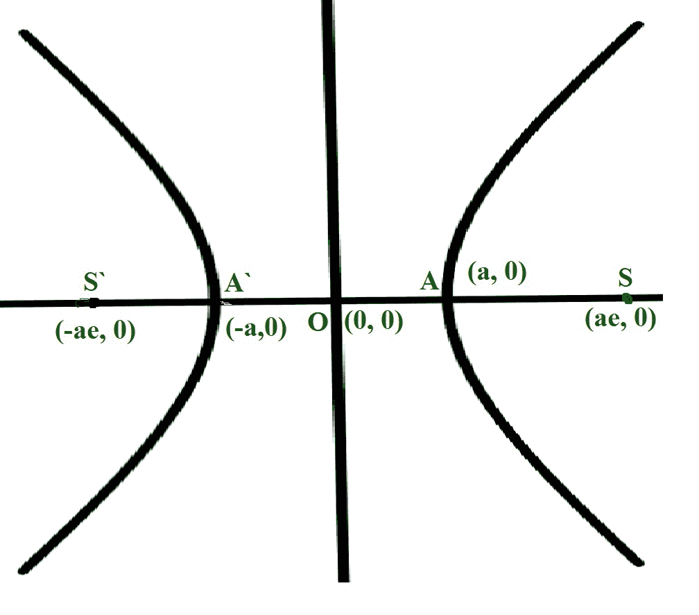

# 计算双曲线偏心率的程序

> 原文: [https://www.geeksforgeeks.org/program-to-find-the-eccentricity-of-a-hyperbola/](https://www.geeksforgeeks.org/program-to-find-the-eccentricity-of-a-hyperbola/)

给定两个整数 `A` 和 `B`，表示方程 `(X^2/A^2) - (Y^2/B^2) = 1` 的双曲线半长半短轴的长度，任务是计算给定双曲线的偏心率。

## 示例

> **输入:** `A = 3`，`B = 2`
> **输出:** `1.20185`
> **说明:**
> 给定双曲线的偏心率为 `1.20185`。
>
> **输入:** `A = 6`，`B = 3`
> **输出:** `1.11803`

## 方法

给定的问题可以用公式求椭圆的偏心来解决。

[](https://media.geeksforgeeks.org/wp-content/uploads/20210320022154/hyperbola.jpg)

*   半长轴的长度为 `A`。
*   半短轴的长度为 `B`。
*   因此，椭圆的偏心率由 `sqrt(1 + B^2 / A^2)` 给出，其中 `A > B`。

因此，想法是将 `sqrt(1 + B^2 / A^2)` 的值打印为椭圆的偏心率。

下面是上述方法的实现：

### C++

```cpp
// C++ program for the above approach

#include <bits/stdc++.h>
using namespace std;

// Function to find the eccentricity
// of a hyperbola
double eccHyperbola(double A, double B)
{
    // Stores the squared ratio
    // of major axis to minor axis
    double r = (double)B * B / A * A;

    // Increment r by 1
    r += 1;

    // Return the square root of r
    return sqrt(r);
}

// Driver Code
int main()
{
    double A = 3.0, B = 2.0;
    cout << eccHyperbola(A, B);

    return 0;
}
```

### Java

```java
// Java program for the above approach
import java.util.*;

class GFG{

// Function to find the eccentricity
// of a hyperbola
static double eccHyperbola(double A, double B)
{

    // Stores the squared ratio
    // of major axis to minor axis
    double r = (double)B * B / A * A;

    // Increment r by 1
    r += 1;

    // Return the square root of r
    return Math.sqrt(r);
}

// Driver Code
public static void main(String[] args)
{
    double A = 3.0, B = 2.0;

    System.out.print(eccHyperbola(A, B));
}
}

// This code is contributed by Amit Katiyar
```

### Python 3

```python
# Python3 program for the above approach
import math

# Function to find the eccentricity
# of a hyperbola

def eccHyperbola(A, B):

    # Stores the squared ratio
    # of major axis to minor axis
    r = B * B / A * A

    # Increment r by 1
    r += 1

    # Return the square root of r
    return math.sqrt(r)

# Driver Code
if __name__ == "__main__":

    A = 3.0
    B = 2.0
    print(eccHyperbola(A, B))

    # This code is contributed by ukasp
```

### C#

```csharp
// C# program for the above approach
using System;

class GFG{

// Function to find the eccentricity
// of a hyperbola
static double eccHyperbola(double A, double B)
{

    // Stores the squared ratio
    // of major axis to minor axis
    double r = (double)B * B / A * A;

    // Increment r by 1
    r += 1;

    // Return the square root of r
    return Math.Sqrt(r);
}

// Driver Code
public static void Main(String[] args)
{
    double A = 3.0, B = 2.0;

    Console.Write(eccHyperbola(A, B));
}
}

// This code is contributed by Princi Singh
```

### JavaScript

```javascript
<script>

// Javascript program for the above approach

// Function to find the eccentricity
// of a hyperbola
function eccHyperbola(A, B)
{

    // Stores the squared ratio
    // of major axis to minor axis
    let r = B * B / A * A;

    // Increment r by 1
    r += 1;

    // Return the square root of r
    return Math.sqrt(r);
}

// Driver Code
let A = 3.0;
let B = 2.0;

document.write(eccHyperbola(A, B));

// This code is contributed by mohit kumar

</script>
```

**输出:**

```
2.23607
```

**时间复杂度:** `O(1)`
**辅助空间:** `O(1)`