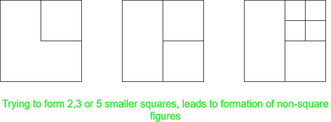
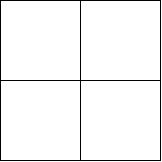
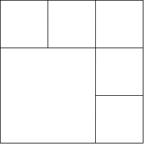
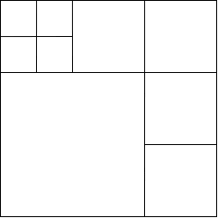

# 拼图|将一个正方形分成 N 个更小的正方形

> 原文:[https://www . geesforgeks . org/拼图-将一个正方形分成 n 个更小的正方形/](https://www.geeksforgeeks.org/puzzle-dividing-a-square-into-n-smaller-squares/)

## 谜题
找出 `N` 的所有值，对于这些值，可以将一个正方形分解成 `N` 个更小的正方形，并勾勒出进行这种分解的算法。

## 解
观察的基本点是正方形有 4 个直角。所以，要把它分成更小的正方形，它的每一个`直角`必须落入另一个正方形中，因为不止一个`直角`加起来会产生一个非正方形的数字。

现在，考虑以下情况:

### 当 N = 2、3 或 5 时
`不可能有这样的划分`，因为它违反了上述给定的条件，并且获得了非形状的图形。

### 当 N = 4 时
这是最简单的情况。只需`从中心水平垂直分割正方形`。得到的图形将有 4 个正方形。

### 当 N 是大于 4 的偶数时
这种情况可以通过考虑 `N = 2k` 并在给定正方形的相邻边上形成 `2k – 1` 个相等的正方形来概括。然而，每个较小正方形的边长应等于给定正方形长度的 `1/k`。

例如：考虑如图所示 `N = 6` 时的例子，这里我们沿着原正方形的边的顶部和右侧，每边 `(1/3)rd` 形成了 `5 个正方形`。此外，还剩下一个正方形的边 `(2/k)` ，总共有 6 个正方形。

### 当 N 是大于 5 的奇数时
这种情况建立在偶数 `N` 的解决方案之上。如果 `N` 是奇数，我们可以将其分解为 `N = 2k + 1`，这可以进一步写成 `N = 2(k – 1) + 3`。现在，我们可以先使用上述方法形成 `2(k – 1)` 个正方形，然后将其中一个获得的正方形分成四个更小的正方形，这将使总的正方形数量增加 3。

例如：考虑 `N = 9` 时的例子，如图所示。这里我们先形成 `6 格`，然后把左上角的方块分成 `4` 个更小的方块，得到总计 `9` 个方块。

