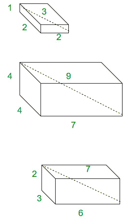

# 毕达哥拉斯四重

> 原文：[https://www.geeksforgeeks.org/pythagorean-quadruple/](https://www.geeksforgeeks.org/pythagorean-quadruple/)

给定四个点，检查它们是否构成毕达哥拉斯四重。定义为整数 `a`、`b`、`c`、`d` 的元组，使得 `a^2 + b^2 + c^2 = d^2`。它们基本上是**丢番图方程**的解。在几何解释中，它表示一个具有整数边长 `|a|`、`|b|`、`|c|` 的**长方体**，其空间对角线为 `|d|`。



这里显示的长方体侧面是毕达哥拉斯四角体的例子。

当它们的最大公约数为 1 时为本原。每一个毕达哥拉斯四元组都是一个原始四元组的整数倍。我们可以通过公式生成 `a` 为奇数的原始毕达哥拉斯四元组集：

> `a = m^2 + n^2 – p^2 – q^2`
> `b = 2(mq + np)`
> `c = 2(nq – mp)`
> `d = m^2 + n^2 + p^2 + q^2`

其中 `m`、`n`、`p`、`q` 是最大公约数为 1 的非负整数，使得 `m + n + p + q` 为奇数。因此，所有原始的毕达哥拉斯四足动物都以**勒贝格的同一性**为特征。

> `(m^2 + n^2 + p^2 + q^2)^2 = (2mq + 2np)^2 + (2nq – 2mp)^2 + (m^2 + n^2 – p^2 – q^2)^2`

## C++

```cpp
// C++ code to detect Pythagorean Quadruples.
#include <bits/stdc++.h>
using namespace std;

// function for checking
bool pythagorean_quadruple(int a, int b, int c, int d)
{
    int sum = a * a + b * b + c * c;
    if (d * d == sum)
        return true;
    else
        return false;
}

// Driver Code
int main()
{
    int a = 1, b = 2, c = 2, d = 3;
    if (pythagorean_quadruple(a, b, c, d))
        cout << "Yes" << endl;
    else
        cout << "No" << endl;
}
```

## Java

```java
// Java code to detect Pythagorean Quadruples.
import java.io.*;
import java.util.*;

class GFG {

    // function for checking
    static Boolean pythagorean_quadruple(int a, int b, int c, int d)
    {
        int sum = a * a + b * b + c * c;
        if (d * d == sum)
            return true;
        else
            return false;
    }

    // Driver function
    public static void main (String[] args) {
        int a = 1, b = 2, c = 2, d = 3;
        if (pythagorean_quadruple(a, b, c, d))
            System.out.println("Yes");
        else
            System.out.println("No");
    }
}
// This code is contributed by Gitanjali.
```

## Python 3

```python
# Python code to detect
# Pythagorean Quadruples.
import math

# function for checking
def pythagorean_quadruple(a, b, c, d):
    sum = a * a + b * b + c * c
    if (d * d == sum):
        return True
    else:
        return False

# driver code
a = 1
b = 2
c = 2
d = 3
if (pythagorean_quadruple(a, b, c, d)):
    print("Yes")
else:
    print("No")

# This code is contributed
# by Gitanjali.
```

## C#

```csharp
// C# code to detect
// Pythagorean Quadruples.
using System;

class GFG {

    // function for checking
    static Boolean pythagorean_quadruple(int a, int b, int c, int d)
    {
        int sum = a * a + b * b + c * c;
        if (d * d == sum)
            return true;
        else
            return false;
    }

    // Driver function
    public static void Main () {
        int a = 1, b = 2, c = 2, d = 3;
        if (pythagorean_quadruple(a, b, c, d))
            Console.WriteLine("Yes");
        else
            Console.WriteLine("No");
    }
}

// This code is contributed by vt_M.
```

## PHP

```php
<?php
// php code to detect Pythagorean Quadruples.

// function for checking
function pythagorean_quadruple($a, $b, $c, $d)
{
    $sum = $a * $a + $b * $b + $c * $c;
    if ($d * $d == $sum)
        return true;
    else
        return false;
}

// Driver Code
$a = 1; $b = 2; $c = 2; $d = 3;
if (pythagorean_quadruple($a, $b, $c, $d))
    echo "Yes";
else
    echo "No";

// This code is contributed by anuj_67.
?>
```

## JavaScript

```javascript
<script>
// JavaScript program to detect Pythagorean Quadruples.

// function for checking
function pythagorean_quadruple(a, b, c, d)
{
    let sum = a * a + b * b + c * c;
    if (d * d == sum)
        return true;
    else
        return false;
}

// Driver code
let a = 1, b = 2, c = 2, d = 3;
if (pythagorean_quadruple(a, b, c, d))
    document.write("Yes");
else
    document.write("No");
</script>
```

**输出：**

```
Yes
```

参考文献：
- [【wiki】](https://en.wikipedia.org/wiki/Pythagorean_quadruple)
- [【mathworld】](http://mathworld.wolfram.com/PythagoreanQuadruple.html)