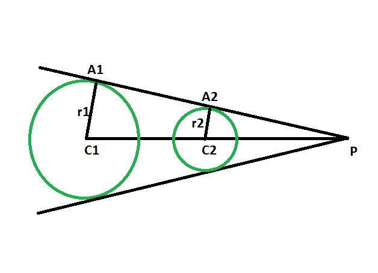

# 圆心与圆的两条直接公共切线交点的距离比

> 原文: [https://www.geeksforgeeks.org/ratio-of-the-distance-between-the-centers-of-the-circles-and-the-point-of-intersection-of-two-direct-common-tangents-to-the-circles/](https://www.geeksforgeeks.org/ratio-of-the-distance-between-the-centers-of-the-circles-and-the-point-of-intersection-of-two-direct-common-tangents-to-the-circles/)

给定两个具有给定半径的圆，使得圆不相互接触，任务是找到圆的中心与圆的两条直接公共切线的交点之间的距离比。

## 示例

```
Input: r1 = 4, r2 = 6 
Output: 2:3

Input: r1 = 22, r2 = 43
Output: 22:43
```



## 方法

*   让圆的半径分别为 `r1` 和 `r2`，圆心分别为 `C1` 和 `C2`。
*   设 `P` 为圆的两条直接公共切线的交点，`A1` 和 `A2` 为切线与圆的接触点。
*   在三角形 `PC1A1` 和三角形 `PC2A2` 中，
    角度 `C1A1P` = 角度 `C2A2P` = `90` 度
    角度 `A1PC1` = 角度 `A2PC2`
    所以，角度 `A1C1P` = 角度 `A2C2P`。
*   所以，由于三角形的相似性，
    `C1P / C2P = C1A1 / C2A2 = r1 / r2`

> 圆心与圆的两条直接公共切线的交点之间的距离之比 = 第一个圆的半径 : 第二个圆的半径

下面是上述方法的实现：

## C++

```cpp
// C++ program to find the ratio of the distance
// between the centers of the circles
// and the point of intersection of
// two direct common tangents to the circles
// which do not touch each other

#include <bits/stdc++.h>
using namespace std;

// Function to find the GCD
int GCD(int a, int b)
{
    return (b != 0 ? GCD(b, a % b) : a);
}

// Function to find the ratio
void ratiotang(int r1, int r2)
{
    cout << "The ratio is "
         << r1 / GCD(r1, r2)
         << " : "
         << r2 / GCD(r1, r2)
         << endl;
}

// Driver code
int main()
{
    int r1 = 4, r2 = 6;
    ratiotang(r1, r2);
    return 0;
}
```

## Java

```java
// Java program to find the ratio of the distance
// between the centers of the circles
// and the point of intersection of
// two direct common tangents to the circles
// which do not touch each other
class GFG {

    // Function to find the GCD
    static int GCD(int a, int b)
    {
        return (b != 0 ? GCD(b, a % b) : a);
    }

    // Function to find the ratio
    static void ratiotang(int r1, int r2)
    {
        System.out.println("The ratio is "
                           + r1 / GCD(r1, r2)
                           + " : "
                           + r2 / GCD(r1, r2));
    }

    // Driver code
    public static void main(String args[])
    {
        int r1 = 4, r2 = 6;
        ratiotang(r1, r2);
    }
}

// This code has been contributed by 29AjayKumar
```

## Python 3

```python
# Python 3 program to find the ratio
# of the distance between the centers
# of the circles and the point of intersection
# of two direct common tangents to the circles
# which do not touch each other

# Function to find the GCD
from math import gcd

# Function to find the ratio
def ratiotang(r1, r2):
    print("The ratio is", int(r1 / gcd(r1, r2)), ":",
                      int(r2 / gcd(r1, r2)))

# Driver code
if __name__ == '__main__':
    r1 = 4
    r2 = 6
    ratiotang(r1, r2)

# This code is contributed by
# Surendra_Gangwar
```

## C#

```csharp
// C# program to find the ratio of the distance
// between the centers of the circles
// and the point of intersection of
// two direct common tangents to the circles
// which do not touch each other
using System;

class GFG
{

    // Function to find the GCD
    static int GCD(int a, int b)
    {
        return (b != 0 ? GCD(b, a % b) : a);
    }

    // Function to find the ratio
    static void ratiotang(int r1, int r2)
    {
        Console.WriteLine("The ratio is "
                        + r1 / GCD(r1, r2)
                        + " : "
                        + r2 / GCD(r1, r2));
    }

    // Driver code
    public static void Main(String[] args)
    {
        int r1 = 4, r2 = 6;
        ratiotang(r1, r2);
    }
}

// This code contributed by Rajput-Ji
```

## PHP

```php
<?php
// PHP program to find the ratio of the distance
// between the centers of the circles
// and the point of intersection of
// two direct common tangents to the circles
// which do not touch each other

// Function to find the GCD
function GCD($a, $b)
{
    return ($b != 0 ? GCD($b, $a % $b) : $a);
}

// Function to find the ratio
function ratiotang($r1, $r2)
{
    echo "The ratio is ", $r1 / GCD($r1, $r2),
                " : ", $r2 / GCD($r1, $r2) ;
}

// Driver code
$r1 = 4; $r2 = 6;
ratiotang($r1, $r2);

// This code is contributed by AnkitRai01
?>
```

## JavaScript

```javascript
<script>
// javascript program to find the ratio of the distance
// between the centers of the circles
// and the point of intersection of
// two direct common tangents to the circles
// which do not touch each other

// Function to find the GCD
function GCD(a , b)
{
    return (b != 0 ? GCD(b, a % b) : a);
}

// Function to find the ratio
function ratiotang(r1 , r2)
{
    document.write("The ratio is "
                       + r1 / GCD(r1, r2)
                       + " : "
                       + r2 / GCD(r1, r2));
}

// Driver code
var r1 = 4, r2 = 6;
ratiotang(r1, r2);

// This code is contributed by Princi Singh
</script>
```

**输出：**

```
The ratio is 2 : 3
```