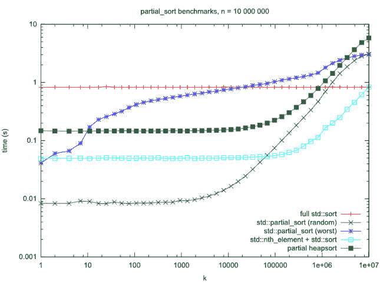

# C++ STL 中 sort()、partial_sort() 与 nth_element() + sort() 的比较

> 原文：[https://www.geeksforgeeks.org/sort-vs-partial_sort-vs-nth_element-sort-in-c-stl/](https://www.geeksforgeeks.org/sort-vs-partial_sort-vs-nth_element-sort-in-c-stl/)

在本文中，我们将讨论 [`sort()`](https://www.geeksforgeeks.org/sort-c-stl/)、[`partial_sort()`](https://www.geeksforgeeks.org/stdpartial_sort-in-cpp/) 和 [`nth_element()`](https://www.geeksforgeeks.org/stdnth_element-in-cpp/) + `sort()`。

以下是上述功能的图示：

## 1. `sort()`

[C++ STL](https://www.geeksforgeeks.org/the-c-standard-template-library-stl/) 提供了一个函数 `sort()`，在 O(N*log N) 时间内对元素列表进行排序。默认情况下，`sort()` 按升序对数组进行排序。下面是程序说明 `sort()`：

```cpp
// C++ program to illustrate the default behaviour
// of sort() in STL
#include <bits/stdc++.h>
using namespace std;

// Driver Code
int main()
{
    // Given array of elements
    int arr[] = { 1, 5, 8, 9, 6, 7, 3, 4, 2, 0 };
    int n = sizeof(arr) / sizeof(arr[0]);

    // Function sort() to sort the element of
    // the array in increasing order
    sort(arr, arr + n);

    // Print the array elements after sorting
    cout << "\nArray after sorting using "
            "default sort is: \n";
    for (int i = 0; i < n; ++i) {
        cout << arr[i] << " ";
    }

    return 0;
}
```

**输出：**

```
Array after sorting using default sort is : 
0 1 2 3 4 5 6 7 8 9
```

## 2. `partial_sort()`

`std::sort()` 的变体之一是 `std::partial_sort()`，用于排序的不是整个范围，而是其中的一个子部分。它重新排列 `[first, last)` 范围内的元素，`middle` 之前的元素按升序排序，而 `middle` 之后的元素没有任何特定的顺序。
下面是说明 `partial_sort()` 的程序：

```cpp
// C++ program to demonstrate the use of
// partial_sort()
#include <bits/stdc++.h>
using namespace std;

// Driver Code
int main()
{
    // Given array of elements
    vector<int> v = { 1, 3, 1, 10, 3, 3, 7, 7, 8 };

    // Using std::partial_sort() to sort
    // first 3 elements
    partial_sort(v.begin(), v.begin() + 3, v.end());

    // Displaying the vector after applying
    // partial_sort()
    for (int ip : v) {
        cout << ip << " ";
    }

    return 0;
}
```

**Output:**

```
1 1 3 10 3 3 7 7 8
```

`partial_sort()` 的复杂度为 O(N*log K)，其中 N 为数组中的元素个数，K 为 `middle` 与 `first` 之间的元素个数。如果 `K` 明显小于 `N`，则 `partial_sort()` 比 `sort()` 快，因为 `partial_sort()` 将首先对 `K` 个元素进行排序，而 `sort()` 将对所有 `N` 个元素进行排序。
最差情况 O(N*log K) 运行时间 `partial_sort()` 并不能说明全部情况。其随机输入的平均情况运行时间为 O(N + K*log K + K*(log K)*(log(N/K)))。
因为忽略每个不在最小 `K` 中的元素所做的工作非常少，到目前为止仅通过一次比较就可以看出，对于小 `K` 来说，常数因子很难超越，即使有一个渐近更好的算法。

## 3. `nth_element()`

`nth_element()` 是一个 STL 算法，它重新排列列表，使得第 `nth` 个位置上的元素，就是如果我们对列表进行排序后应该位于该位置的元素。
它并不对列表进行排序，只是确保所有位于第 `nth` 个元素之前的元素都不大于它，而所有位于其后的元素都不小于它。
下面是程序说明 `nth_element()`：

```cpp
// C++ program to demonstrate the use
// of std::nth_element
#include <bits/stdc++.h>
using namespace std;

// Driver Code
int main()
{
    // Given array v[]
    int v[] = { 3, 2, 10, 45, 33, 56, 23, 47 };

    // Using nth_element with n as 5
    nth_element(v, v + 4, v + 8);

    // Since, n is 5 so 5th element
    // should be sorted
    for (int i = 0; i < 8; i++)
        cout << v[i] << " ";

    return 0;
}
```

**Output:**

```
3 2 10 23 33 56 45 47
```

下面是三种算法的基准比较，N 从 0 到 10 不等 <sup>7</sup> (图中 X 轴)：
[](https://media.geeksforgeeks.org/wp-content/uploads/20200616101133/Benchmark_Untitled-Diagram.jpg)

**`nth_element()` + `sort()`** 解是渐近最快的，对于更大的 `K` (其中大部分都注意到对数刻度)执行更好的结果。但在随机输入 `K < 70000` 时，它确实输给了 `partial_sort()`，输率高达 6 倍。