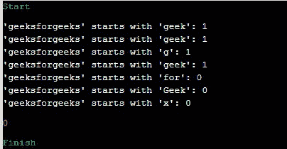
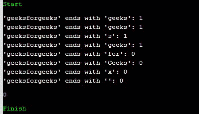

# 在 C++20 中以 `starts_with()` 开头，以 `ends_with()` 结尾，示例

> 原文: [https://www.geeksforgeeks.org/starts_with-and-ends_with-in-c20-with-examples/](https://www.geeksforgeeks.org/starts_with-and-ends_with-in-c20-with-examples/)

在这篇文章中，我们将讨论以 `starts_with()` 开头，以 `ends_with()` 结尾，并用 C++20 中的例子。

## 以 `starts_with()` 开头

这个函数有效地检查一个字符串是否以给定的前缀开始。这个函数是用 `std::basic_string` 和 `std::basic_string_view` 编写的。

**语法:**

> `template <typename PrefixType> bool starts_with(PrefixType prefix) const`

在上面的语法中，`PrefixType` 可以是:

*   `std::string`
*   `std::string_view`
*   单字符或带有空终止字符的 C 风格字符串

**以 `starts_with()` 开头，前缀类型不同:**

> `constexpr bool starts_with(std::basic_string_view<CharT, Traits> sv) const noexcept;`
> `constexpr bool starts_with(CharT c) const noexcept;`
> `constexpr bool starts_with(const CharT* s) const;`

函数的三种重载形式都有效地返回了 `std::basic_string_view<CharT, Traits>(data(), size()).starts_with(x)`。

**参数:** 需要单个字符序列或单个字符来与字符串的开头进行比较。

**返回值:** 返回如下布尔真或假指示:

*   **True:** 如果字符串以前缀开头。
*   **False:** 如果字符串不以前缀开头。

**程序 1:**

下面的程序演示了在 C++ 中 `starts_with()` 的概念:

```cpp
// C++ program to illustrate the use
// of starts_with()
#include <iostream>
#include <string>
#include <string_view>
using namespace std;

// Function template to check if the
// given string starts with the given
// prefix or not
template <typename PrefixType>
void if_prefix(const std::string& str,
               PrefixType prefix)
{
    cout << "'" << str << "' starts with '"
         << prefix << "': "
         << str.starts_with(prefix)
         << endl;
}

// Driver Code
int main()
{
    string str = { "geeksforgeeks" };

    if_prefix(str, string("geek"));
    // prefix is string
    if_prefix(str, string_view("geek"));
    // prefix is string view
    if_prefix(str, 'g');
    // prefix is single character
    if_prefix(str, "geek\0");
    // prefix is C-style string
    if_prefix(str, string("for"));
    if_prefix(str, string("Geek"));
    if_prefix(str, 'x');

    return 0;
}
```

**输出:**

[](https://media.geeksforgeeks.org/wp-content/uploads/20201102015227/Screenshot20201102015203.jpg)

## 以 `ends_with()` 结尾

这个函数有效地检查一个字符串是否以给定的后缀结束。这个函数是用 `std::basic_string` 和 `std::basic_string_view` 编写的。

**语法:**

> `template <typename SuffixType> bool ends_with(SuffixType suffix) const`

在上面的语法中，`SuffixType` 可以是:

*   `std::string`
*   `std::string_view`
*   单字符或带有空终止字符的 C 风格字符串。

**以 `ends_with()` 结尾不同类型的后缀:**

> `constexpr bool ends_with(std::basic_string_view<CharT, Traits> sv) const noexcept;`
> `constexpr bool ends_with(CharT c) const noexcept;`
> `constexpr bool ends_with(const CharT* s) const;`

函数的三种重载形式都有效地返回了 `std::basic_string_view<CharT, Traits>(data(), size()).ends_with(x)`。

**参数:** 需要单个字符序列或单个字符与字符串结尾进行比较。

**返回值:** 返回布尔值真或假，表示如下:

*   **True:** 如果字符串以后缀结尾。
*   **False:** 如果字符串不以后缀结尾。

**程序 2:**

下面的程序演示了 C++ 中 `ends_with()` 的概念:

```cpp
// C++ program to illustrate the use
// of ends_with()
#include <iostream>
#include <string>
#include <string_view>
using namespace std;

// Function template to check if the
// given string ends_with given string
template <typename SuffixType>
void if_suffix(const std::string& str,
               SuffixType suffix)
{
    cout << "'" << str << "' ends with '" << suffix << "': " << str.ends_with(suffix) << std::endl;
}

// Driver Code
int main()
{
    string str = { "geeksforgeeks" };

    if_suffix(str, string("geeks"));
    // suffix is string
    if_suffix(str, string_view("geeks"));
    // suffix is string view
    if_suffix(str, 's');
    // suffix is single character
    if_suffix(str,
              "geeks\0");
    // suffix is C-style string
    if_suffix(str, string("for"));
    if_suffix(str, string("Geeks"));
    if_suffix(str, 'x');
    if_suffix(str, '\0');
}
```

**输出:**

[](https://media.geeksforgeeks.org/wp-content/uploads/20201102020259/Screenshot20201102020241.jpg)