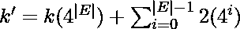
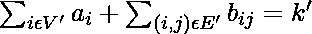
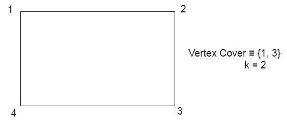
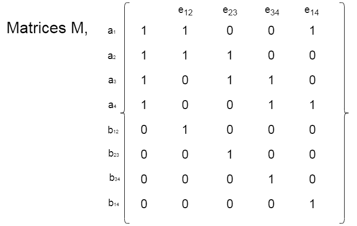
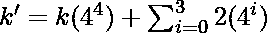
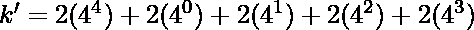
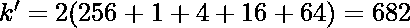

# 子集和为 NP 完全

> 原文: [https://www.geeksforgeeks.org/subset-sum-is-np-complete/](https://www.geeksforgeeks.org/subset-sum-is-np-complete/)

**先决条件:** [NP-完全性](https://www.geeksforgeeks.org/np-completeness-set-1/) [子集和问题](https://www.geeksforgeeks.org/subset-sum-problem-dp-25/)

## 子集和问题

给定 `N` 个非负整数 `a_1 … a_N` 和目标和 `K`，任务是决定是否存在和等于 `K` 的子集。

## 解释

问题的一个实例是指定给问题的输入。子集和问题的一个例子是集合 `S = {a_1, …, a_N}` 和整数 `K`。由于 [NP-complete](https://www.geeksforgeeks.org/np-completeness-set-1/) 问题是同时存在于 `NP` 和 `NP-hard` 中的问题，因此问题是 NP-complete 这一说法的证明由两部分组成:

> 1.  The problem itself lies in NP class.
> 2.  All other problems in NP class can be reduced to that by polynomial time. (`b` can be reduced to `c` by polynomial time and expressed as `b ≤_p c`)

如果**第二个条件**仅被满足，那么问题被称为 **NP-Hard**。

但是不可能把每一个 NP 问题都化为另一个 NP 问题来一直展示它的 NP 完全性。这就是为什么如果我们想证明一个问题是 NP-Complete，我们只需要证明这个问题是 NP 中的问题，并且任何 NP-Complete 问题都可以简化为 NP，那么我们就完成了，即如果 `B` 是 NP-Complete，并且 `B ≤_p C` 代表 NP 中的 `C`，那么 `C` 就是 NP-Complete。因此，我们可以使用以下两个命题来验证**子集和问题**是 NP 完全的:

## Subset Sum 在 NP 中

如果有问题在 NP 中，那么给一个证书，这是问题的一个解决方案和问题的一个实例(整数的一个集合 `S = {a_1… a_N}` 和一个整数 `K`)我们将能够在多项式时间内识别(解决方案是否正确)证书。这可以通过检查子集 `S’` 中的整数之和是否等于 `K` 来实现。

## 子集和是 NP-Hard

为了证明子集和是 NP-Hard，从一个已知的 NP-Hard 问题到这个问题进行约简。
进行约简，由此 [**顶点覆盖问题**](https://www.geeksforgeeks.org/proof-that-vertex-cover-is-np-complete/) 可以约简为**子集和问题**。让我们假设一个图 `G(V, E)`，其中 `V = {1, 2, …, N}`。现在，对于每个顶点 `i`， `a_i = i`。对于每个边 `(i, j)`，我们定义了一个名为 `b_ij` 的组件。
我们将以矩阵格式表示整数，其中每一行都用对应整数值 `|E|+1` 位数的 4 进制表示来表示。
矩阵具有以下特性:

1.  第一列包含整数值 1 表示 `a_i`，0 表示 `b_ij`。
2.  从矩阵右侧开始的每个 `E` 列代表每个边的一个数字。`a_i`、`a_j`、`b_ij` 的列 `(i, j) = 1`，否则等于 0。
3.  我们定义一个常数 `k'` 这样，

> 

现在，以下主张成立:

*   Let us consider a subset of vertices and edges to `(V’, E’)` respectively, such that

> 

`b_ij` 每列最多只能包含 1 个。此外，`k'` 参数在不到 `|E|` 的所有低有效数字中都有一个 2。这些数字我们永远不能随身携带。现在，每列中这些数字加起来最多是三个 1。这意味着对于每条边 `(i, j)`，`V'` 必须包含 `i` 或 `j`。因此，`V'` 成为顶点覆盖。

*   假设有一个大小为 `k` 的顶点覆盖，我们将选择整数 `a_i`，这样 `i` 位于 `V'` 中，而所有的 `b_ij` 这样 `i` 或 `j` 都位于 `V'` 中。在以基数 4 表示的所有这些整数的和(我们从矩阵中选择的)上，我们得到整数的和 = `k'`。因此，选择的整数构成了和 = `k'` 的整数子集。因此，子集和成立。

让我们考虑下面的例子，
给定的是一个顶点覆盖 `V = {1, 3}` 和 `k = 2`

现在，`a_1 = 1`，`a_2 = 2`，`a_3 = 3`，`a_4 = 4`

矩阵可以通过以下方式构建:

> => 
>
> => 
>
> => 

现在，为了证明 `k` 的值 `k'` 让我们选择 `a_i`，这样 `i` 就躺在 `V'` 中，我们选择 `a_1` 和 `a_3` 和 `b_ij` 这样 `i` 或者 `j` 躺在 `V'` 中，也就是说我们选择 `b_ij` 这样 `i` 或者 `j` 躺在 `V'` 中，也就是说我们选择 `b_12`、`b_23`、`b_14`、`b_34`。在 base 4 表示中，我们有以下值:

`a_1 = 321`，`a_3 = 276`，`b_12 = 64`，`b_23 = 16`，`b_14 = 1`，`b_34 = 4`

这些值是使用矩阵计算的。对这些值求和，我们得到，

`k' = 321 + 276 + 64 + 16 + 1 + 4 = 682`。

因此，可以计算和验证 `k'` 值。

因此 **子集和问题** 是 NP 完全的。