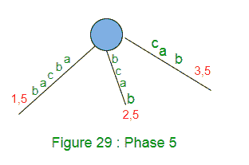
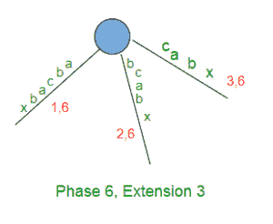
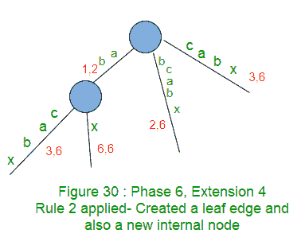
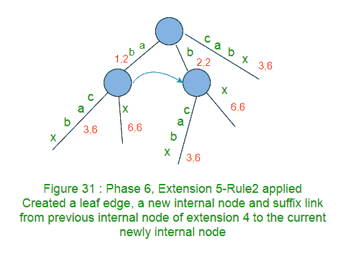
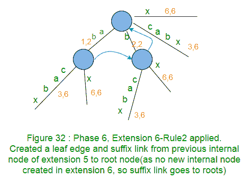

# Ukkonen 的后缀树构造–第 4 部分

> 原文: [https://www.geeksforgeeks.org/ukkonens-suffix-tree-construction-part-4/](https://www.geeksforgeeks.org/ukkonens-suffix-tree-construction-part-4/)

本文是以下三篇文章的续篇:
[Ukkonen 的后缀树构造–第 1 部分](https://www.geeksforgeeks.org/ukkonens-suffix-tree-construction-part-1/ "Ukkonen’s Suffix Tree Construction – Part 1")
[Ukkonen 的后缀树构造–第 2 部分](https://www.geeksforgeeks.org/ukkonens-suffix-tree-construction-part-2/ "Ukkonen’s Suffix Tree Construction – Part 2")
[Ukkonen 的后缀树构造–第 3 部分](https://www.geeksforgeeks.org/ukkonens-suffix-tree-construction-part-3/ "Ukkonen’s Suffix Tree Construction – Part 3")

请看[第 1 部分](https://www.geeksforgeeks.org/ukkonens-suffix-tree-construction-part-1/ "Ukkonen’s Suffix Tree Construction – Part 1")、[第 2 部分](https://www.geeksforgeeks.org/ukkonens-suffix-tree-construction-part-2/ "Ukkonen’s Suffix Tree Construction – Part 2")和[第 3 部分](https://www.geeksforgeeks.org/ukkonens-suffix-tree-construction-part-3/ "Ukkonen’s Suffix Tree Construction – Part 3")，在看当前文章之前，我们在这里看到了一些关于后缀树的基础知识、高级 ukkonen 的算法、后缀链接和三个实现技巧以及关于 `activePoint` 的一些细节，还有一个示例字符串“abcabxabcd”，我们在这里经历了构建后缀树的四个阶段。

让我们重温一下我们已经在[第 3 部分](https://www.geeksforgeeks.org/ukkonens-suffix-tree-construction-part-3/ "Ukkonen’s Suffix Tree Construction – Part 3")中看到的四个阶段，分别是技巧 2、技巧 3 和活动点。

*   `activePoint` 被初始化为 `(root, NULL, 0)`，即 `activeNode` 是 `root`，`activeEdge` 是 `NULL`（为了便于理解，我们给 `activeEdge` 赋予了字符值，但是在代码实现中，它将是字符的索引）并且 `activeLength` 是 `ZERO`。
*   全局变量 `END` 和 `remainingSuffixCount` 被初始化为零。

## 第 1 阶段
我们从字符串 `S` 中读取第 1 个字符（`a`）。

*   将 `END` 设置为 1。
*   将 `remainingSuffixCount` 增加 1（此处 `remainingSuffixCount` 将为 1，即还有 1 个扩展需要执行）。
*   如下所示运行一个循环 `remainingSuffixCount` 次（即一次）:
    *   如果 `activeLength` 为零，则将 `activeEdge` 设置为当前字符（此处 `activeEdge` 为“a”）。这里是 **APCFALZ**。
    *   检查 `activeEdge` 是否有边从 `activeNode`（在此阶段 1 中是根节点）出去。如果没有，创建一个叶片边。如果有，走下去。在我们的例子中，叶边被创建（规则 2）。
    *   执行扩展后，将 `remainingSuffixCount` 减 1。
    *   此时，`activePoint` 为 `(根, a, 0)`。

在阶段 1 结束时，`remainingSuffixCount` 为零（所有后缀都显式添加）。
第 3 部分中的图 20 是第 1 阶段后的结果树。

## 第 2 阶段
我们从字符串 `S` 中读取第 2 个字符（`b`）。

*   将 `END` 设置为 2（这将执行扩展 1）。
*   将 `remainingSuffixCount` 增加 1（此处 `remainingSuffixCount` 将为 1，即还有 1 个扩展需要执行）。
*   如下所示运行一个循环 `remainingSuffixCount` 次（即一次）:
    *   如果 `activeLength` 为零，则将 `activeEdge` 设置为当前字符（此处 `activeEdge` 为“b”）。这里是 **APCFALZ**。
    *   检查 `activeEdge` 是否有边从 `activeNode`（在第 2 阶段是根节点）出去。如果没有，创建一个叶片边。如果有，走下去。在我们的例子中，叶边被创建。
    *   执行扩展后，将 `remainingSuffixCount` 减 1。
    *   此时，`activePoint` 为 `(根, b, 0)`。

在阶段 2 结束时，`remainingSuffixCount` 为零（所有后缀都显式添加）。
第 3 部分中的图 22 是第 2 阶段后的结果树。

## 第 3 阶段
我们从字符串 `S` 中读取第 3 个字符（`c`）。

*   将 `END` 设置为 3（这将执行扩展 1 和 2）。
*   将 `remainingSuffixCount` 增加 1（此处 `remainingSuffixCount` 将为 1，即还有 1 个扩展需要执行）。
*   如下所示运行一个循环 `remainingSuffixCount` 次（即一次）:
    *   如果 `activeLength` 为零，则将 `activeEdge` 设置为当前字符（此处 `activeEdge` 为“c”）。这里是 **APCFALZ**。
    *   检查 `activeEdge` 是否有边从 `activeNode`（在第 3 阶段中是根节点）出去。如果没有，创建一个叶片边。如果有，走下去。在我们的例子中，叶边被创建。
    *   执行扩展后，将 `remainingSuffixCount` 减 1。
    *   此时，`activePoint` 为 `(根, c, 0)`。

在第 3 阶段结束时，`remainingSuffixCount` 为零（所有后缀都显式添加）。
第 3 部分中的图 25 是第 3 阶段后的结果树。

## 第 4 阶段
我们从字符串 `S` 中读取第 4 个字符（`a`）。

*   将 `END` 设置为 4（这将执行扩展 1、2 和 3）。
*   将 `remainingSuffixCount` 增加 1（此处 `remainingSuffixCount` 将为 1，即还有 1 个扩展需要执行）。
*   如下所示运行一个循环 `remainingSuffixCount` 次（即一次）:
    *   如果 `activeLength` 为零，则将 `activeEdge` 设置为当前字符（此处 `activeEdge` 为“a”）。这里是 **APCFALZ**。
    *   检查 `activeEdge` 是否有边从 `activeNode`（在第 3 阶段中是根节点）出去。如果没有，创建一个叶片边。如果有，走下去（技巧 1–跳过/计数）。在我们的示例中，边“a”出现在活动节点（即根）之外。不需要走下，因为 `activeLength` < `edgeLength`。我们将 `activeLength` 从零增加到 1（**APCFER3**）并停止任何进一步的处理（规则 3）。
    *   此时，`activePoint` 为 `(根, a, 1)`，并且 `remainingSuffixCount` 保持设置为 1（没有变化）。

在阶段 4 结束时，`remainingSuffixCount` 为 1（最后一个后缀“a”在树中没有显式添加，但在树中隐式添加）。
第 3 部分中的图 28 是第 4 阶段后的结果树。

重游完成了前四个阶段，我们将继续建造这棵树，看看进展如何。

## 第 5 阶段
我们从字符串 `S` 中读出第 5 个字符（`b`）。

*   将 `END` 设置为 5（这将进行扩展 1、2 和 3）。见下图 29。
*   将 `remainingSuffixCount` 增加 1（`remainingSuffixCount` 在这里将是 2，即还有 2 个扩展需要执行，它们是扩展 4 和 5。扩展 4 应该添加后缀“ab”，扩展 5 应该在树中添加后缀“b”）。
*   如下所示运行一个循环 `remainingSuffixCount` 次（即两次）:
    *   检查 `activeEdge` 是否有边从 `activeNode`（在第 3 阶段中是根节点）出去。如果没有，创建一个叶片边。如果有，走下去。在我们的示例中，边“a”出现在活动节点（即根）之外。
    *   如有必要，走下去（技巧 1–跳过/计数）。在当前阶段 5，不需要向下移动，因为 `activeLength`。
    *   检查字符串 `S` 的当前字符（即“b”）是否已经出现在 `activePoint` 之后。如果是，则不再处理（规则 3）。在我们的例子中也是如此，所以我们将 `activeLength` 从 1 增加到 2（**APCFER3**）并在此停止（规则 3）。
    *   此时，`activePoint` 为 `(根, a, 2)`，并且 `remainingSuffixCount` 保持设置为 2（`remainingSuffixCount` 不变）。

第 5 阶段结束时，`remainingSuffixCount` 为 2（后两个后缀‘ab’和‘b’不是显式添加在树中，而是隐式添加在树中）。

## 第 6 阶段
我们从字符串 `S` 中读取第 6 个字符（`x`）。

*   将 `END` 设置为 6（这将进行扩展 1、2 和 3）。
    
*   将 `remainingSuffixCount` 增加 1（`remainingSuffixCount` 在这里将为 3，即还有 3 个扩展需要执行，分别是后缀“abx”、“bx”和“x”的扩展 4、5 和 6）。
*   如下所示，运行一个循环 `remainingSuffixCount` 次（即三次）:
    *   对于扩展 4，`activePoint` 是 `(根, a, 2)`，它指向从“a”开始的边上的“b”。
    *   在扩展规则 4 中，字符串 `S` 中的当前字符“x”与 `activePoint` 之后的下一个字符不匹配，因此这是扩展规则 2 的情况。因此，这里创建了一个带有边标签 `x` 的叶子边。此外，遍历在一个边的中间结束，因此在 `activePoint` 的末端也创建了一个新的内部节点。
    *   在树中添加后缀“abx”时，将 `remainingSuffixCount` 减 1（从 3 到 2）。

现在 `activePoint` 在应用规则 2 后会改变。其他三种情况（**APCFER3**、**APCFWD** 和 **APCFALZ**）`activePoint` 发生变化，已经在[第 3 部分](https://www.geeksforgeeks.org/ukkonens-suffix-tree-construction-part-3/ "Ukkonen’s Suffix Tree Construction – Part 3")中讨论过。

**扩展规则 2 (APCFER2)的 `activePoint` 更改:**
**情况 1 (APCFER2C1):** 如果 `activeNode` 是根节点且 `activeLength` 大于零，则 `activeLength` 减 1，`activeEdge` 将设置为 `“S[i – remainingSuffixCount + 1]”`，其中 `i` 为当前阶段号。你能看出为什么在 `activePoint` 会有这种变化吗？再看一下我们刚才讨论的第 6 阶段（`i=6`）的当前扩展，我们在其中添加了后缀“abx”。`activeLength` 为 2，`activeEdge` 为“a”。现在在下一个扩展中，我们需要在树中添加后缀“bx”，即下一个扩展中的路径标签应该以‘b’开头。因此‘b’（字符串 `S` 中的第 5 个字符）应该是下一个扩展的 `activeEdge`，`b` 的索引将是 `“i – remainingSuffixCount + 1”`（6 – 2 + 1 = 5）。`activeLength` 递减 1，因为 `activePoint` 在每次扩展后都会以长度 1 更接近根。
如果 `activeNode` 是根节点，`activeLength` 为零，会发生什么情况？本案已经由 **APCFALZ** 处理。

**情况 2 (APCFER2C2):** 如果 `activeNode` 不是根，则跟随当前 `activeNode` 的后缀链接。后缀链接指向的新节点（可以是根节点或另一个内部节点）将是下一个扩展的 `activeNode`。`activeLength` 和 `activeEdge` 没有变化。你能看出为什么在 `activePoint` 会有这种变化吗？这是因为: 如果两个节点通过后缀链接连接，那么从这两个节点开始的所有路径上的标签都将完全相同，因此对于这些路径上的两个对应的相似点，`activeEdge` 和 `activeLength` 将相同，这两个节点将是 `activeNode`。参见[第二部分](https://www.geeksforgeeks.org/ukkonens-suffix-tree-construction-part-2/ "Ukkonen’s Suffix Tree Construction – Part 2")中的图 18。假设在第一阶段和扩展 `j` 中，在树中添加了后缀“xAabcdefg”。在这一点上，我们假设 `activePoint` 是 `(节点-v, a, 7)`，即点“g”。因此，对于下一个扩展 `j+1`，我们将添加后缀‘Aabcdefg’，为此，我们需要遍历图 18 所示的第 2 条路径。这可以通过跟随当前 `activeNode` `v` 的后缀链接来实现。后缀链接将我们带到要穿过的路径，该路径位于[节点 `s(v)`]之间的某个位置，在该位置之下，路径与先前 `activeNode` `v` 之下的路径完全相同。如前所述，“`activePoint` 在每次扩展后都以长度 1 接近根”，这种长度的减少将发生在节点 `s(v)` 之上，但在 `s(v)` 之下，完全没有变化。因此，当 `activeNode` 不是当前扩展的根节点时，对于下一个扩展，只有 `activeNode` 发生变化（`activeEdge` 和 `activeLength` 没有变化）。

*   此时在扩展 4 中，当前 `activePoint` 是 `(根, a, 2)`，基于 **APCFER2C1**，下一个扩展 5 的新 `activePoint` 将是 `(根, b, 1)`。
*   下一个要添加的后缀是“bx”（带有 `remainingSuffixCount` 2）。
*   字符串 `S` 中的当前字符“x”与 `activePoint` 后边的下一个字符不匹配，因此这是扩展规则 2 的情况。因此，这里创建了一个带有边标签 `x` 的叶子边。此外，遍历在一个边的中间结束，因此在 `activePoint` 的末端也创建了一个新的内部节点。
    后缀链接也是从以前的内部节点（扩展 4）创建到当前扩展 5 中创建的新内部节点。
*   在树中添加后缀“bx”时，将 `remainingSuffixCount` 减 1（从 2 到 1）。

*   在扩展 5 的这一点上，当前的 `activePoint` 是 `(根, b, 1)` 并且基于 **APCFER2C1** 下一个扩展 6 的新 `activePoint` 将是 `(根, x, 0)`。
*   下一个要添加的后缀是“x”（`remainingSuffixCount` 为 1）。
*   在下一个扩展 6 中，字符 `x` 将不匹配根节点的任何现有边，因此将从根节点创建一个带有标签 `x` 的新边。来自前一个扩展的内部节点的后缀链接也指向根（因为在当前扩展 6 中没有创建新的内部节点）。
*   在树中添加后缀“x”时，将 `remainingSuffixCount` 减 1（从 1 到 0）。

这就完成了第 6 阶段。
请注意，第 6 阶段已经完成了它的所有 6 个扩展（为什么？因为到目前为止还没有在字符串中看到当前的字符 `c`，所以阻止进一步扩展的规则 3 在阶段 6 中从未得到应用的机会），因此阶段 6 之后生成的树是一个真正的后缀树（即，不是一个隐式树），用于到目前为止读取的字符“abcabx”，并且它在树中显式地具有所有后缀。

在构建上面的树时，注意到以下事实:

*   扩展 `i` 中新创建的内部节点通过后缀链接（每个内部节点必须有一个指向另一个内部节点或根的后缀链接）在扩展 `i+1` 的末尾指向另一个内部节点或根（如果 `activeNode` 是扩展 `i+1` 中的根）。
*   后缀链接在搜索下一个后缀的路径标签结尾时提供捷径。
*   通过正确跟踪扩展/阶段之间的 `activePoint`，可以避免不必要的从根走下来。

我们将在[第 5 部分](https://www.geeksforgeeks.org/ukkonens-suffix-tree-construction-part-5/ "Ukkonen’s Suffix Tree Construction – Part 5")中完成剩下的阶段(7 到 11)，并完全构建树，之后，我们将在[第 6 部分](https://www.geeksforgeeks.org/ukkonens-suffix-tree-construction-part-6/ "Ukkonen’s Suffix Tree Construction – Part 6")中看到算法的代码。

## 参考文献

[http://web.stanford.edu/~mjkay/gusfield.pdf](http://web.stanford.edu/~mjkay/gusfield.pdf)

[Ukkonen 的后缀树算法通俗地说](http://stackoverflow.com/questions/9452701/ukkonens-suffix-tree-algorithm-in-plain-english)

本文由**阿努拉格·辛格**供稿。如果您发现任何不正确的地方，或者您想分享关于上面讨论的主题的更多信息，请写评论