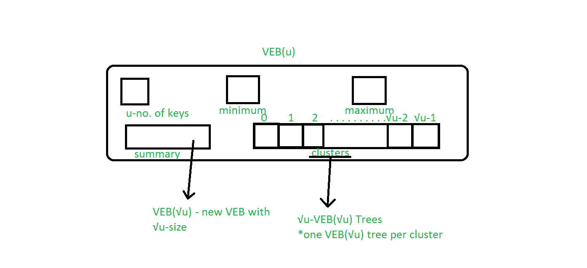
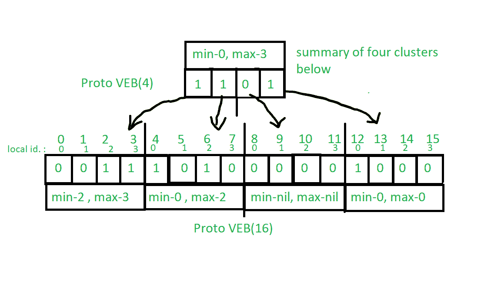
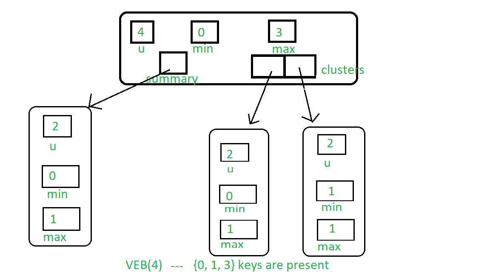

# Van Emde Boas Tree | 第 1 集 | 基础和构造

> 原文：[https://www.geeksforgeeks.org/van-emde-boas-tree-set-1-basics-and-construction/](https://www.geeksforgeeks.org/van-emde-boas-tree-set-1-basics-and-construction/)

强烈建议全面了解[原 Van Emde Boas Tree](https://www.geeksforgeeks.org/proto-van-emde-boas-trees-set-1-background-introduction/)。

`Van Emde Boas Tree` 支持 `O(lglgN)` 时间内的搜索、后继、前置、插入和删除操作，比优先级队列、二叉查找树等任何相关数据结构都要快。`Van Emde Boas Tree` 利用 `O(1)` 时间复杂度进行最小和最大查询。这里 `N` 是定义树的宇宙的大小，`lg` 是对数基数 2。

**注意：** `Van Emde Boas Data Structure` 的密钥集必须在 0 到 `n`（`n` 是形式 `2^k` 的正整数）的范围内定义，并且在不允许重复密钥时有效。

**缩写：**

1.  `VEB` 是 `Van Emde Boas Tree` 的缩写。
2.  `VEB(√u)` 是 `VEB` 的缩写，包含 `u` 个键。

**Van Emde Boas Tree 的结构：**



`Van Emde Boas Tree` 是一种递归定义的结构。

1.  **u**：`VEB` 树中存在的键的数量。
2.  **最小值**：包含 `VEB` 树中存在的最小键。
3.  **最大值**：包含 `VEB` 树中存在的最大键。
4.  **摘要**：指向新的 `VEB(√u)` 树，该树包含集群数组中存在的键的概述。
5.  **集群**：一个大小为 `√u` 的数组，数组中的每个元素都指向新的 `VEB(√u)` 树。

请参见下图，了解 `Van Emde Boas Tree` 的基础知识，尽管它并不代表 `Van Emde Boas Tree` 的实际结构：



**对 Van Emde Boas Tree 的基本认识：**

1.  `Van Emde Boas Tree` 是递归定义的结构，类似于原型 `Van Emde Boas Tree`。
2.  在 `Van Emde Boas Tree` 中，最小和最大查询在 `O(1)` 时间内工作，因为 `Van Emde Boas Tree` 存储树结构中存在的最小和最大键。
3.  添加最大值和最小值属性的优势有助于降低时间复杂性：
    *   如果 `VEB` 树的任何最小值和最大值为空（代码中为零或 -1），则树中不存在元素。
    *   如果最小值和最大值相等，则结构中只存在一个值。
    *   如果两者都存在并且不同，则树中存在两个或更多元素。
    *   我们可以通过在常数时间 `O(1)` 中根据条件设置最大值和最小值来插入和删除键，这有助于减少递归调用链：如果 `VEB` 中只有一个键，那么要删除该键，我们只需将最小值和最大值设置为零值。类似地，如果没有键，那么我们可以通过设置最小和最大到我们想要插入的键来插入。这些是 `O(1)` 运算。
    *   在后继查询和前任查询中，我们可以根据 `VEB` 的最小值和最大值进行决策，这将使我们的工作更容易。

在原型 `Van Emde Boas Tree` 中，宇宙大小的大小被限制为类型 `2^(2^k)`，但是在 `Van Emde Boas Tree` 中，它允许宇宙大小是 2 的精确幂。所以我们需要如下修改 `Proto Van Emde Boas Tree` 中使用的 `High(x)`、`low(x)`、`generate_index()` 辅助函数。

1.  `High(x)`：会返回 `floor(x / ceil(√u))`，基本上就是键 `x` 所在的簇索引。

```
High(x) = floor(x / ceil(√u))
```

2.  `Low(x)`：它将返回 `x mod ceil(√u)`，这是它在集群中的位置。

```
Low(x) = x % ceil(√u)
```

3.  `generate_index(a, b)`：它将返回从其集群索引 `a` 和集群内位置 `b` 计算出的键的位置。

```
generate_index(a, b) = a * ceil(√u) + b
```

**Van Emde Boas Tree 的构建：** `Van Emde Boas Tree` 的构建与 `Proto Van Emde Boas Tree` 非常相似。这里的区别是，我们允许宇宙大小是 2 的任意次方，这样 `high()`，`low()`，`generate_index()` 就会不同。

构建空 `VEB`：程序与原 `VEB` 相同，只是在每个 `VEB` 中添加了两个最小和最大的东西。为了表示最小值和最大值为空，我们将其表示为 -1。

**注意：** 在基本情况下，我们只需要最小值和最大值，因为添加最小值和最大值后，添加大小为 2 的集群将是多余的。



下面是实现：

```cpp
// C++ implementation of the approach
#include <bits/stdc++.h>
using namespace std;

class Van_Emde_Boas {

public:
    int universe_size;
    int minimum;
    int maximum;
    Van_Emde_Boas* summary;
    vector<Van_Emde_Boas*> clusters;

    // Function to return cluster numbers
    // in which key is present
    int high(int x)
    {
        int div = ceil(sqrt(universe_size));
        return x / div;
    }

    // Function to return position of x in cluster
    int low(int x)
    {
        int mod = ceil(sqrt(universe_size));
        return x % mod;
    }

    // Function to return the index from
    // cluster number and position
    int generate_index(int x, int y)
    {
        int ru = ceil(sqrt(universe_size));
        return x * ru + y;
    }

    // Constructor
    Van_Emde_Boas(int size)
    {
        universe_size = size;
        minimum = -1;
        maximum = -1;

        // Base case
        if (size <= 2) {
            summary = nullptr;
            clusters = vector<Van_Emde_Boas*>(0, nullptr);
        }
        else {
            int no_clusters = ceil(sqrt(size));

            // Assigning VEB(sqrt(u)) to summary
            summary = new Van_Emde_Boas(no_clusters);

            // Creating array of VEB Tree pointers of size sqrt(u)
            clusters = vector<Van_Emde_Boas*>(no_clusters, nullptr);

            // Assigning VEB(sqrt(u)) to all of its clusters
            for (int i = 0; i < no_clusters; i++) {
                clusters[i] = new Van_Emde_Boas(ceil(sqrt(size)));
            }
        }
    }
};

// Driver code
int main()
{
    // New Van_Emde_Boas tree with u = 16
    Van_Emde_Boas* akp = new Van_Emde_Boas(4);
}
```