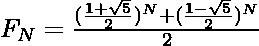

# 黄金分割比为什么取值为 1.618，与比奈公式有什么关系？

> 原文：[https://www.geeksforgeeks.org/why-the-value-of-golden-ratio-is-1-618-and-how-is-it-related-to-binets-formula/](https://www.geeksforgeeks.org/why-the-value-of-golden-ratio-is-1-618-and-how-is-it-related-to-binets-formula/)

## 黄金分割比例

两个数字，比如说 `A` 和 `B`，如果它们的比例等于两个数字之和与较大数字的比例，那么这两个数字就是黄金分割比例。也就是说，

> 假设 `A > B`，那么
> 如果 `A/B = (A + B)/A = ∅ = 1.618`（黄金比例），
> 那么这两个数字就说是黄金比例。

用 `∅` 表示，其值等于 `1.6180339……`，是一个[无理数](https://www.geeksforgeeks.org/irrational-numbers/)。

## 比奈公式

[比奈公式](https://www.geeksforgeeks.org/finding-number-of-digits-in-nth-fibonacci-number/)用于在[斐波那契数列](https://www.geeksforgeeks.org/program-for-nth-fibonacci-number/)中寻找 `N` 项，该项由下式给出：

> 
>
> 其中，`F_N` 是斐波那契数列中的第 `N` 项。

## 推导过程

对于等式：`x^2–x–1 = 0`，以下是可以推导出的关系：

> `x^2 = x + 1`
> `x^3 = x * x^2 = x * (x + 1) = x^2 + x = (x + 1) + x = 2x + 1`
> `x^4 = x * x^3 = x * (2x + 1) = 2x^2 + x = 2(x + 1) + x = 3x + 2`
> `x^5 = x * x^4 = x * (3x + 2) = 3x^2 + 2x = 3(x + 1) + 2x = 5x + 3`

`x` 的下一次幂的下一个项，看上面的图案就能猜到。观察 `x^N` 的系数等于 `x^(N–1)` 和 `x^(N–2)` 的系数之和。在剩余的学期中也可以观察到同样的模式。所以 `x` 的下一次幂可以直接表示为：

> `x^1 = 1x + 0`
> `x^2 = 1x + 1`
> `x^3 = 2x + 1`
> `x^4 = 3x + 2`
> `x^5 = 5x + 3`
> `x^6 = 8x + 5`
> ...

斐波那契数列由 `{0, 1, 1, 2, 3, 5, 8, 13, 21, …}` 给出，观察以上两个数列，两者之间存在关系。可以说：

> `x^N = f_N * x + f_(N–1)`
> 其中，`f_N` 是斐波那契数列中的第 `N` 项 (`n > 0`)。

现在，让方程的根：`x^2–x–1 = 0` 是 `∝` 和 `β`，然后

> `∝ = (1 + √5) / 2`
> `β = (1 – √5) / 2`

可以说：

> `∝^2 – ∝ – 1 = 0` 和 `β^2 – β – 1 = 0`
> `∝^N = f_N * ∝ + f_(N–1)` 且 `β^N = f_N * β + f_(N–1)`

在上式中代入 `∝` 和 `β` 的值后：

> 

以上方程称为**比奈公式**。而数值 `(1+√5)/2` 被称为**黄金比例**，等于 `1.618`。因此，`N` 个斐波那契数由下式给出：

> `f_n ≈ ∅^n`
> 其中，`∅` 是黄金分割比例，`F_n` 是第 `n` 个斐波那契项。

## 应用

*   **黄金比例**：用于建筑、绘画、摄影，也以多种形式存在于自然界本身，如鹦鹉螺壳、向日葵等。
*   **比奈公式**：用于寻找斐波那契数列中的 `N` 项，这使得它在数学和计算机科学的许多领域都非常有用。
*   **黄金分割比**和**比奈公式**：它们也用于计算像[欧几里德算法](https://www.geeksforgeeks.org/euclidean-algorithms-basic-and-extended/)等算法的时间复杂度。