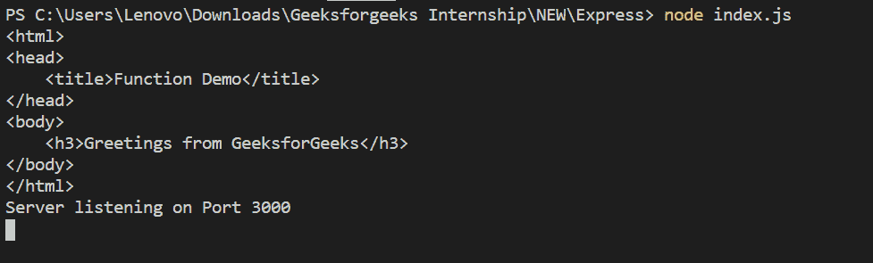

# Express.js | `app.render()` 函数

> 原文: [https://www.geeksforgeeks.org/express-js-app-render-function/](https://www.geeksforgeeks.org/express-js-app-render-function/)

`app.render()` 函数用于通过回调函数渲染视图的 HTML。这个函数返回回调函数中的 html。

## 语法

```js
app.render(view, [locals], callback)
```

## 参数

1.  `view`: 是要渲染的 HTML 页面的名称。
2.  `locals`: 这是一个可选参数，它是一个包含所传递视图参数的局部变量的对象。
3.  `callback`: 是作为参数传递的函数。

## 安装 Express 模块

1.  您可以访问[安装 Express 模块](https://www.npmjs.com/package/express)的链接。您可以使用此命令安装此软件包。

```js
npm install express
```

2.  安装 `express` 模块后，您可以使用命令在命令提示符下检查您的 `express` 版本。

```js
npm version express
```

3.  在 `views` 文件夹中创建一个 `email.ejs` 文件，代码如下：
    **文件名: `email.ejs`**

```js
<html>
<head>
    <title>Function Demo</title>
</head>
<body>
    <h3>Greetings from GeeksforGeeks</h3>
</body>
</html>
```

**注意:** 你可以使用任何视图引擎，就像在这种情况下，我们使用了 `ejs`。

4.  之后，你可以创建一个文件夹并添加一个文件，例如 `index.js`。要运行此文件，你需要运行以下命令。

```js
node index.js
```

## 文件名: `index.js`

```js
var express = require('express');
var app = express();
var PORT = 3000;

// View engine setup
app.set('view engine', 'ejs');

app.render('email', function (err, html) {
    if (err) console.log(err);
    console.log(html);
});

app.listen(PORT, function(err){
    if (err) console.log("Error in server setup");
    console.log("Server listening on Port", PORT);
});
```

## 运行程序的步骤

1.  使用以下命令确保你已经安装了 `express` 和 `ejs` 模块:

```js
npm install express
npm install ejs
```

2.  使用以下命令运行 `index.js` 文件:

```js
node index.js
```

## 输出

