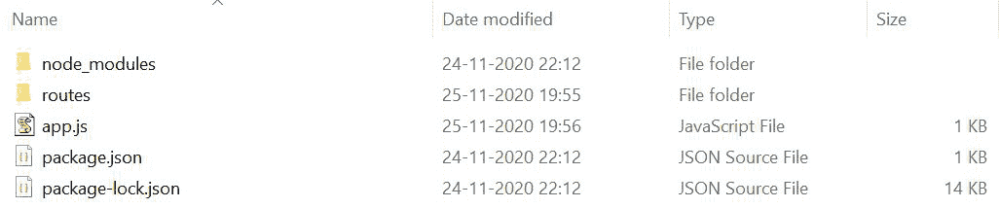
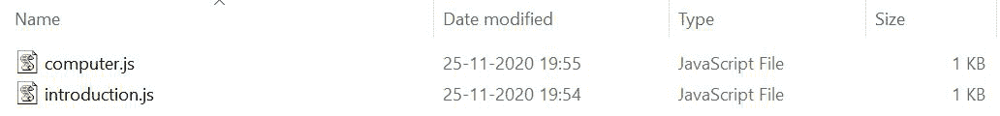

# Express.js app.router 属性

> 原文：[https://www.geeksforgeeks.org/express-js-app-router-property/](https://www.geeksforgeeks.org/express-js-app-router-property/)

在 Express 4 中引入了 `Express.js app.router` 属性。它帮助我们创建模块化、可安装的路由处理器。它为我们提供了许多功能，例如它扩展了这个路由来处理验证、处理 404 或其他错误等。它帮助我们为服务器端编程组织文件结构。

## 为什么需要 Express Router？

它帮助我们管理服务器端项目中创建的数百条路由，方法是将它们分成单独的文件。它有助于基本的中间件路由和处理 404 错误。使用 `express.Router`，包含所有依赖项、文件、路由等的整个文件夹结构良好，任何人都很容易理解。

## 安装 Express 模块

运行 `npm init` 并创建一个 `package.json` 文件后，是时候安装我们的依赖项即 Express 了。

1.  您可以访问此[链接](https://www.npmjs.com/package/express)并使用以下命令下载：
    ```js
    npm install express --save
    ```

2.  安装 express 后，您可以使用以下命令在命令提示符下检查您的 express 版本：
    ```js
    npm version express
    ```

3.  安装所需的依赖项后，使用终端创建一个 `app.js` 文件。为了运行该文件，您需要执行以下操作：
    ```js
    node app.js
    ```

## 项目目录

创建 `app.js` 后，单独创建一个名为 `routes` 的文件夹，如下图所示：


这将是文件和包创建和安装后的项目结构。在 `routes` 内部，将有两个文件，如下所示：


## 文件名：app.js

```js
// Requiring module
const express = require('express');

// Creating express object
const app=express();

// Middlewares
app.use(require('./routes/introduction.js'));
app.use(require('./routes/computer.js'));

// Server setup
app.listen(3000, function() { 
   console.log('Server listening on port 3000'); 
});
```

我们需要在 `routes` 内部创建的两个文件，即 `computer.js` 和 `introduction.js` 在我们的 `app.js` 文件中使用以下代码：
```js
// Syntax
app.use(require('Filepath'))

// Implementation
app.use(require('./routes/introduction.js'));
app.use(require('./routes/computer.js'));
```

## 文件名：introduction.js

```js
// Requiring module
const express = require('express');

// Creating router object
const router = express.Router();

// Handling request
router.get('/introduction', (req,res) => {
  console.log('Opening introduction.js');
  res.send('Welcome to geeksforgeeks!');
});

// Exporting router object
module.exports = router;
```

## 文件名：computer.js

```js
// Requiring module
const express = require('express');

// Creating router object
const router = express.Router();

// Handling request
router.get('/computer', (req,res) => {
  console.log('Opening computer.js');
  res.send('This is a computer science portal');
});

// Exporting router object
module.exports = router;
```

使用以下命令运行 `app.js` 文件：
```js
node app.js
```

## 输出

```js
Server listening on port 3000
```

现在打开浏览器，转到 `http://localhost:3000/introduction` 和 `http://localhost:3000/computer`，然后你会在你的终端屏幕上看到如下输出：
```js
Server listening on port 3000
Opening introduction.js
Opening computer.js
```

## 工作原理

两条路由都已经在浏览器中打开，所以 `console.log()` 打印了以下关于成功打开路由的声明。在浏览器上，两条路由将显示不同的输出，如下所示：

对于 `http://localhost:3000/introduction` 将显示以下输出：
```js
Welcome to geeksforgeeks!
```

对于 `http://localhost:3000/computer` 将显示以下输出：
```js
This is a computer science portal
```