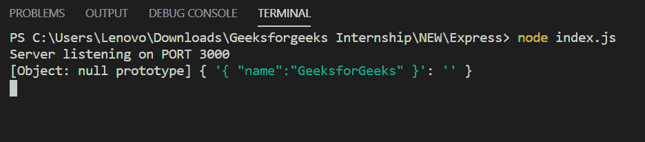

# Express.js `express.urlencoded()` 函数

> 原文: [https://www.geeksforgeeks.org/express-js-express-urlencoded-function/](https://www.geeksforgeeks.org/express-js-express-urlencoded-function/)

`express.urlencoded()` 函数是 Express 中内置的中间件函数。它使用 urlencoded 有效负载解析传入的请求，并且基于 `body-parser`。

## 语法

```js
express.urlencoded( [options] )
```

## 参数

`options` 参数包含 `extended`、`inflate`、`limit`、`verify` 等各种属性。

## 返回值

返回一个对象。

## Express 模块安装

1.  您可以访问 [安装 Express 模块](https://www.npmjs.com/package/express) 的链接。您可以使用此命令安装此软件包。

```js
npm install express
```

2.  安装 Express 模块后，您可以使用命令在命令提示符下检查您的 Express 版本。

```js
npm version express
```

3.  之后，您可以创建一个文件夹并添加一个文件，例如 `index.js`。

```js
node index.js
```

## 示例 1

**文件名:** `index.js`

### JavaScript

```js
var express = require('express');
var app = express();
var PORT = 3000;

app.use(express.urlencoded({extended:false}));

app.post('/', function (req, res) {
    console.log(req.body);
    res.end();
});

app.listen(PORT, function(err){
    if (err) console.log(err);
    console.log("Server listening on PORT", PORT);
});
```

**运行程序的步骤:**

1.  项目结构会是这样的:


2.  使用以下命令确保您已经安装了 `express` 模块:

```js
npm install express
```

3.  使用以下命令运行 `index.js` 文件:

```js
node index.js
```

4.  **输出:**

```js
Server listening on PORT 3000
```

5.  现在向 `http://localhost:3000/` 发出 POST 请求，头部设置为 `'Content-Type:application/x-www-form-urlencoded'` 和正文 `{"title":"geeksforgeeks"}`，然后您将在控制台上看到以下输出:



## 示例 2

**文件名:** `index.js`

### JavaScript

```js
var express = require('express');
var app = express();
var PORT = 3000;

// Without this middleware
// app.use(express.urlencoded({extended:false}));

app.post('/', function (req, res) {
    console.log(req.body);
    res.end();
});

app.listen(PORT, function(err){
    if (err) console.log(err);
    console.log("Server listening on PORT", PORT);
});
```

使用以下命令运行 `index.js` 文件:

```js
node index.js
```

现在向 `http://localhost:3000/` 发出 POST 请求，头部设置为 `'Content-Type:application/x-www-form-urlencoded'` 和正文 `{"title":"geeksforgeeks"}`，然后您将在控制台上看到以下输出:

```js
Server listening on PORT 3000
undefined
```

**参考:** [官方文档](https://expressjs.com/en/api.html#express.urlencoded)