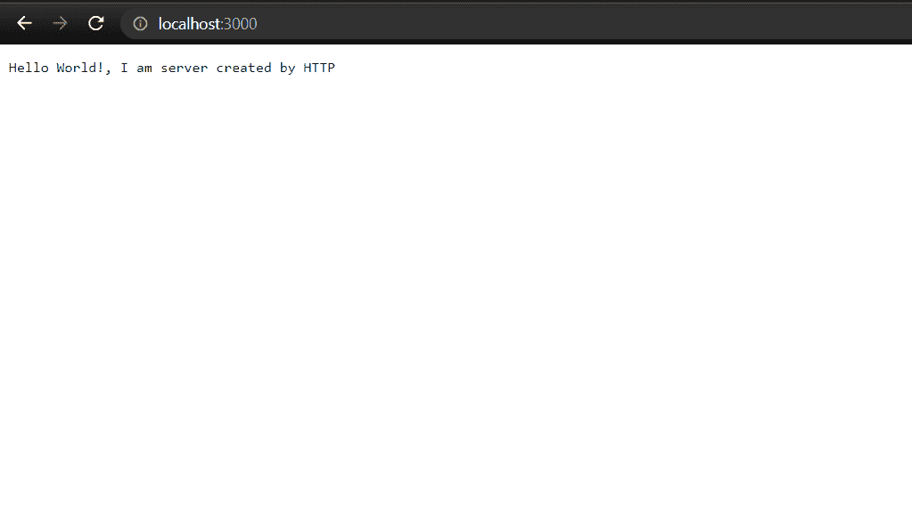
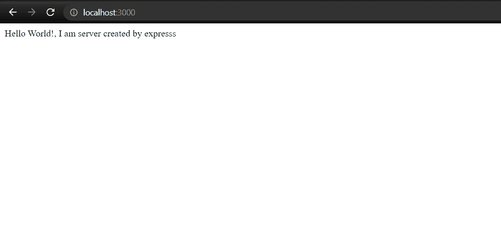

# HTTP 模块和 Express.js 模块有什么区别？

> 原文：[https://www.geeksforgeeks.org/what-are-the-differences-between-http-module-and-express-js-module/](https://www.geeksforgeeks.org/what-are-the-differences-between-http-module-and-express-js-module/)

`HTTP` 和 `Express` 都在 `NodeJS` 中用于开发。在本文中，我们将分别介绍 `HTTP` 和 `express` 模块。

**`HTTP`：** 是内置模块，和 `NodeJS` 一起预装。它用于创建服务器和建立连接。使用这种连接，只要连接使用超文本传输协议，数据发送和接收就可以完成。

**示例：** 使用 `NodeJS` 中的 `HTTP` 模块创建服务器。

## index.js (HTTP)

```js
// Importing http module 
var http = require('http');

// Create a server object which listens on port 300
http.createServer(function (req, res) {
    // Write a response to the client
    res.write('Hello World!');

    // End the response
    res.end();
}).listen(3000);
```

使用以下命令运行 `index.js` 文件。

```bash
node index.js
```

**输出：**



**`Express`：** `Express` 作为一个整体被称为框架，而不仅仅是一个模块。它为您提供了一个应用编程接口、子模块、函数、方法和惯例，用于快速、轻松地将所有必要的组件输入到一起，以构建一个现代化的、功能齐全的网络服务器，并为其提供所有必要的便利（静态资产托管、模板、处理 `CSRF`、`CORS`、`cookie` 解析、`POST` 数据处理以及更多功能）。

**模块安装：** 您可以使用以下命令安装 `express` 模块。

```bash
npm i express
```

**示例：** 使用 `NodeJS` 中的 `express` 模块创建服务器。

## index.js (Express)

```js
// Importing express
const express = require('express');

// Creating instance of express
const app = express();

// Handling GET / Request
app.get('/', function (req, res) {
    res.send("Hello World!, I am server created by expresss");
})

// Listening to server at port 3000
app.listen(3000, function () {
    console.log("server started");
})
```

使用以下命令运行 `index.js` 文件。

```bash
node index.js
```

**输出：**



**`HTTP` 模块与 `Express.js` 模块的区别：**

| HTTP | Express |
| :--- | :--- |
| `HTTP` 随 `NodeJS` 一起提供，这意味着我们不需要显式安装它。 | `Express` 使用 `npm` 命令显式安装：`npm install express` |
| `HTTP` 不是一个完整的框架，它只是一个模块。 | `Express` 是一个完整的框架。 |
| `HTTP` 不提供对静态资产托管的任何支持。 | `Express` 提供 `express.static` 函数用于静态资产托管。例如：`app.use(express.static('public'));` |
| `HTTP` 是一个独立的模块。 | `Express` 的交付基于 `HTTP` 模块。 |
| `HTTP` 模块提供各种工具（函数）来处理网络事务，例如创建服务器和客户端。 | `Express` 与 `HTTP` 一起，提供了更多功能以方便开发。 |