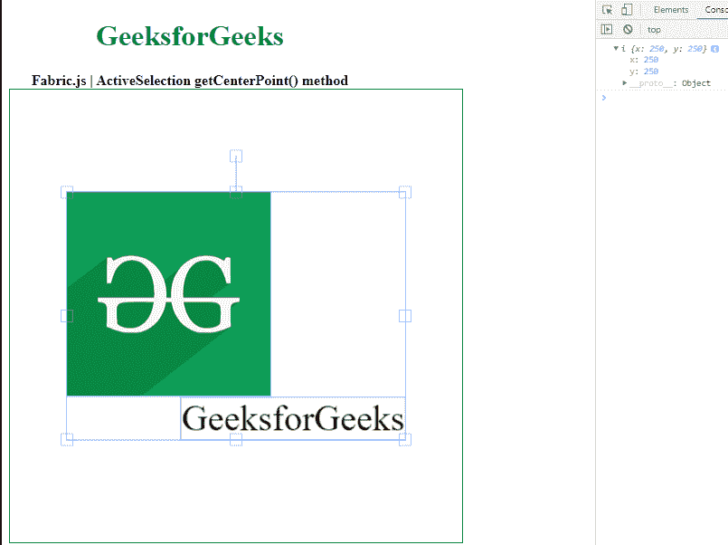

# Fabric.js ActiveSelection getCenterPoint() 方法

> 原文：[https://www.geeksforgeeks.org/fabric-js-activeselection-getcenterpoint-method/](https://www.geeksforgeeks.org/fabric-js-activeselection-getcenterpoint-method/)

在本文中，我们将了解如何在 FabricJS 中使用 `ActiveSelection` 的 `getCenterPoint()` 方法。画布中的 `ActiveSelection` 意味着它是可移动的，并且可以根据需要进行拉伸。此外，在初始笔画颜色、高度、宽度、填充颜色或笔画宽度方面，都可以对 `ActiveSelection` 进行自定义。

`getCenterPoint()` 方法用于获取对象的真实中心坐标。

## 方法

首先导入 `fabric.js` 库。导入库后，在 `<body>` 标签中创建一个包含 `ActiveSelection` 的画布块。之后，初始化一个由 FabricJS 提供的 `Canvas` 和 `ActiveSelection` 类的实例，并使用 `getCenterPoint()` 方法。

## 语法

```
ActiveSelection.getCenterPoint()
```

## 参数

该函数不接受任何参数。

## 返回值

该方法返回一个包含真实中心坐标的对象值。

## 示例

本示例演示了如何使用 FabricJS 设置画布 `ActiveSelection` 的 `getCenterPoint()` 方法。

### HTML

```html
<!DOCTYPE html>
<html>

<head>
    <!-- FabricJS CDN -->
    <script src="https://cdnjs.cloudflare.com/ajax/libs/fabric.js/3.6.2/fabric.min.js">
    </script>
</head>

<body>
    <div style="text-align: center;width: 400px;">
        <h1 style="color: green;">
            GeeksforGeeks
        </h1>
        <b>
            Fabric.js | ActiveSelection getCenterPoint() method
        </b>
    </div>

    <div style="text-align: center;">
        <canvas id="canvas" width="500" height="500"
                style="border:1px solid green;">
        </canvas>
    </div>
    
    <script>
        var canvas = new fabric.Canvas("canvas");

        // Getting the image
        var img = document.getElementById('my-image');

        // Creating the image instance
        var geek = new fabric.Image(img, {
        });

        canvas.add(geek);

        var geek = new fabric.IText('GeeksforGeeks', {
        });
        canvas.add(geek);
        canvas.centerObject(geek);

        var gfg = new fabric.ActiveSelection(canvas.getObjects(), {
        });
        canvas.setActiveObject(gfg);
        canvas.requestRenderAll();
        canvas.centerObject(gfg);
        console.log(gfg.getCenterPoint())
    </script>
</body>

</html>
```

## 输出



## 参考

[http://fabricjs.com/docs/fabric.ActiveSelection.html#getCenterPoint](http://fabricjs.com/docs/fabric.ActiveSelection.html#getCenterPoint)