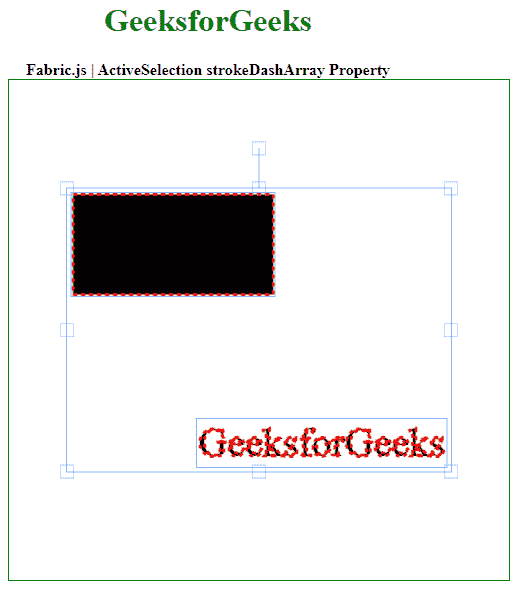

# Fabric.js ActiveSelection strokeDashArray 属性

> 原文：`https://www.geeksforgeeks.org/fabric-js-activeselection-strokedasharray-property/`

`Fabric.js` 是一个用来处理画布的 JavaScript 库。`ActiveSelection` 是用于创建动态选择实例的 `fabric.js` 类之一。画布活动选择意味着活动选择是可移动的，可以根据需要拉伸。在本文中，我们将使用 `strokeDashArray` 属性来设置画布动态选择中笔画的虚线图案。

### 方法
首先导入 `fabric.js` 库。导入后，在主体标签中创建一个包含动态选择的画布块。之后，初始化由 `Fabric.js` 提供的画布和 `ActiveSelection` 类的实例，并使用 `strokeDashArray` 属性在画布 `ActiveSelection` 中设置描边的虚线图案。

### 语法
```html
fabric.ActiveSelection(ActiveSelection, {
    strokeDashArray : array
});
```

### 参数
该函数采用如上所述的单个参数，如下所述。

*   `strokeDashArray`: 该参数取一个数组值。

### 示例
本示例使用 `FabricJS` 设置画布 `ActiveSelection` 的 `strokeDashArray` 属性，如下例所示。

### HTML
```html
<!DOCTYPE html> 
<html>

<head>
   <!-- FabricJS CDN -->
   <script src= 
"https://cdnjs.cloudflare.com/ajax/libs/fabric.js/3.6.2/fabric.min.js"> 
   </script> 
</head>

<body> 
   <div style="text-align: center;width: 400px;"> 
      <h1 style="color: green;"> 
         GeeksforGeeks 
      </h1>
      <b> 
         Fabric.js | ActiveSelection strokeDashArray Property 
      </b>
</div>

<div style="text-align:center;"> 
      <canvas id="canvas" width="500" height="500"
            style="border:1px solid green;"> 
      </canvas> 
   </div> 
   
   <script> 
      var canvas = new fabric.Canvas("canvas");

      // Initiate a Rect instance   
      var rectangle = new fabric.Rect({   
          width: 200,   
          height: 100,
          strokeDashArray :[4],
          stroke: 'red',
          strokeWidth:3
      });   
      canvas.add(rectangle);

      var itext = new fabric.IText('GeeksforGeeks', {
              stroke: 'red',
              strokeWidth:3,
              strokeDashArray :[4],
      });
      canvas.add(itext);
      canvas.centerObject(itext);

      var select = new fabric
           .ActiveSelection(canvas.getObjects(), {
             stroke: 'red',
             strokeDashArray :[4],
             strokeWidth:9
          })
          canvas.setActiveObject(select);
          canvas.requestRenderAll();
          canvas.centerObject(select);   
   </script> 
</body> 
</html>
```

### 输出
