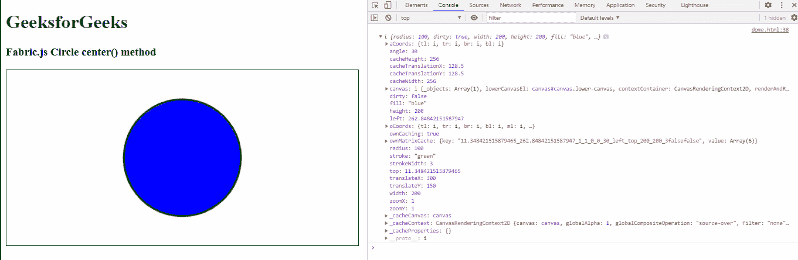

# Fabric.js `center()` 方法

> 原文：[https://www.geeksforgeeks.org/fabric-js-circle-center-method/](https://www.geeksforgeeks.org/fabric-js-circle-center-method/)

在这篇文章中，我们将看到如何使用 `center()` 方法让一个圆对象在画布上垂直和水平地居中。`center()` 方法在画布上使用 FabricJS 画圆时使用，它用来填充一个对象。画布中的圆意味着圆是可移动的，可以根据需要拉伸。此外，当涉及到初始笔画颜色、高度、宽度、填充颜色或笔画宽度时，可以自定义圆形。

`center()` 方法用于使圆形对象在画布上垂直和水平居中。

**方法**：首先导入 `fabric.js` 库。导入库后，在 `<body>` 标签中创建一个包含圆形的画布块。之后，初始化由 FabricJS 提供的 `Canvas` 和 `Circle` 类的实例，并使用 `center()` 方法。

**语法：**

```
circle.center()
```

**参数：** 该函数不接受任何参数。

**返回值：** 此方法返回一个表示画布上垂直和水平居中对象的对象值。

**示例：** 本示例使用 FabricJS 设置画布圆的 `center()` 方法，如下所示：

## HTML

```
<!DOCTYPE html> 
<html>

<head>
    <script src="https://cdnjs.cloudflare.com/ajax/libs/fabric.js/3.6.2/fabric.min.js"></script>
</head>

<body>
    <h1 style="color: green;">
        GeeksforGeeks
    </h1>

    <h3>
        Fabric.js Circle center() method
    </h3>

    <canvas id="canvas" width="600" height="300" style="border:1px solid #000000"></canvas>

    <script>
        var canvas = new fabric.Canvas("canvas");

        var circle = new fabric.Circle({
            radius: 100,
            fill: 'blue',
            stroke: 'green',
            strokeWidth: 3,
            angle: 30
        });

        canvas.add(circle);
        canvas.centerObject(circle);
        console.log(circle.center())
    </script>
</body>

</html>
```

**输出：**



**参考：** [http://fabricjs.com/docs/fabric.Circle.html#center](http://fabricjs.com/docs/fabric.Circle.html#center)