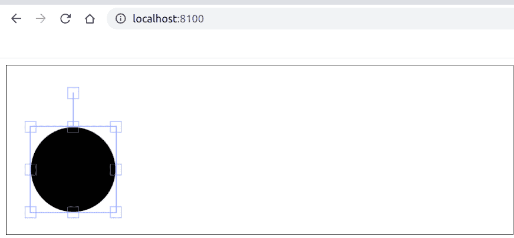

# Fabric.js | Circle lockScalingY Property

> 原文: [https://www.geeksforgeeks.org/fabric-js-circle-lockscalingy-property/](https://www.geeksforgeeks.org/fabric-js-circle-lockscalingy-property/)

在本文中，我们将看到如何使用 `FabricJS` 锁定画布圆圈的垂直缩放。画布意味着圆是可移动的，可以根据需要拉伸。此外，当涉及到初始笔画颜色、填充颜色、笔画宽度或半径时，可以对圆进行自定义。

## 方法
为了使其成为可能，我们将使用一个名为 `FabricJS` 的 `JavaScript` 库。使用 `CDN` 导入库后，我们将在 `body` 标签中创建一个包含我们的圆的 `canvas` 块。之后，我们将初始化 `FabricJS` 提供的 `Canvas` 和 `Circle` 实例，并使用 `lockScalingY` 属性锁定圆形的垂直缩放，并在 `Canvas` 上渲染圆形，如下例所示。

## 语法
```
fabric.Circle({
    radius: number,
    lockScalingY: boolean
});
```

## 参数
该函数接受两个参数，如上所述，如下所述:
*   `radius`: 指定圆的半径。
*   `lockScalingY`: 指定是否锁定垂直缩放。

## 示例
本示例使用 `FabricJS` 锁定画布圆的垂直缩放。
```html
<!DOCTYPE html>
<html>

<head>
    <title>
        Fabric.js | Circle lockScalingY Property
    </title>

    <!-- FabricJS CDN -->
    <script src="https://cdnjs.cloudflare.com/ajax/libs/fabric.js/3.6.2/fabric.min.js"></script>
</head>

<body>
    <canvas id="canvas" width="600" height="200" style="border:1px solid #000000"></canvas>

    <script>
        // Initiate a Canvas instance
        var canvas = new fabric.Canvas("canvas");

        // Initiate a Circle instance
        var circle = new fabric.Circle({
            radius: 50,
            lockScalingY: true
        });

        // Render the circle in canvas
        canvas.add(circle);
    </script>
</body>

</html>
```

## 输出
