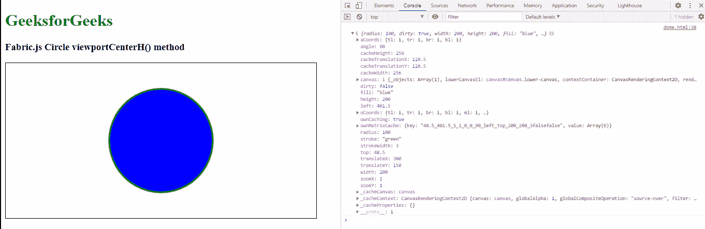

# Fabric.js `Circle.viewportCenterH()` 方法

> 原文：[https://www.geeksforgeeks.org/fabric-js-circle-viewportcenterh-method/](https://www.geeksforgeeks.org/fabric-js-circle-viewportcenterh-method/)

在本文中，我们将看到如何使用 `viewportCenterH()` 方法在 Fabric.js 画布中获取圆形的水平视口中心。画布中的圆形意味着该对象是可移动的，并且可以根据需要进行拉伸。此外，在初始笔画颜色、高度、宽度、填充颜色或笔画宽度等方面，可以对圆形进行自定义。

该方法用于获取圆形对象的水平视口中心。

**方法：** 首先导入 `fabric.js` 库。导入库后，在 `<body>` 标签中创建一个包含圆形的画布块。之后，初始化由 Fabric.js 提供的 `Canvas` 和 `Circle` 类的实例，并使用 `viewportCenterH()` 方法。

**语法：**

```javascript
circle.viewportCenterH()
```

**参数：** 此函数不接受任何参数。

**返回值：** 该方法返回一个表示圆形对象水平视口中心的对象值。

**示例：** 本示例演示了如何使用 FabricJS 设置画布圆形的 `viewportCenterH()` 方法。

## HTML 示例

```html
<!DOCTYPE html>
<html>

<head>
    <script src="https://cdnjs.cloudflare.com/ajax/libs/fabric.js/3.6.2/fabric.min.js"></script>
</head>

<body>
    <h1 style="color: green;">
        GeeksforGeeks
    </h1>

    <h3>
        Fabric.js Circle viewportCenterH() method
    </h3>

    <canvas id="canvas" width="600" height="300" style="border:1px solid #000000"></canvas>

    <script>
        var canvas = new fabric.Canvas("canvas");

        var circle = new fabric.Circle({
            radius: 100,
            fill: 'blue',
            stroke: 'green',
            strokeWidth: 3,
            angle: 90
        });

        canvas.add(circle);
        canvas.centerObject(circle);
        console.log(circle.viewportCenterH())
    </script>
</body>

</html>
```

**输出：**



**参考：** [http://fabricjs.com/docs/fabric.Circle.html#viewportCenterH](http://fabricjs.com/docs/fabric.Circle.html#viewportCenterH)